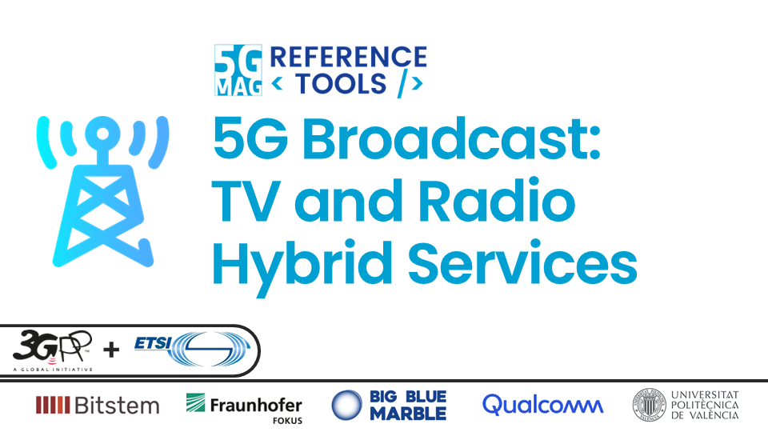
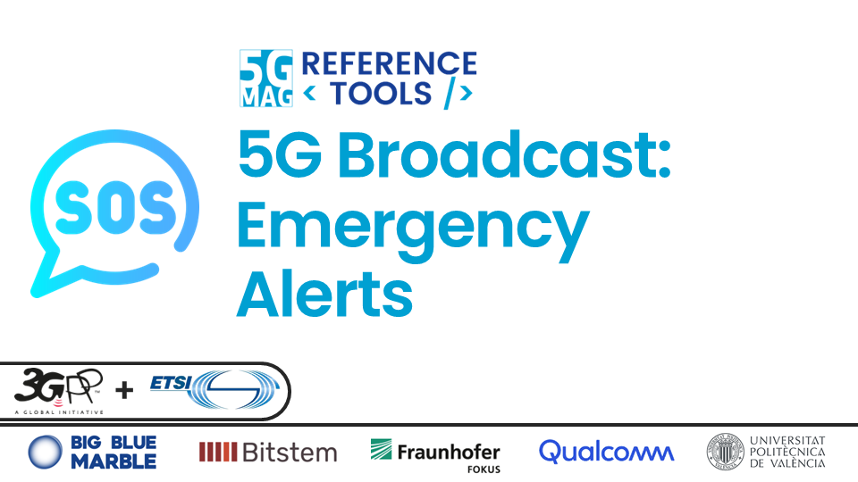
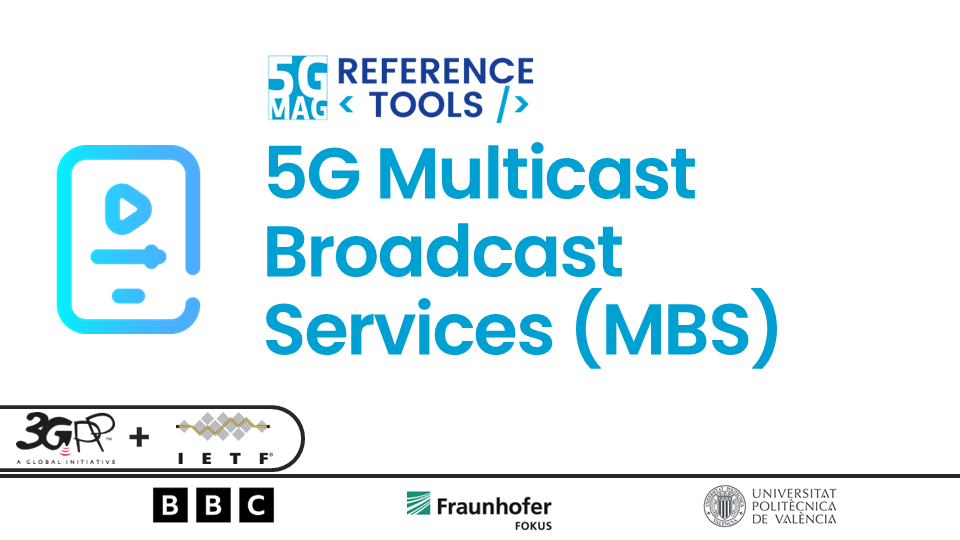
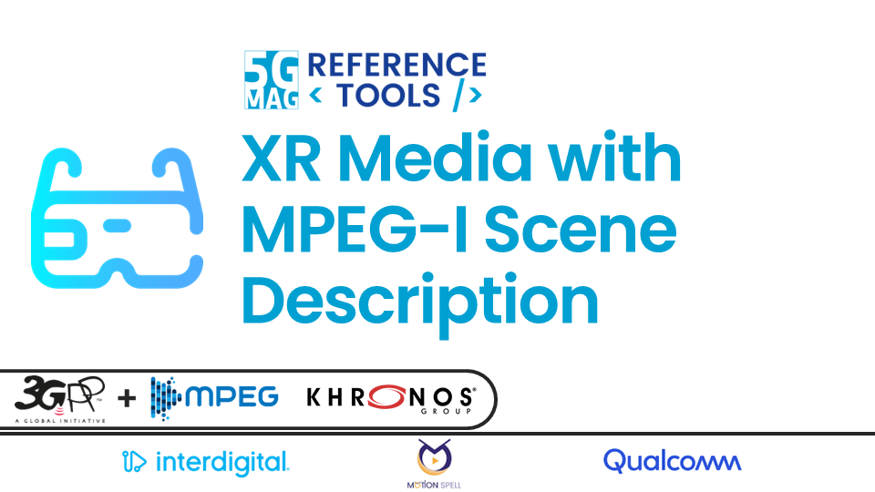
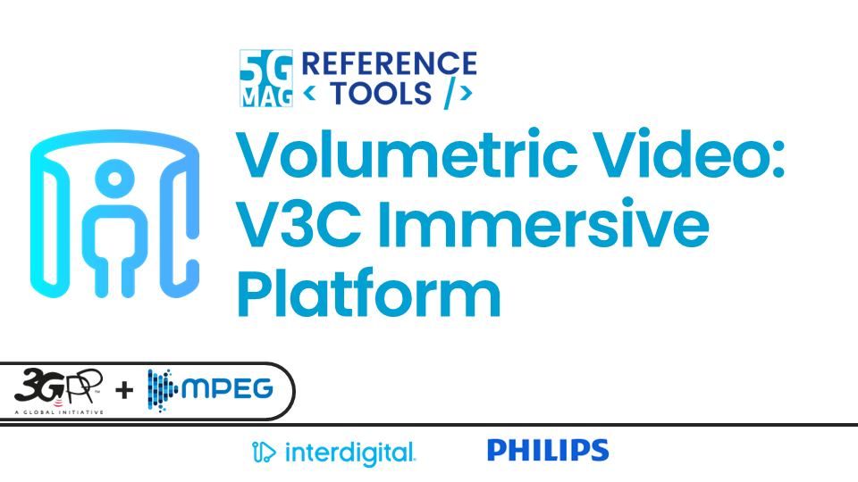
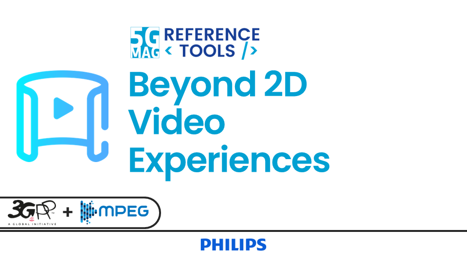
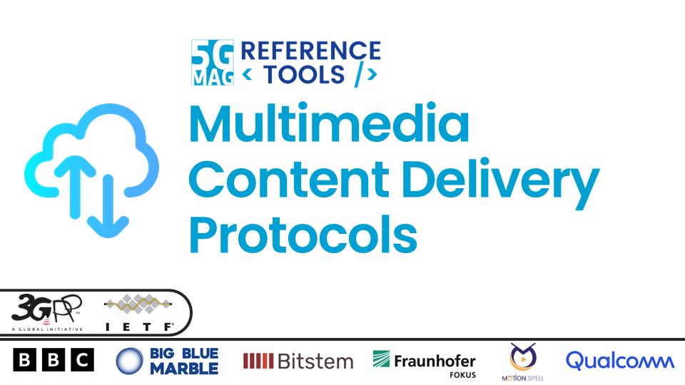

 

Today, specifications in media and connectivity technologies are ultimately realised through software implementations. Developing robust software requires specific expertise, tools, and support – resources the **5G-MAG Reference Tools Developer Community** makes available for a structured approach to software development alongside specification work.

[Overview about the 5G-MAG Reference Tools](#overview-of-the-5g-mag-reference-tools){: .btn .btn-blue }
[Videos and Tutorials](#videos-and-tutorials){: .btn .btn-blue }

With the **5G-MAG Reference Tools** we:
* Accelerate progress through early and continuous feedback from implementations
* Support higher quality specifications thanks to earlier validation in real-world environments
* Foster adoption through the availability of open-source software and tools that lower entry barriers for product development

[How to use this documentation](./pages/how-to-use.html){: .btn .btn-blue }
[Guidelines for Contributors: Learn How to Contribute](./pages/guidelines-contributors.html){: .btn .btn-blue }

---

# The 5G-MAG Reference Tools Projects

<table>
  <tr>
    <td markdown="span" align="center"><a href="./pages/5g-media-streaming/"><a/></td>
    <td markdown="span" align="center"><a href="./pages/5g-core-service-consumers/"><a/></td>
  </tr>
  <tr>
    <td markdown="span" align="center">[Project Documentation](./pages/5g-media-streaming/){: .btn .btn-blue } [Project Roadmap](https://github.com/orgs/5G-MAG/projects/48/views/6){: .btn .btn-blue } [Latest Releases](./pages/releases.html#project-5g-media-streaming){: .btn .btn-blue } </td>
    <td markdown="span" align="center">[Project Documentation](./pages/5g-core-service-consumers/){: .btn .btn-blue } [Project Roadmap](https://github.com/orgs/5G-MAG/projects/48/views/17){: .btn .btn-blue } [Latest Releases](./pages/releases.html#project-5g-core-service-consumers){: .btn .btn-blue } </td>
  </tr>
    <td> </td>
  <tr>
    <td markdown="span" align="center"><a href="./pages/ue-data-collection-reporting-exposure/"><a/></td>
    <td markdown="span" align="center"><a href="./pages/lte-based-5g-broadcast/"><a/></td>
  </tr>
  <tr>
    <td markdown="span" align="center">[Project Documentation](./pages/ue-data-collection-reporting-exposure/){: .btn .btn-blue } [Project Roadmap](https://github.com/orgs/5G-MAG/projects/48/views/8){: .btn .btn-blue } [Latest Releases](./pages/releases.html#project-ue-data-collection-reporting--event-exposure){: .btn .btn-blue } </td>
    <td markdown="span" align="center">[Project Documentation](./pages/lte-based-5g-broadcast/){: .btn .btn-blue } [Project Roadmap](https://github.com/orgs/5G-MAG/projects/48/views/7){: .btn .btn-blue } [Latest Releases](./pages/releases.html#project-5g-broadcast-tv-and-radio-hybrid-services){: .btn .btn-blue } </td>
  </tr>
    <td> </td>
  <tr>
    <td markdown="span" align="center"><a href="./pages/emergency-alerts/"><a/></td>
    <td markdown="span" align="center"><a href="./pages/5g-multicast-broadcast-services/"><a/></td>
  </tr>
  <tr>
    <td markdown="span" align="center">[Project Documentation](./pages/emergency-alerts/){: .btn .btn-blue } [Project Roadmap](https://github.com/orgs/5G-MAG/projects/48/views/12){: .btn .btn-blue } [Latest Releases](./pages/releases.html#project-5g-broadcast-emergency-alerts){: .btn .btn-blue } </td>
    <td markdown="span" align="center">[Project Documentation](./pages/5g-multicast-broadcast-services/){: .btn .btn-blue } [Project Roadmap](https://github.com/orgs/5G-MAG/projects/48/views/13){: .btn .btn-blue } [Latest Releases](./pages/releases.html#project-5g-multicast-broadcast-services){: .btn .btn-blue } </td>
  </tr>
    <td> </td>
  <tr>
    <td markdown="span" align="center"><a href="./pages/xr-media-integration-in-5g/"><a/></td>
    <td markdown="span" align="center"><a href="./pages/v3c-immersive-platform/"><a/></td>
  </tr>
  <tr>
    <td markdown="span" align="center">[Project Documentation](./pages/xr-media-integration-in-5g/){: .btn .btn-blue } [Project Roadmap](https://github.com/orgs/5G-MAG/projects/48/views/16){: .btn .btn-blue } [Latest Releases](./pages/releases.html#project-xr-media-with-mpeg-i-scene-description){: .btn .btn-blue } </td>
    <td markdown="span" align="center">[Project Documentation](./pages/v3c-immersive-platform/){: .btn .btn-blue } [Project Roadmap](https://github.com/orgs/5G-MAG/projects/48/views/15){: .btn .btn-blue } [Latest Releases](./pages/releases.html#project-volumetric-video-experiences-with-mpeg-v3c){: .btn .btn-blue } </td>
  </tr>
    <td> </td>
  <tr>
    <td markdown="span" align="center"><a href="./pages/beyond-2d-evaluation-framework/"><a/></td>
    <td markdown="span" align="center"><a href="./pages/ai-ml-evaluation-framework/"><a/></td>
  </tr>
  <tr>
    <td markdown="span" align="center">[Project Documentation](./pages/beyond-2d-evaluation-framework/){: .btn .btn-blue } [Project Roadmap](https://github.com/orgs/5G-MAG/projects/48/views/10){: .btn .btn-blue } [Latest Releases](./pages/releases.html#project-beyond-2d-video-experiences){: .btn .btn-blue } </td>
    <td markdown="span" align="center">[Project Documentation](./pages/ai-ml-evaluation-framework/){: .btn .btn-blue } [Project Roadmap](https://github.com/orgs/5G-MAG/projects/48/views/9){: .btn .btn-blue } [Latest Releases](./pages/releases.html#project-aiml-in-mobile-media-services){: .btn .btn-blue } </td>
  </tr>
    <td> </td>
  <tr>
    <td markdown="span" align="center"><a href="./pages/multimedia-content-delivery/"><a/></td>
    <td markdown="span" align="center"><a href="./pages/dvbi-over-5g/"><a/></td>
  </tr>
  <tr>
    <td markdown="span" align="center">[Project Documentation](./pages/multimedia-content-delivery/){: .btn .btn-blue } [Project Roadmap](https://github.com/orgs/5G-MAG/projects/48/views/14){: .btn .btn-blue } [Latest Releases](./pages/releases.html#project-multimedia-content-delivery-protocols){: .btn .btn-blue } </td>
    <td markdown="span" align="center">[Project Documentation](./pages/dvbi-over-5g/){: .btn .btn-blue } [Project Roadmap](https://github.com/orgs/5G-MAG/projects/48/views/11){: .btn .btn-blue } [Latest Releases](./pages/releases.html#project-dvb-i-services-over-5g-systems){: .btn .btn-blue } </td>
  </tr>
</table>

 

## Auxiliary tools common to various projects
[Documentation](./common-tools/index.html){: .btn .btn-blue }
[Latest Releases](./pages/releases.html#auxiliary-tools-common-to-various-projects){: .btn .btn-blue }

## 3GPP RAN and Core Platforms
[Documentation](./3gpp-ran-and-core-platforms/index.html){: .btn .btn-blue }

## External Tools
[Documentation](./external-tools/index.html){: .btn .btn-blue }

# Overview of the 5G-MAG Reference Tools

<iframe width="60%" height="520" src="./docs/Reference_Tools_Overview.pdf"></iframe>

[Download the slidedeck of the 5G-MAG Reference Tools](./docs/Reference_Tools_Overview.pdf){: .btn .btn-blue }

# Videos and Tutorials
The tutorial pages within the projects provide audiovisual resources that guide users through project setup and offer developer-led explanations of key aspects and features.

<iframe width="560" height="315" src="https://www.youtube.com/embed/videoseries?si=cij1rf0oe5TQsn_H&amp;list=PLFqKJZ78_IWU3RXGLPulR4hkStzfBSXTJ" title="YouTube video player" frameborder="0" allow="accelerometer; autoplay; clipboard-write; encrypted-media; gyroscope; picture-in-picture; web-share" referrerpolicy="strict-origin-when-cross-origin" allowfullscreen></iframe>

{: .note }
Copyright: 5G Media Action Group (5G-MAG). Please refer to the [Getting-Started](https://github.com/5G-MAG/Getting-Started/tree/main/pages) repository to provide updates to this documentation.
