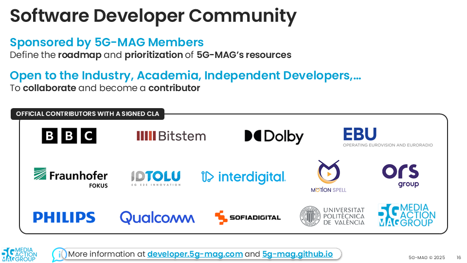

 

This website serves as an umbrella for documentation, practical guidelines and examples of applications that can be
built with the software packages available in the 5G-MAG Reference Tools and also in combination with other platforms.

<iframe width="60%" height="440" src="https://drive.google.com/file/d/1tPcMWLeY6QJNH5OfGWDwLmoSyjrqk8gA/preview"></iframe>

[DOWNLOAD THE PRESENTATION](https://drive.google.com/file/d/1tPcMWLeY6QJNH5OfGWDwLmoSyjrqk8gA/preview){: .btn} 

## 5G-MAG Reference Tools under development
* Get an overview about the tools under development and their scope [here](./pages/projects.html)

## How to use this documentation
* Find here some practical information about this documentation [here](./pages/how-to-use.html)

## Developer Community
* Meet the developer community, participate, contribute, join the public calls: [https://www.5g-mag.com/community](https://www.5g-mag.com/community)
* Discussion are happening in [Slack](https://5g-mag.slack.com/).
* Announcements are communicated through the [Google Group](https://groups.google.com/g/5g-mag-reference-tools)
* If you have questions that cannot be shared publicly, reach out to us via email: [reference-tools@5g-mag.com](mailto:reference-tools@5g-mag.com)

### Join our Public Monthly Call (Last Friday of the month at 13:00 CET/CEST - unless communicated otherwise)
* Find all the information how to join here: [https://5g-mag.com/community#calendar](https://5g-mag.com/community#calendar)
* Agendas circulated via the [Google Group](https://groups.google.com/g/5g-mag-reference-tools) mailing list

### Contributing
* Learn about the Contributor License Agreement for contributors: [https://www.5g-mag.com/license](https://www.5g-mag.com/license)
* Guidelines for contributors are available [here](guidelines-contributors.html)

