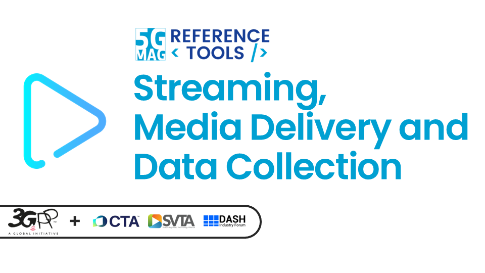
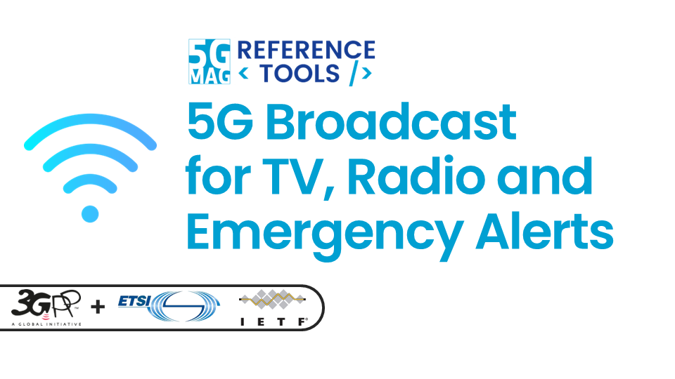
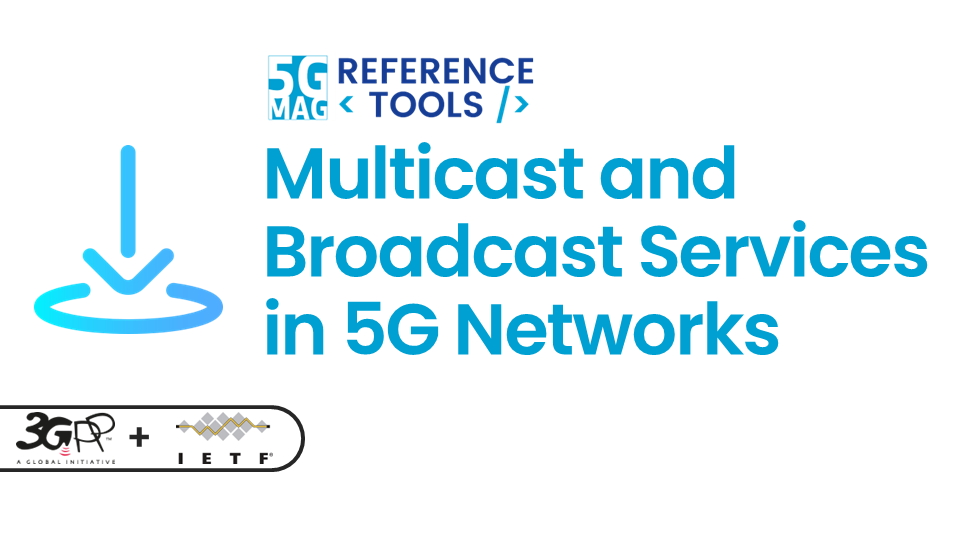
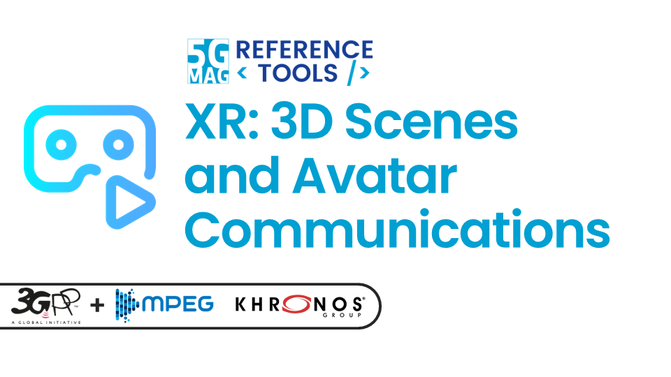
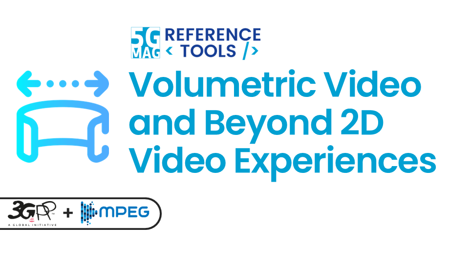
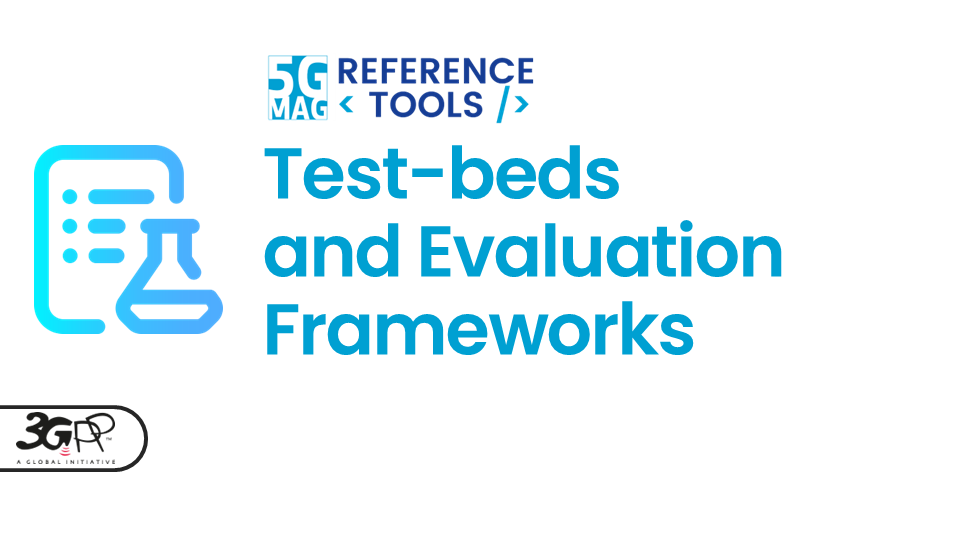
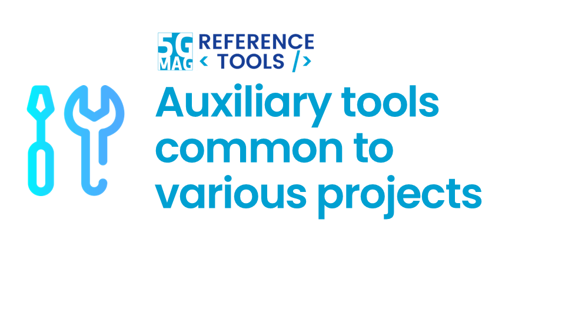
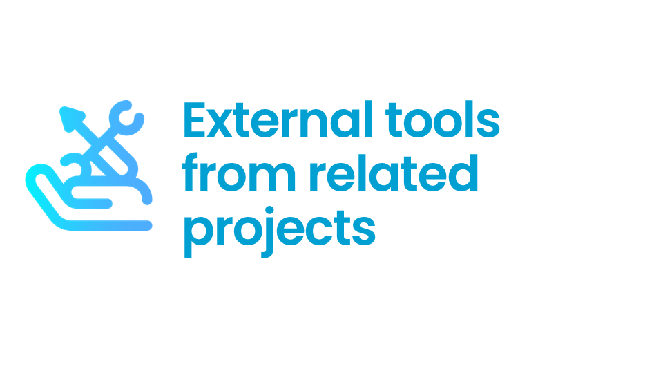
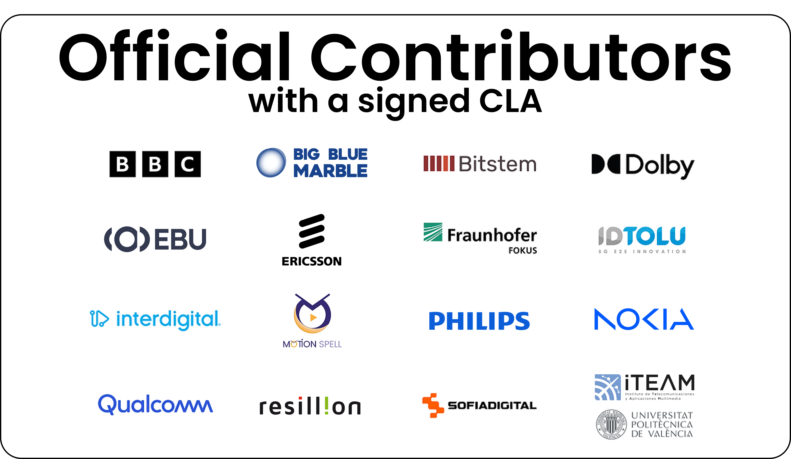
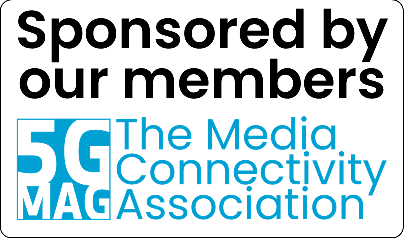

 

[Application Areas](./pages/applications.html){: .btn .btn-blue } [All the Projects](./pages/projects.html){: .btn .btn-blue } [Releases](./pages/releases.html){: .btn .btn-release } [Join us and Contribute!](#join-us-and-contribute){: .btn .btn-blue } [Public Monthly Call](./pages/public-call.html){: .btn .btn-blue }

[Download an overview about the 5G-MAG Reference Tools](https://hub.5g-mag.com/Getting-Started/docs/Reference_Tools_Overview.pdf){: .btn .btn-blue }

Today’s media and connectivity specifications are ultimately realized through code, and our goal is to accelerate that journey from the drafting table to the developer’s toolkit.

The <b>5G-MAG Reference Tools Developer Community</b> provides a structured environment where software development and specification work move in sync. We:

<ul>
  <li><b>Make Technology Accessible:</b> We put the latest innovations directly into the hands of developers, lowering entry barriers for product development.</li>
  <li><b>Ensure Quality:</b> We use software implementations to provide early feedback, ensuring specifications are tested and ready for the real world.</li>
  <li><b>Drive Global Adoption:</b> Through open-source software and tutorials, we empower users and creators to adopt and scale new technologies with confidence.</li>
</ul>

# What are the domains covered by the projects?

<table>
  <tr>
    <td markdown="span" align="center" width="33%"><a href="./pages/streaming.html"><a/></td>
    <td markdown="span" align="center" width="33%"><a href="./pages/5gbroadcast.html"><a/></td>
    <td markdown="span" align="center" width="33%"><a href="./pages/multicastbroadcast.html"><a/></td>
  </tr>
  <tr>
    <td markdown="span" align="center" width="33%">[Streaming, Media Delivery and Data Analytics](./pages/streaming.html){: .btn .btn-blue }</td>
    <td markdown="span" align="center" width="33%">[5G Broadcast for TV, Radio and Emergency Alerts](./pages/5gbroadcast.html){: .btn .btn-blue }</td>
    <td markdown="span" align="center" width="33%">[Multicast and Broadcast Services in 5G Networks](./pages/multicastbroadcast.html){: .btn .btn-blue }</td>
  </tr>
    <td> </td>
  <tr>
    <td markdown="span" align="center" width="33%"><a href="./pages/xr.html"><a/></td>
    <td markdown="span" align="center" width="33%"><a href="./pages/volumetric.html"><a/></td>
    <td markdown="span" align="center" width="33%"><a href="./pages/testbeds.html"><a/></td>
  </tr>
  <tr>
    <td markdown="span" align="center" width="33%">[XR: 3D Scenes and Avatar Communications](./pages/xr.html){: .btn .btn-blue }</td>
    <td markdown="span" align="center" width="33%">[Volumetric Video and Beyond 2D Video Experiences](./pages/volumetric.html){: .btn .btn-blue }</td>
    <td markdown="span" align="center" width="33%">[Test-beds and Evaluation Frameworks](./pages/testbeds.html){: .btn .btn-blue }</td>
  </tr>
    <td> </td>
  <tr>
    <td markdown="span" align="center" width="33%"><a href="./pages/common-tools/index.html"><a/></td>
    <td markdown="span" align="center" width="33%"><a href="./pages/3gpp-ran-and-core-platforms/index.html"><a/></td>
    <td markdown="span" align="center" width="33%"><a href="./pages/external-tools/index.html"><a/></td>
  </tr>
  <tr>
    <td markdown="span" align="center" width="33%">[Auxiliary Tools common to various projects](./pages/common-tools/index.html){: .btn .btn-blue } [Latest Releases](./releases.html#auxiliary-tools-common-to-various-projects){: .btn .btn-blue }
</td>
    <td markdown="span" align="center">[3GPP RAN and Core Platforms](./pages/3gpp-ran-and-core-platforms/index.html){: .btn .btn-blue }</td>
    <td markdown="span" align="center" width="33%">[3GPP RAN and Core Platforms](./pages/3gpp-ran-and-core-platforms/index.html){: .btn .btn-blue }</td>
  </tr>
</table>
      
# Join us and Contribute!

[Guidelines for Contributors: Learn How to Contribute](./pages/guidelines-contributors.html){: .btn .btn-blue }
[The Software Licenses](./pages/license.html){: .btn .btn-blue }

<table>
  <tr>
    <td width="65%" align="center" valign="top">
      
    </td>
    <td width="35%" align="center" valign="middle">
      
    </td>
  </tr>
</table>

{: .note }
Please refer to the [Getting-Started](https://github.com/5G-MAG/Getting-Started/) repository to provide updates to this documentation.
