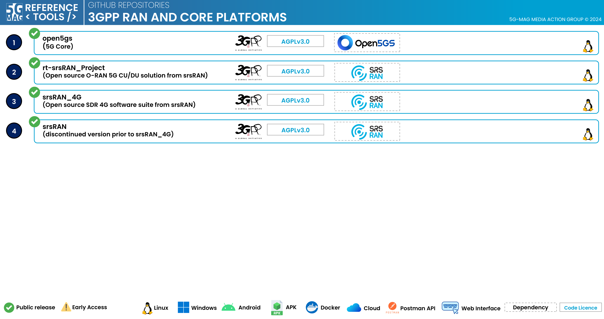

# Repositories

## Description

Some 5G-MAG Reference Tools Projects make use of software developed by several Open-Source initiatives. In particular:

* [srsRAN Project](https://www.srsran.com/), in its two variants:
  * `srsran/srsRAN_Project`: Open source O-RAN 5G CU/DU solution from Software Radio Systems (SRS), used primarily as the NG-RAN to build 5G-MAG Reference Tools demonstrators and PoCs and as the basis for the development of NG-RAN related components for MBS
  * `srsran/srsRAN_4G`: Open source SDR 4G software suite from Software Radio Systems (SRS), used primarily as the basis for the LTE-based 5G Broadcast components, emergency alerts over 5G Broadcast and the development of UE functionalities for MBS

* [Open5GS Project](https://www.open5gs.org), used primarily as the 5GC to build 5G-MAG Reference Tools demonstrators and PoCs and as the basis for the development of 5GC related components for MBS

---

## Open5GS: [open5gs](https://github.com/5G-MAG/open5gs)

## srsRAN Project: [rt-srsRAN_Project](https://github.com/5G-MAG/rt-srsRAN_Project)

## srsRAN_4G: [srsRAN_4G](https://github.com/5G-MAG/srsRAN_4G)

## srsRAN (discontinued version prior to srsRAN_4G): [srsRAN](https://github.com/5G-MAG/srsRAN)
