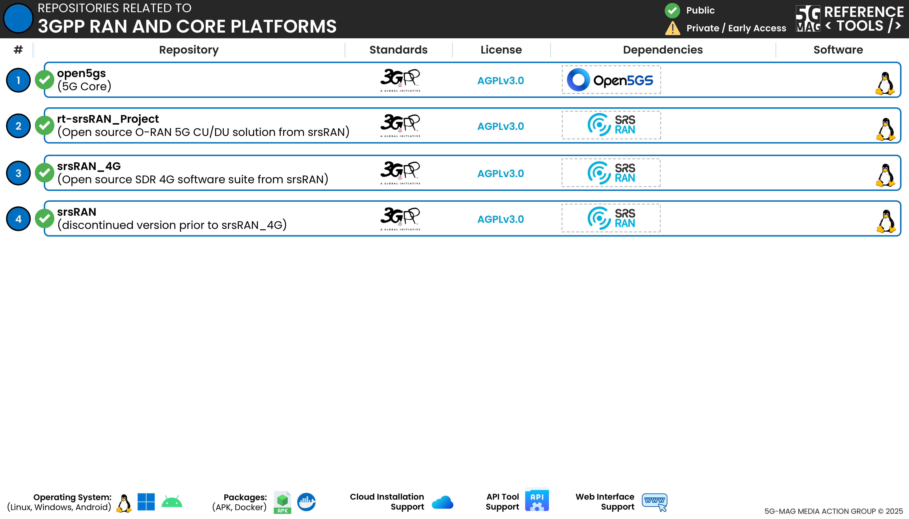

 

1. TOC
{:toc}

# Repositories

---

## Open5GS fork: [open5gs](https://github.com/5G-MAG/open5gs)
5G-MAG maintains a fork of open5gs for the development and adaptation of 5GC network functions to support other Reference Tools.

The branches available under this repository are:
* **main** - A fork of the "main" brach of Open5GS primarily used for building a regular 5G Network.
* **5mbs** - Acts as the "main" brach for implementations of 5GC NFs related to 5MBS.
* **5mbs-development** - Acts as the "development" brach for implementations of 5GC NFs related to 5MBS.
* TODO

## srsRAN Project: [rt-srsRAN_Project](https://github.com/5G-MAG/rt-srsRAN_Project)
5G-MAG maintains a fork of srsRAN_Project for the development and adaptation of NG-RAN procedures to support other Reference Tools.

The branches available under this repository are:
* TODO

## srsRAN_4G: [srsRAN_4G](https://github.com/5G-MAG/srsRAN_4G)
5G-MAG maintains a fork of srsRAN_4G for the development and adaptation of NG-RAN procedures to support other Reference Tools.

The branches available under this repository are:
* TODO (MBMS, EPC and E-UTRAN)
* TODO (basic implmentation of a 5G-NR UE)

## srsRAN (discontinued version prior to srsRAN_4G): [srsRAN](https://github.com/5G-MAG/srsRAN)
5G-MAG maintains a fork of a legacy/discontinued version of srsRAN prior to its conversion into srsRAN_4G.

The branches available under this repository are:
* TODO
