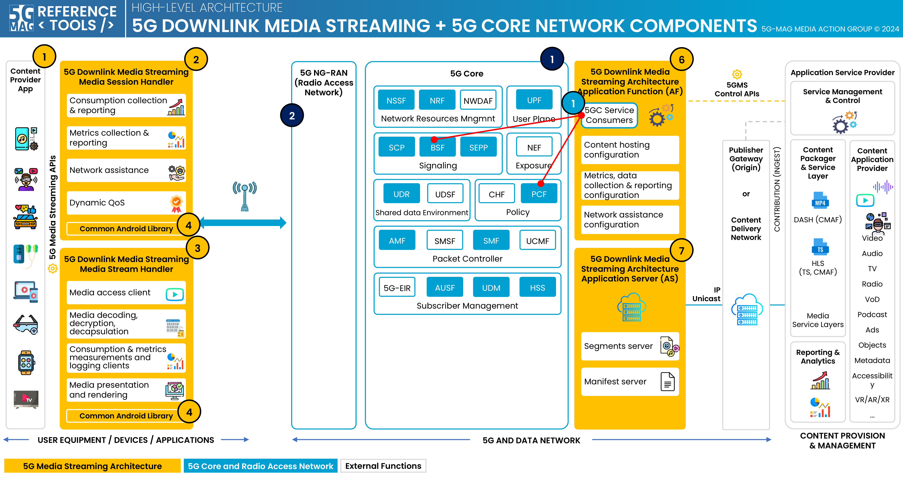

# Related repositories

## UE Data Collection Application Function: [rt-5gc-data-collection-application-function](https://github.com/5G-MAG/rt-5gc-data-collection-application-function)

## 5G Core Service Consumers: [rt-5gc-service-consumers](https://github.com/5G-MAG/rt-5gc-service-consumers)
* [Information and how to download, build, install and run](https://github.com/5G-MAG/rt-5gc-service-consumers#readme)
* [Guidelines, development and testing](https://github.com/5G-MAG/rt-5gc-service-consumers/wiki)
* [Releases](https://github.com/5G-MAG/rt-5gc-service-consumers/releases)
* [Projects](https://github.com/5G-MAG/rt-5gc-service-consumers/projects?query=is%3Aopen)
