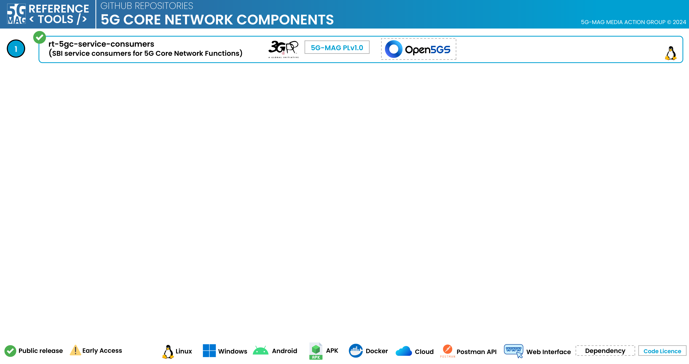

 

1. TOC
{:toc}

# Repositories

The following repositories are available. Please refer to the "Scope & Architecture" sections of the different projects for more context.

---

## 5GC Service Consumers: [rt-5gc-service-consumers](https://github.com/5G-MAG/rt-5gc-service-consumers)
This repository contains a collection of reusable service consumer libraries designed to talk to the 5G Core Network Functions using service interfaces.

The following libraries are available:
* **libscbsf** - Binding Support Function (BSF) service consumer library
* **libscpcf** - Policy Control Function (PCF) service consumer library
* **libscmbsmf** - Multicast/Broadcast Session Management Function (MB-SMF) service consumer library

Additional information:
* [Information and how to download, build, install and run](https://github.com/5G-MAG/rt-5gc-service-consumers#readme)
* [Releases](https://github.com/5G-MAG/rt-5gc-service-consumers/releases)
