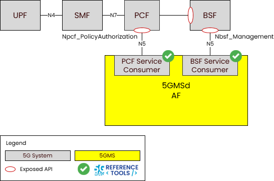
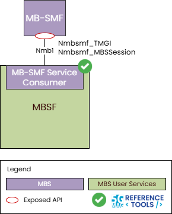

 

[Scope](./scope.html){: .btn .btn-blue } [Project Roadmap](./projects.html){: .btn .btn-blue } [GitHub Repos](./repositories.html){: .btn .btn-github } [Releases](../releases.html#project-5g-core-service-consumers){: .btn .btn-release } [Tutorials](./tutorials.html){: .btn .btn-tutorial } [Requirements](./requirements.html){: .btn .btn-blue }

# Scope

The 5G Core presents several Network Functions, each of which has its own set of service interfaces. This project hosts a collection of reusable service consumer libraries designed to talk to the 5G Core Network Functions using some of these service interfaces.

A list of relevant specifications can be found in the link below.

[Specifications](https://hub.5g-mag.com/Standards/pages/5g-core-service-consumers.html){: .btn .btn-blue }

# What is being implemented? 

{: .inshort }
A series of reusable service consumer libraries to invoke service operations on various 5GC network functions.

Within the context of 5G Media Streaming, the 5GMS AF needs to communicate with the 5G Core in order to manipulate network Quality of Service (QoS) for ongoing media streaming sessions.

The following libraries are available:
* **libscbsf** - Binding Support Function (BSF) service consumer library
* **libscpcf** - Policy Control Function (PCF) service consumer library

## libscbsf - Binding Support Function (BSF) service consumer library

[To the GitHub Repos](./repositories.html){: .btn .btn-github }

* Responsible for maintaining a mapping between UE PDU Session and the PCF which is managing that PDU Session.
* The `libscbsf` library aids in discovery of the BSF in the 5G Core (by interrogating the NRF) and subsequently looking up which PCF is managing the PDU Session for a UE, identified by its IP address.
* This library implements the service consumer end of the following service-based APIs:
  * `Nbsf_Management`

## libscpcf - Policy Control Function (PCF) service consumer library

[To the GitHub Repos](./repositories.html){: .btn .btn-github }

[Tutorial: Test libscpcf](./tutorials/using-libscPCF.html){: .btn .btn-tutorial }

* Responsible for applying charging and network policy to the PDU sessions of UEs. The `Npcf_PolicyAuthorization` service API is used at reference point N5 by an Application Function (AF) to request policy changes to the PDU session on behalf of the UE. This allows an Application Function to manipulate particular network QoS parameters for selected IP traffic flows within the PDU session.
* The `libscpcf` library allows an application to connect to a PCF and request an `AppSessionContext` which it can then use to manipulate the network routing policies for traffic passing across specific application flows within a UE's PDU Session.
* This library implements the service consumer end of the following service-based APIs:
  * `Npcf_PolicyAuthorization`

### Command line tool: pcf-policyauthorization

The **pcf-policyauthorization** tool manipulates the network Quality of Service parameters of Application Session Contexts in the PCF by using the PCF service consumer library to invoke operations on the `Npcf_PolicyAuthorization` service API.

The PCF address can be explicitly specified at the command line if this is already known. Alternatively, the tool can also use the BSF service consumer library to look up which PCF instance is managing the PDU Session of interest ( based on the IP address of a UE registered with the AMF).

---

Within the context of 5G Multicast/Broadcast Services (MBS), the Multicast/Broadcast Session Management Function (MB-SMF) is responsible for allocating and deallocating Temporary Mobile Group Identities (TMGIs) and for the management of Multicast/Broadcast Services on the Multicast/Broadcast User Plane Function (MB-UPF).

The following libraries are available:
* **libscmbsmf** - Multicast/Broadcast Session Management Function (MB-SMF) service consumer library

## libscmbsmf - Multicast/Broadcast Session Management Function (MB-SMF) service consumer library

[To the GitHub Repos](./repositories.html){: .btn .btn-github }

[Tutorial: Test libscmbsmf](./tutorials/using-libscMBSMF.html){: .btn .btn-tutorial }

* Responsible for allocating and deallocating Temporary Mobile Group Identities (`TMGIs`) and for the management of Multicast/Broadcast Services (`MBS`) on the Multicast/Broadcast User Plane Function (`MB-UPF`).
* The `Nmbsmf_TMGI` service API is used at reference point `Nmb1` for the allocation and deallocation of `TMGIs`, and the `Nmbsmf_MBSSession` service API is used to reference point `Nmb1` for the creation, modification and destruction of MBS Sessions and for the management of notification subscriptions to events arising on those MBS Sessions.
* The `libscmbsmf` library provides a simple create/destroy interface for `TMGI` management and an MBS Session and notifications subscriptions model for management of MBS Sessions.
* This library implements the service consumer end of the following service-based APIs:
  * `Nmbsmf_TMGI`
  * `Nmbsmf_MBSSession`

### Command line tool: tmgi-tool

The **tmgi-tool** provides a simple command line interface to either request the creation or destruction of a TMGI using the interfaces provided by the MB-SMF service consumer library to invoke operations on the Nmbsmf_TMGI service API.

### Command line tool: mbs-service-tool

The **mbs-service-tool** can register an MBS Session and will then wait for notifications for that MBS Session. It does this by using the interfaces provided by the MB-SMF service consumer library to invoke operations on the Nmbsmf_MBSSession service API.

## 5G Downlink Media Streaming (5GMSd) with 5GC Service Consumers

[5G Media Streaming: Repositories](../5g-media-streaming/repositories.html){: .btn .btn-5gms }
[5GC Service Consumers: Repositories](../5g-core-service-consumers/repositories.html){: .btn .btn-5gcsc }
[3GPP RAN and Core Platforms: Repositories](../3gpp-ran-and-core-platforms/repositories.html){: .btn .btn-3gpp }
[Common Tools: Repositories](../common-tools/){: .btn .btn-common }

## 5G Multicast Broadcast Services (MBS) with 5GC Service Consumers

[5G Multicast Broadcast Services: Repositories](../5g-multicast-broadcast-services/repositories.html){: .btn .btn-5mbs }
[Multimedia content delivery protocols: Repositories](../multimedia-content-delivery/repositories.html){: .btn .btn-md }
[5GC Service Consumers: Repositories](../5g-core-service-consumers/repositories.html){: .btn .btn-5gcsc }
[3GPP RAN and Core Platforms: Repositories](../3gpp-ran-and-core-platforms/repositories.html){: .btn .btn-3gpp }
[Common Tools: Repositories](../common-tools/){: .btn .btn-common }
