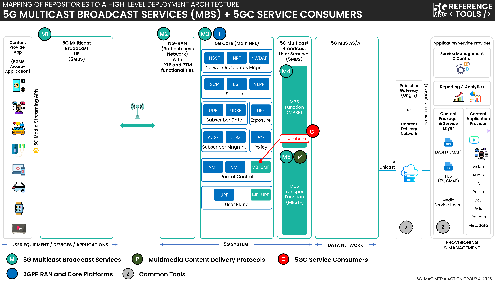

 

[Scope & Architectures](./scope.html){: .btn .btn-blue } [Project Roadmap](./projects.html){: .btn .btn-blue } [Features](./features.html){: .btn .btn-blue } [GitHub Repos](./repositories.html){: .btn .btn-github } [Releases](../releases.html#project-5g-core-service-consumers){: .btn .btn-release } [Tutorials](./tutorials.html){: .btn .btn-blue } [Requirements](./requirements.html){: .btn .btn-blue }

# Scope and Architectures

This page contains information such as the specifications within the scope of the tools and high-level architectures that bring context to their applicability.

## Technical Resources and Specifications

The 5GC service consumers are developed in relation to the requirements from other projects to use 5GC network functions. Please refer to the relevant projects for more information.

[Specifications](https://hub.5g-mag.com/Standards/pages/5g-core-service-consumers.html){: .btn .btn-blue }

# High-level architectures

## 5G Downlink Media Streaming (5GMSd) with 5GC Service Consumers

[5G Media Streaming: Repositories](../5g-media-streaming/repositories.html){: .btn .btn-5gms }
[5GC Service Consumers: Repositories](../5g-core-service-consumers/repositories.html){: .btn .btn-5gcsc }
[3GPP RAN and Core Platforms: Repositories](../3gpp-ran-and-core-platforms/repositories.html){: .btn .btn-3gpp }
[Common Tools: Repositories](../common-tools/){: .btn .btn-common }

## 5G Multicast Broadcast Services (MBS) with 5GC Service Consumers

[5G Multicast Broadcast Services: Repositories](../5g-multicast-broadcast-services/repositories.html){: .btn .btn-5mbs }
[Multimedia content delivery protocols: Repositories](../multimedia-content-delivery/repositories.html){: .btn .btn-md }
[5GC Service Consumers: Repositories](../5g-core-service-consumers/repositories.html){: .btn .btn-5gcsc }
[3GPP RAN and Core Platforms: Repositories](../3gpp-ran-and-core-platforms/repositories.html){: .btn .btn-3gpp }
[Common Tools: Repositories](../common-tools/){: .btn .btn-common }
