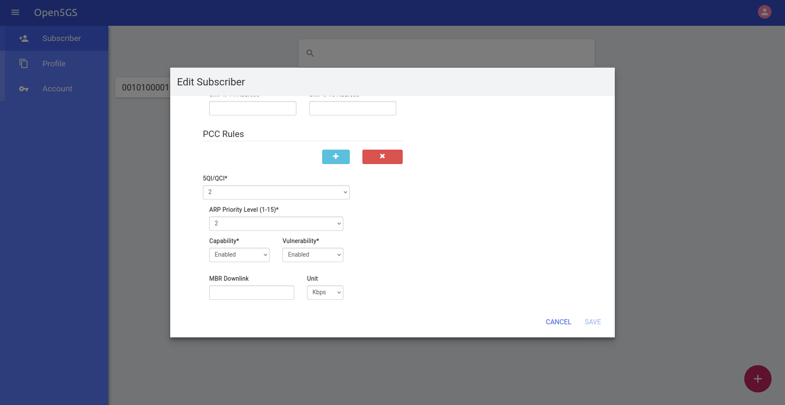

# Tutorial - Using the 5GC Service Consumer libraries: libscBSF

## Introduction

This tutorial provides information to test the 5GC Service Consumer libraries available in [rt-5gc-service-consumers](https://github.com/5G-MAG/rt-5gc-service-consumers) repository.

This collection of reusable service consumer libraries are designed to talk to the 5G Core Network Functions using some of their defined service interfaces. The command line tools below are provided to demonstrate the use of these service consumer libraries.

## Setup the relevant Open5GS network functions

We recommend a local installation of Open5GS following the instructions provided [here](../../3gpp-ran-and-core-platforms/tutorials/5gnetwork.html).

Note that the **PCF Policy Authorization tool** requires Open5GS v2.7.2.

In the following examples 127.0.0.10:7777 is used as the address and port number for the NRF API (Open5GS default). The address 12.34.56.78 is the UE's IP address as assigned by the 5G Core.

Please substitute these IP addresses for the ones you are using with your network.

## Using the PCF PolicyAuthorization tool

The PCF PolicyAuthorization tool can request a QoS policy and will then wait and report notifications for the QoS policy session.

The PCF PolicyAuthorization tool can be run with a command like the follwing one, which requests QoS settings for video Media-Type with a minimum guarenteed 2.5Mbps downlink:

```
/usr/local/bin/pcf-policyauthorization -a 12.34.56.78 -n 127.0.0.10:7777 -t video -d 2.5e6
```

Note: This will only work if you have defined a PCC Rule for 5QI 2 (video) defaults.



To get the full command help for the PCF PolicyAuthorization tool use the command:

```
/usr/local/bin/pcf-policyauthorization -h
```

This is an example of the result of executing the commands above:
```
fivegmag@fivegmag:~$ /usr/local/bin/pcf-policyauthorization -a 10.45.0.2  -n 127.0.0.10:7777 -t video -d 2.5e6 -e debug
10/08 16:31:07.334: [app] INFO: Configuration: '/tmp/pcf-policyauth-yaml.JXO3mg' (../subprojects/open5gs/lib/app/ogs-init.c:144)
10/08 16:31:07.334: [sbi] INFO: NF EndPoint(addr) setup [127.0.0.10:7777] (../subprojects/open5gs/lib/sbi/context.c:430)
10/08 16:31:07.334: [bsf-service-consumer] DEBUG: Initialising BSF client context (../lib/bsf-service-consumer/context.c:185)
10/08 16:31:07.334: [bsf-service-consumer] DEBUG: BSF client context initialised (../lib/bsf-service-consumer/context.c:196)
10/08 16:31:07.334: [bsf-service-consumer] ERROR: No notification listener address (../lib/bsf-service-consumer/context.c:367)
10/08 16:31:07.334: [sock] DEBUG: addr:10.45.0.2, port:0 (../subprojects/open5gs/lib/core/ogs-sockaddr.c:143)
10/08 16:31:07.334: [bsf-service-consumer] DEBUG: _bsf_retrieve_pcf_binding_for_pdu_session(ue_address=0x76346c000c20, callback=0x63c043db7200, user_data=(nil)) (../lib/bsf-service-consumer/pcf-bind.c:29)
10/08 16:31:07.334: [bsf-service-consumer] DEBUG: BSF Client Context: (../lib/bsf-service-consumer/context.c:114)
10/08 16:31:07.334: [bsf-service-consumer] DEBUG:   Configuration: (../lib/bsf-service-consumer/context.c:121)
10/08 16:31:07.334: [bsf-service-consumer] DEBUG:     Notification listener addresses: (../lib/bsf-service-consumer/bsf-configuration.c:57)
10/08 16:31:07.334: [bsf-service-consumer] DEBUG:     BSF Service addresses: (../lib/bsf-service-consumer/bsf-configuration.c:62)
10/08 16:31:07.334: [bsf-service-consumer] DEBUG:     Discovery flag = 0 (../lib/bsf-service-consumer/bsf-configuration.c:67)
10/08 16:31:07.334: [bsf-service-consumer] DEBUG:     Discovered NF instance = (nil) (../lib/bsf-service-consumer/bsf-configuration.c:69)
10/08 16:31:07.334: [bsf-service-consumer] DEBUG:   PCF Bindings Cache: (../lib/bsf-service-consumer/context.c:123)
10/08 16:31:07.334: [bsf-service-consumer] DEBUG:     Bindings Cache: (../lib/bsf-service-consumer/pcf-bindings-cache.c:53)
10/08 16:31:07.334: [bsf-service-consumer] DEBUG:   BSF Client Sessions: (../lib/bsf-service-consumer/context.c:125)
10/08 16:31:07.334: [bsf-service-consumer] DEBUG:     SBI object = 0x76346c000d20 (../lib/bsf-service-consumer/bsf-client-sess.c:62)
10/08 16:31:07.334: [bsf-service-consumer] DEBUG:     UE Address = 10.45.0.2 (../lib/bsf-service-consumer/bsf-client-sess.c:64)
10/08 16:31:07.334: [bsf-service-consumer] DEBUG:     IPv4 Address = 10.45.0.2 (../lib/bsf-service-consumer/bsf-client-sess.c:66)
10/08 16:31:07.334: [bsf-service-consumer] DEBUG:     IPv6 Prefix = <not set> (../lib/bsf-service-consumer/bsf-client-sess.c:67)
10/08 16:31:07.334: [bsf-service-consumer] DEBUG:     Callback = 0x63c043db7200 (..., (nil)) (../lib/bsf-service-consumer/bsf-client-sess.c:68)
10/08 16:31:07.334: [bsf-service-consumer] DEBUG: Queueing discover & send event (0x76346c001c30) (../lib/bsf-service-consumer/local.c:34)
10/08 16:31:07.334: [bsf-service-consumer] DEBUG: event queued (../lib/bsf-service-consumer/local.c:44)
10/08 16:31:07.334: [bsf-service-consumer] DEBUG: _bsf_process_event: ENTRY (../lib/bsf-service-consumer/nbsf-process.c:30)
10/08 16:31:07.334: [pcf-service-consumer] DEBUG: _pcf_process_event: ENTRY (../lib/pcf-service-consumer/npcf-process.c:34)
10/08 16:31:07.334: [pcf-policyauth] DEBUG: Processing event 0x76347402be08 [ENTRY] (../tools/c/pcf-policyauthorization/app-sm.c:108)
10/08 16:31:07.334: [pcf-policyauth] INFO: Discovering PCF for UE... (../tools/c/pcf-policyauthorization/app-sm.c:112)
10/08 16:31:07.334: [bsf-service-consumer] DEBUG: _bsf_process_event: BSF_CLIENT_LOCAL_DISCOVER_AND_SEND (../lib/bsf-service-consumer/nbsf-process.c:30)
10/08 16:31:07.334: [bsf-service-consumer] DEBUG: Discover & Send event (../lib/bsf-service-consumer/local.c:61)
10/08 16:31:07.335: [bsf-service-consumer] DEBUG: Sending BSF query (../lib/bsf-service-consumer/bsf-client-sess.c:157)
10/08 16:31:07.335: [sbi] WARNING: Try to discover [nbsf-management] (../subprojects/open5gs/lib/sbi/path.c:548)
10/08 16:31:07.335: [bsf-service-consumer] DEBUG: _bsf_process_event: OGS_EVENT_NAME_SBI_CLIENT (../lib/bsf-service-consumer/nbsf-process.c:30)
10/08 16:31:07.335: [bsf-service-consumer] DEBUG: OGS_EVENT_SBI_CLIENT: service=nnrf-disc, component[0]=nf-instances (../lib/bsf-service-consumer/nbsf-process.c:57)
10/08 16:31:07.335: [bsf-service-consumer] DEBUG: Got NF-Instances (../lib/bsf-service-consumer/nbsf-process.c:64)
10/08 16:31:07.335: [bsf-service-consumer] DEBUG: BSF Client Context: (../lib/bsf-service-consumer/context.c:114)
10/08 16:31:07.335: [bsf-service-consumer] DEBUG:   Configuration: (../lib/bsf-service-consumer/context.c:121)
10/08 16:31:07.335: [bsf-service-consumer] DEBUG:     Notification listener addresses: (../lib/bsf-service-consumer/bsf-configuration.c:57)
10/08 16:31:07.335: [bsf-service-consumer] DEBUG:     BSF Service addresses: (../lib/bsf-service-consumer/bsf-configuration.c:62)
10/08 16:31:07.335: [bsf-service-consumer] DEBUG:     Discovery flag = 0 (../lib/bsf-service-consumer/bsf-configuration.c:67)
10/08 16:31:07.335: [bsf-service-consumer] DEBUG:     Discovered NF instance = (nil) (../lib/bsf-service-consumer/bsf-configuration.c:69)
10/08 16:31:07.335: [bsf-service-consumer] DEBUG:   PCF Bindings Cache: (../lib/bsf-service-consumer/context.c:123)
10/08 16:31:07.335: [bsf-service-consumer] DEBUG:     Bindings Cache: (../lib/bsf-service-consumer/pcf-bindings-cache.c:53)
10/08 16:31:07.335: [bsf-service-consumer] DEBUG:   BSF Client Sessions: (../lib/bsf-service-consumer/context.c:125)
10/08 16:31:07.335: [bsf-service-consumer] DEBUG:     SBI object = 0x76346c000d20 (../lib/bsf-service-consumer/bsf-client-sess.c:62)
10/08 16:31:07.335: [bsf-service-consumer] DEBUG:     UE Address = 10.45.0.2 (../lib/bsf-service-consumer/bsf-client-sess.c:64)
10/08 16:31:07.335: [bsf-service-consumer] DEBUG:     IPv4 Address = 10.45.0.2 (../lib/bsf-service-consumer/bsf-client-sess.c:66)
10/08 16:31:07.335: [bsf-service-consumer] DEBUG:     IPv6 Prefix = <not set> (../lib/bsf-service-consumer/bsf-client-sess.c:67)
10/08 16:31:07.335: [bsf-service-consumer] DEBUG:     Callback = 0x63c043db7200 (..., (nil)) (../lib/bsf-service-consumer/bsf-client-sess.c:68)
10/08 16:31:07.335: [bsf-service-consumer] DEBUG: bsf_client_sess_t = 0x76346c000d20 (../lib/bsf-service-consumer/nbsf-process.c:66)
10/08 16:31:07.335: [sbi] INFO: [9e24e832-a44f-41f0-a252-47a40ac23262] (NRF-discover) NF registered [type:NULL] (../subprojects/open5gs/lib/sbi/nnrf-handler.c:1252)
10/08 16:31:07.335: [sock] DEBUG: addr:127.0.0.15, port:80 (../subprojects/open5gs/lib/core/ogs-sockaddr.c:143)
10/08 16:31:07.335: [sock] DEBUG: addr:127.0.0.15, port:7777 (../subprojects/open5gs/lib/core/ogs-sockaddr.c:143)
10/08 16:31:07.335: [sbi] INFO: NF EndPoint(addr) setup [127.0.0.15:80] (../subprojects/open5gs/lib/sbi/context.c:2291)
10/08 16:31:07.335: [sbi] INFO: NF EndPoint(addr) setup [127.0.0.15:7777] (../subprojects/open5gs/lib/sbi/context.c:2028)
10/08 16:31:07.335: [sbi] INFO: [9e24e832-a44f-41f0-a252-47a40ac23262] (NF-discover) NF Profile updated [type:BSF validity:30s] (../subprojects/open5gs/lib/sbi/nnrf-handler.c:1297)
10/08 16:31:07.336: [bsf-service-consumer] DEBUG: _bsf_process_event: OGS_EVENT_NAME_SBI_CLIENT (../lib/bsf-service-consumer/nbsf-process.c:30)
10/08 16:31:07.336: [bsf-service-consumer] DEBUG: OGS_EVENT_SBI_CLIENT: service=nbsf-management, component[0]=pcfBindings (../lib/bsf-service-consumer/nbsf-process.c:57)
10/08 16:31:07.336: [bsf-service-consumer] DEBUG: Got pcfBindings! (../lib/bsf-service-consumer/nbsf-process.c:105)
10/08 16:31:07.336: [bsf-service-consumer] DEBUG: BSF Client Context: (../lib/bsf-service-consumer/context.c:114)
10/08 16:31:07.336: [bsf-service-consumer] DEBUG:   Configuration: (../lib/bsf-service-consumer/context.c:121)
10/08 16:31:07.336: [bsf-service-consumer] DEBUG:     Notification listener addresses: (../lib/bsf-service-consumer/bsf-configuration.c:57)
10/08 16:31:07.336: [bsf-service-consumer] DEBUG:     BSF Service addresses: (../lib/bsf-service-consumer/bsf-configuration.c:62)
10/08 16:31:07.336: [bsf-service-consumer] DEBUG:     Discovery flag = 0 (../lib/bsf-service-consumer/bsf-configuration.c:67)
10/08 16:31:07.336: [bsf-service-consumer] DEBUG:     Discovered NF instance = (nil) (../lib/bsf-service-consumer/bsf-configuration.c:69)
10/08 16:31:07.336: [bsf-service-consumer] DEBUG:   PCF Bindings Cache: (../lib/bsf-service-consumer/context.c:123)
10/08 16:31:07.336: [bsf-service-consumer] DEBUG:     Bindings Cache: (../lib/bsf-service-consumer/pcf-bindings-cache.c:53)
10/08 16:31:07.336: [bsf-service-consumer] DEBUG:   BSF Client Sessions: (../lib/bsf-service-consumer/context.c:125)
10/08 16:31:07.336: [bsf-service-consumer] DEBUG:     SBI object = 0x76346c000d20 (../lib/bsf-service-consumer/bsf-client-sess.c:62)
10/08 16:31:07.336: [bsf-service-consumer] DEBUG:     UE Address = 10.45.0.2 (../lib/bsf-service-consumer/bsf-client-sess.c:64)
10/08 16:31:07.336: [bsf-service-consumer] DEBUG:     IPv4 Address = 10.45.0.2 (../lib/bsf-service-consumer/bsf-client-sess.c:66)
10/08 16:31:07.336: [bsf-service-consumer] DEBUG:     IPv6 Prefix = <not set> (../lib/bsf-service-consumer/bsf-client-sess.c:67)
10/08 16:31:07.336: [bsf-service-consumer] DEBUG:     Callback = 0x63c043db7200 (..., (nil)) (../lib/bsf-service-consumer/bsf-client-sess.c:68)
10/08 16:31:07.336: [bsf-service-consumer] DEBUG: bsf_client_sess_t = 0x76346c000d20 (../lib/bsf-service-consumer/nbsf-process.c:107)
10/08 16:31:07.336: [bsf-service-consumer] DEBUG: taking event for OGS_EVENT_SBI_CLIENT (../lib/bsf-service-consumer/nbsf-process.c:140)
10/08 16:31:07.336: [bsf-service-consumer] DEBUG: _bsf_process_event: Unknown Event Type (../lib/bsf-service-consumer/nbsf-process.c:30)
10/08 16:31:07.336: [pcf-service-consumer] DEBUG: _pcf_process_event: Unknown Event Type (../lib/pcf-service-consumer/npcf-process.c:34)
10/08 16:31:07.336: [pcf-policyauth] DEBUG: Processing event 0x76346c003fe0 [APP_LOCAL_EVENT_DISCOVERED_PCF] (../tools/c/pcf-policyauthorization/app-sm.c:108)
10/08 16:31:07.336: [pcf-policyauth] INFO: Found PCF... (../tools/c/pcf-policyauthorization/app-sm.c:124)
10/08 16:31:07.336: [bsf-service-consumer] DEBUG: _bsf_process_event: EXIT (../lib/bsf-service-consumer/nbsf-process.c:30)
10/08 16:31:07.336: [pcf-service-consumer] DEBUG: _pcf_process_event: EXIT (../lib/pcf-service-consumer/npcf-process.c:34)
10/08 16:31:07.336: [pcf-policyauth] DEBUG: Processing event 0x76346c003fe0 [EXIT] (../tools/c/pcf-policyauthorization/app-sm.c:108)
10/08 16:31:07.336: [bsf-service-consumer] DEBUG: _bsf_process_event: ENTRY (../lib/bsf-service-consumer/nbsf-process.c:30)
10/08 16:31:07.336: [pcf-service-consumer] DEBUG: _pcf_process_event: ENTRY (../lib/pcf-service-consumer/npcf-process.c:34)
10/08 16:31:07.336: [pcf-policyauth] DEBUG: Processing event 0x76346c003fe0 [ENTRY] (../tools/c/pcf-policyauthorization/app-sm.c:153)
10/08 16:31:07.336: [pcf-policyauth] INFO: Requesting AppSessionContext... (../tools/c/pcf-policyauthorization/app-sm.c:157)
10/08 16:31:07.336: [sock] DEBUG: addr:127.0.0.13, port:7777 (../subprojects/open5gs/lib/core/ogs-sockaddr.c:143)
10/08 16:31:07.336: [sock] DEBUG: addr:10.45.0.2, port:0 (../subprojects/open5gs/lib/core/ogs-sockaddr.c:143)
10/08 16:31:07.336: [sock] DEBUG: socket create(2:2:0) (../subprojects/open5gs/lib/core/ogs-socket.c:97)
10/08 16:31:07.336: [sock] DEBUG: socket connect 127.0.0.13:7777
 (../subprojects/open5gs/lib/core/ogs-socket.c:147)
10/08 16:31:07.336: [sock] DEBUG: socket create(2:1:6) (../subprojects/open5gs/lib/core/ogs-socket.c:97)
10/08 16:31:07.336: [sock] DEBUG: Turn on TCP_NODELAY (../subprojects/open5gs/lib/core/ogs-sockopt.c:139)
10/08 16:31:07.336: [sock] DEBUG: Turn on SO_REUSEADDR (../subprojects/open5gs/lib/core/ogs-sockopt.c:120)
10/08 16:31:07.336: [sock] DEBUG: socket bind 127.0.0.1:0 (../subprojects/open5gs/lib/core/ogs-socket.c:122)
10/08 16:31:07.336: [sock] DEBUG: tcp_server() [127.0.0.1]:0 (../subprojects/open5gs/lib/core/ogs-tcp.c:60)
10/08 16:31:07.336: [sbi] INFO: nghttp2_server() [http://127.0.0.1]:0 (../subprojects/open5gs/lib/sbi/nghttp2-server.c:424)
10/08 16:31:07.336: [pcf-service-consumer] DEBUG: 
 PCF policy authorization create (Request header): 
 Method: [POST] 
 URI: [http://127.0.0.13:7777/npcf-policyauthorization/v1/app-sessions] 
 Service Name: [npcf-policyauthorization] 
 Resource Component: [app-sessions]
 (../lib/pcf-service-consumer/pcf-build.c:65)
10/08 16:31:07.336: [pcf-service-consumer] DEBUG: app_sess_context_text: {
	"ascReqData":	{
		"evSubsc":	{
			"events":	[{
					"event":	"ACCESS_TYPE_CHANGE",
					"notifMethod":	"EVENT_DETECTION"
				}, {
					"event":	"ANI_REPORT",
					"notifMethod":	"EVENT_DETECTION"
				}, {
					"event":	"APP_DETECTION",
					"notifMethod":	"EVENT_DETECTION"
				}, {
					"event":	"CHARGING_CORRELATION",
					"notifMethod":	"EVENT_DETECTION"
				}, {
					"event":	"EPS_FALLBACK",
					"notifMethod":	"EVENT_DETECTION"
				}, {
					"event":	"FAILED_QOS_UPDATE",
					"notifMethod":	"EVENT_DETECTION"
				}, {
					"event":	"FAILED_RESOURCES_ALLOCATION",
					"notifMethod":	"EVENT_DETECTION"
				}, {
					"event":	"OUT_OF_CREDIT",
					"notifMethod":	"EVENT_DETECTION"
				}, {
					"event":	"PDU_SESSION_STATUS",
					"notifMethod":	"EVENT_DETECTION"
				}, {
					"event":	"PLMN_CHG",
					"notifMethod":	"EVENT_DETECTION"
				}, {
					"event":	"QOS_MONITORING",
					"notifMethod":	"EVENT_DETECTION"
				}, {
					"event":	"QOS_NOTIF",
					"notifMethod":	"EVENT_DETECTION"
				}, {
					"event":	"RAN_NAS_CAUSE",
					"notifMethod":	"EVENT_DETECTION"
				}, {
					"event":	"REALLOCATION_OF_CREDIT",
					"notifMethod":	"EVENT_DETECTION"
				}, {
					"event":	"SAT_CATEGORY_CHG",
					"notifMethod":	"EVENT_DETECTION"
				}, {
					"event":	"SUCCESSFUL_QOS_UPDATE",
					"notifMethod":	"EVENT_DETECTION"
				}, {
					"event":	"SUCCESSFUL_RESOURCES_ALLOCATION",
					"notifMethod":	"EVENT_DETECTION"
				}, {
					"event":	"TSN_BRIDGE_INFO",
					"notifMethod":	"EVENT_DETECTION"
				}, {
					"event":	"UP_PATH_CHG_FAILURE",
					"notifMethod":	"EVENT_DETECTION"
				}, {
					"event":	"USAGE_REPORT",
					"notifMethod":	"EVENT_DETECTION"
				}],
			"notifUri":	"http://127.0.0.1:35315/npcf-policyauthorization/v1/app-session-instance/0x76346c004a50"
		},
		"medComponents":	{
			"0":	{
				"medCompN":	0,
				"medType":	"VIDEO",
				"mirBwDl":	"2.500 Mbps"
			}
		},
		"resPrio":	"PRIO_16",
		"notifUri":	"http://127.0.0.1:35315/npcf-policyauthorization/v1/app-session-instance/0x76346c004a50",
		"sponStatus":	"SPONSOR_DISABLED",
		"suppFeat":	"",
		"ueIpv4":	"10.45.0.2"
	}
} (../lib/pcf-service-consumer/pcf-build.c:104)
10/08 16:31:07.337: [pcf-service-consumer] DEBUG: asc_req_data_text: {
	"evSubsc":	{
		"events":	[{
				"event":	"ACCESS_TYPE_CHANGE",
				"notifMethod":	"EVENT_DETECTION"
			}, {
				"event":	"ANI_REPORT",
				"notifMethod":	"EVENT_DETECTION"
			}, {
				"event":	"APP_DETECTION",
				"notifMethod":	"EVENT_DETECTION"
			}, {
				"event":	"CHARGING_CORRELATION",
				"notifMethod":	"EVENT_DETECTION"
			}, {
				"event":	"EPS_FALLBACK",
				"notifMethod":	"EVENT_DETECTION"
			}, {
				"event":	"FAILED_QOS_UPDATE",
				"notifMethod":	"EVENT_DETECTION"
			}, {
				"event":	"FAILED_RESOURCES_ALLOCATION",
				"notifMethod":	"EVENT_DETECTION"
			}, {
				"event":	"OUT_OF_CREDIT",
				"notifMethod":	"EVENT_DETECTION"
			}, {
				"event":	"PDU_SESSION_STATUS",
				"notifMethod":	"EVENT_DETECTION"
			}, {
				"event":	"PLMN_CHG",
				"notifMethod":	"EVENT_DETECTION"
			}, {
				"event":	"QOS_MONITORING",
				"notifMethod":	"EVENT_DETECTION"
			}, {
				"event":	"QOS_NOTIF",
				"notifMethod":	"EVENT_DETECTION"
			}, {
				"event":	"RAN_NAS_CAUSE",
				"notifMethod":	"EVENT_DETECTION"
			}, {
				"event":	"REALLOCATION_OF_CREDIT",
				"notifMethod":	"EVENT_DETECTION"
			}, {
				"event":	"SAT_CATEGORY_CHG",
				"notifMethod":	"EVENT_DETECTION"
			}, {
				"event":	"SUCCESSFUL_QOS_UPDATE",
				"notifMethod":	"EVENT_DETECTION"
			}, {
				"event":	"SUCCESSFUL_RESOURCES_ALLOCATION",
				"notifMethod":	"EVENT_DETECTION"
			}, {
				"event":	"TSN_BRIDGE_INFO",
				"notifMethod":	"EVENT_DETECTION"
			}, {
				"event":	"UP_PATH_CHG_FAILURE",
				"notifMethod":	"EVENT_DETECTION"
			}, {
				"event":	"USAGE_REPORT",
				"notifMethod":	"EVENT_DETECTION"
			}],
		"notifUri":	"http://127.0.0.1:35315/npcf-policyauthorization/v1/app-session-instance/0x76346c004a50"
	},
	"medComponents":	{
		"0":	{
			"medCompN":	0,
			"medType":	"VIDEO",
			"mirBwDl":	"2.500 Mbps"
		}
	},
	"resPrio":	"PRIO_16",
	"notifUri":	"http://127.0.0.1:35315/npcf-policyauthorization/v1/app-session-instance/0x76346c004a50",
	"sponStatus":	"SPONSOR_DISABLED",
	"suppFeat":	"",
	"ueIpv4":	"10.45.0.2"
} (../lib/pcf-service-consumer/pcf-build.c:110)
10/08 16:31:07.338: [bsf-service-consumer] DEBUG: _bsf_process_event: OGS_EVENT_NAME_SBI_CLIENT (../lib/bsf-service-consumer/nbsf-process.c:30)
10/08 16:31:07.338: [pcf-service-consumer] DEBUG: _pcf_process_event: OGS_EVENT_NAME_SBI_CLIENT (../lib/pcf-service-consumer/npcf-process.c:34)
10/08 16:31:07.338: [pcf-service-consumer] DEBUG: OGS_EVENT_SBI_CLIENT: service=npcf-policyauthorization, component[0]=app-sessions (../lib/pcf-service-consumer/npcf-process.c:216)
10/08 16:31:07.338: [pcf-service-consumer] DEBUG: POST response: status = 201 (../lib/pcf-service-consumer/npcf-process.c:257)
10/08 16:31:07.338: [pcf-service-consumer] DEBUG: message.res_status == OGS_SBI_HTTP_STATUS_CREATED (../lib/pcf-service-consumer/npcf-process.c:259)
10/08 16:31:07.339: [pcf-service-consumer] DEBUG: App Session Context: {
	"ascReqData":	{
		"evSubsc":	{
			"events":	[{
					"event":	"ACCESS_TYPE_CHANGE",
					"notifMethod":	"EVENT_DETECTION"
				}, {
					"event":	"ANI_REPORT",
					"notifMethod":	"EVENT_DETECTION"
				}, {
					"event":	"APP_DETECTION",
					"notifMethod":	"EVENT_DETECTION"
				}, {
					"event":	"CHARGING_CORRELATION",
					"notifMethod":	"EVENT_DETECTION"
				}, {
					"event":	"EPS_FALLBACK",
					"notifMethod":	"EVENT_DETECTION"
				}, {
					"event":	"FAILED_QOS_UPDATE",
					"notifMethod":	"EVENT_DETECTION"
				}, {
					"event":	"FAILED_RESOURCES_ALLOCATION",
					"notifMethod":	"EVENT_DETECTION"
				}, {
					"event":	"OUT_OF_CREDIT",
					"notifMethod":	"EVENT_DETECTION"
				}, {
					"event":	"PDU_SESSION_STATUS",
					"notifMethod":	"EVENT_DETECTION"
				}, {
					"event":	"PLMN_CHG",
					"notifMethod":	"EVENT_DETECTION"
				}, {
					"event":	"QOS_MONITORING",
					"notifMethod":	"EVENT_DETECTION"
				}, {
					"event":	"QOS_NOTIF",
					"notifMethod":	"EVENT_DETECTION"
				}, {
					"event":	"RAN_NAS_CAUSE",
					"notifMethod":	"EVENT_DETECTION"
				}, {
					"event":	"REALLOCATION_OF_CREDIT",
					"notifMethod":	"EVENT_DETECTION"
				}, {
					"event":	"SAT_CATEGORY_CHG",
					"notifMethod":	"EVENT_DETECTION"
				}, {
					"event":	"SUCCESSFUL_QOS_UPDATE",
					"notifMethod":	"EVENT_DETECTION"
				}, {
					"event":	"SUCCESSFUL_RESOURCES_ALLOCATION",
					"notifMethod":	"EVENT_DETECTION"
				}, {
					"event":	"TSN_BRIDGE_INFO",
					"notifMethod":	"EVENT_DETECTION"
				}, {
					"event":	"UP_PATH_CHG_FAILURE",
					"notifMethod":	"EVENT_DETECTION"
				}, {
					"event":	"USAGE_REPORT",
					"notifMethod":	"EVENT_DETECTION"
				}],
			"notifUri":	"http://127.0.0.1:35315/npcf-policyauthorization/v1/app-session-instance/0x76346c004a50"
		},
		"medComponents":	{
			"0":	{
				"medCompN":	0,
				"medType":	"VIDEO",
				"mirBwDl":	"2.500 Mbps"
			}
		},
		"resPrio":	"PRIO_16",
		"notifUri":	"http://127.0.0.1:35315/npcf-policyauthorization/v1/app-session-instance/0x76346c004a50",
		"sponStatus":	"SPONSOR_DISABLED",
		"suppFeat":	"",
		"ueIpv4":	"10.45.0.2"
	}
} (../lib/pcf-service-consumer/pcf-handler.c:232)
10/08 16:31:07.339: [pcf-service-consumer] DEBUG: taking event for OGS_EVENT_SBI_CLIENT (../lib/pcf-service-consumer/npcf-process.c:261)
10/08 16:31:07.339: [pcf-service-consumer] DEBUG: end OGS_EVENT_SBI_CLIENT (../lib/pcf-service-consumer/npcf-process.c:287)
10/08 16:31:07.339: [bsf-service-consumer] DEBUG: _bsf_process_event: Unknown Event Type (../lib/bsf-service-consumer/nbsf-process.c:30)
10/08 16:31:07.339: [pcf-service-consumer] DEBUG: _pcf_process_event: Unknown Event Type (../lib/pcf-service-consumer/npcf-process.c:34)
10/08 16:31:07.339: [pcf-policyauth] DEBUG: Processing event 0x76346c003990 [APP_LOCAL_EVENT_APP_SESSION_CREATED] (../tools/c/pcf-policyauthorization/app-sm.c:153)
10/08 16:31:07.339: [pcf-policyauth] INFO: AppSessionContext created... (../tools/c/pcf-policyauthorization/app-sm.c:171)
10/08 16:31:07.339: [bsf-service-consumer] DEBUG: _bsf_process_event: EXIT (../lib/bsf-service-consumer/nbsf-process.c:30)
10/08 16:31:07.339: [pcf-service-consumer] DEBUG: _pcf_process_event: EXIT (../lib/pcf-service-consumer/npcf-process.c:34)
10/08 16:31:07.339: [pcf-policyauth] DEBUG: Processing event 0x76346c003990 [EXIT] (../tools/c/pcf-policyauthorization/app-sm.c:153)
10/08 16:31:07.339: [bsf-service-consumer] DEBUG: _bsf_process_event: ENTRY (../lib/bsf-service-consumer/nbsf-process.c:30)
10/08 16:31:07.339: [pcf-service-consumer] DEBUG: _pcf_process_event: ENTRY (../lib/pcf-service-consumer/npcf-process.c:34)
10/08 16:31:07.339: [pcf-policyauth] DEBUG: Processing event 0x76346c003990 [ENTRY] (../tools/c/pcf-policyauthorization/app-sm.c:202)
10/08 16:31:07.339: [pcf-policyauth] INFO: Awaiting notifications... (../tools/c/pcf-policyauthorization/app-sm.c:206)
10/08 16:31:37.365: [bsf-service-consumer] DEBUG: _bsf_process_event: OGS_EVENT_NAME_SBI_TIMER (../lib/bsf-service-consumer/nbsf-process.c:30)
10/08 16:31:37.365: [bsf-service-consumer] DEBUG: Got timer event [OGS_TIMER_NF_INSTANCE_VALIDITY] (../lib/bsf-service-consumer/nbsf-process.c:165)
10/08 16:31:37.365: [pcf-service-consumer] DEBUG: _pcf_process_event: OGS_EVENT_NAME_SBI_TIMER (../lib/pcf-service-consumer/npcf-process.c:34)
10/08 16:31:37.365: [pcf-policyauth] DEBUG: Processing event 0x76346c0061d0 [OGS_EVENT_NAME_SBI_TIMER] (../tools/c/pcf-policyauthorization/app-sm.c:202)

```

