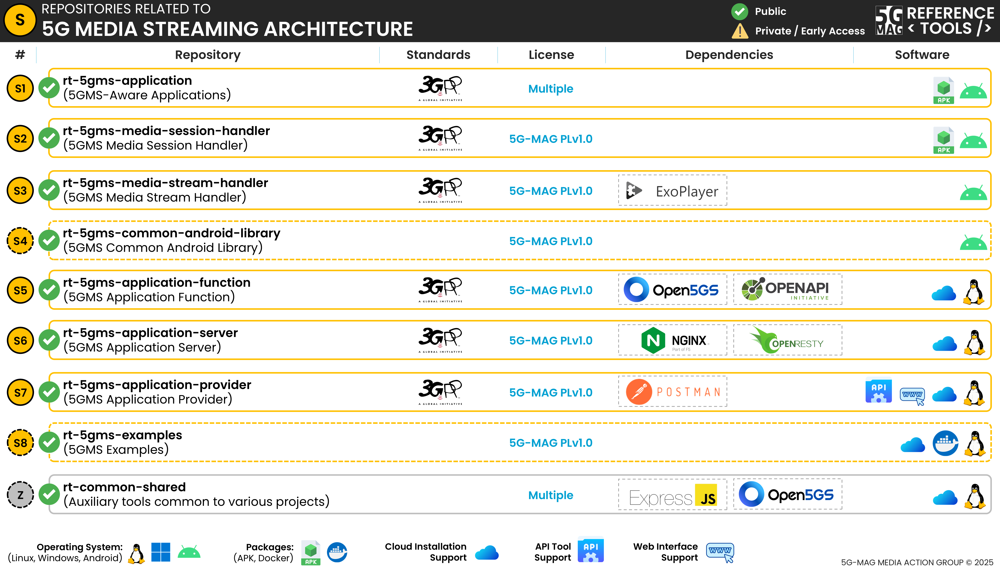

 

1. TOC
{:toc}

# Repositories

---

## 5GMS-Aware Application: [rt-5gms-application](https://github.com/5G-MAG/rt-5gms-application)

The 5GMS Aware Application is an Android application that serves as a reference implementation for 5GMS downlink
media streaming. It uses the Media Stream Handler for playback and communication with the Media Session Handler.

* [Information and how to download, build, install and run](https://github.com/5G-MAG/rt-5gms-application#readme)
* [Releases](https://github.com/5G-MAG/rt-5gms-application/releases) (pre-built APK available)

## 5GMS Media Session Handler: [rt-5gms-media-session-handler](https://github.com/5G-MAG/rt-5gms-media-session-handler)
The 5GMS Media Session Handler is a 5GMS Client component that forms part of the 5G Media Services framework as defined
in ETSI TS 126.501.

A Media Session Handler first retrieves its configuration (“Service Access Information”) from the 5GMSd AF at reference
point M5d and then uses this configuration information to activate and exploit the currently provisioned 5GMSd features.
In addition, the Media Session Handler exposes APIs via M6 to the 5GMSd-Aware Application and to the Media Player (for
downlink streaming).

* [Information and how to download, build, install and run](https://github.com/5G-MAG/rt-5gms-media-session-handler#readme)
* [Releases](https://github.com/5G-MAG/rt-5gms-media-session-handler/releases) (pre-built APK available)

## 5GMSd Media Stream Handler: [rt-5gms-media-stream-handler](https://github.com/5G-MAG/rt-5gms-media-stream-handler)
* [Information and how to download, build, install and run](https://github.com/5G-MAG/rt-5gms-media-stream-handler#readme)
* [Releases](https://github.com/5G-MAG/rt-5gms-media-stream-handler/releases)
* [Packages](https://github.com/orgs/5G-MAG/packages?repo_name=rt-5gms-media-stream-handler)

## 5GMS Application Provider: [rt-5gms-application-provider](https://github.com/5G-MAG/rt-5gms-application-provider)

A 5GMS Application Provider uses the M1 interface of the Application Function to provision the network for media
streaming sessions that are operated by that 5GMS Application Provider. For downlink media streaming, these sessions may
be DASH streaming sessions, progressive download sessions, or any other type of media streaming or distribution (e.g.
HLS) sessions.

The 5G-MAG Reference Tools ship with multiple tools to interact with the 5GMS Application Function via the interface at
reference point M1.

* [Information and how to download, build, install and run](https://github.com/5G-MAG/rt-5gms-application-provider#readme)
* [Releases](https://github.com/5G-MAG/rt-5gms-application-provider/releases)
* [Projects](https://github.com/5G-MAG/rt-5gms-application-provider/projects?query=is%3Aopen)

## 5GMSd Application Function: [rt-5gms-application-function](https://github.com/5G-MAG/rt-5gms-application-function)
* [Information and how to download, build, install and run](https://github.com/5G-MAG/rt-5gms-application-function#readme)
* [Guidelines, development and testing](https://github.com/5G-MAG/rt-5gms-application-function/wiki)
* [Releases](https://github.com/5G-MAG/rt-5gms-application-function/releases)
* [Projects](https://github.com/5G-MAG/rt-5gms-application-function/projects?query=is%3Aopen)

## 5GMSd Application Server: [rt-5gms-application-server](https://github.com/5G-MAG/rt-5gms-application-server)

The 5GMS Application Server (AS) is a Network Function that forms part of the 5G Media Services framework as defined in
ETSI TS 126.501.

A 5GMS Downlink Application Server (5GMSd AS), which can be deployed in the 5G Core Network or in an External Data
Network, provides 5G Downlink Media Streaming services to 5GMSd Clients. This logical function embodies the data plane
aspects of the 5GMSd System that deals with proxying media content (similar to a Content Delivery Network). The content
is ingested from 5GMSd Application Providers at reference point M2d. Both push- and pull-based ingest methods are
supported, based on HTTP. Ingested content is distributed to 5GMSd clients at reference point M4d (after possible
manipulation by the 5GMSd AS). Standard pull-based content retrieval protocols (e.g. DASH) are supported at this
reference point.

* [Information and how to download, build, install and run](https://github.com/5G-MAG/rt-5gms-application-server#readme)
* [Guidelines, development and testing](https://github.com/5G-MAG/rt-5gms-application-server/wiki)
* [Releases](https://github.com/5G-MAG/rt-5gms-application-server/releases)
* [Projects](https://github.com/5G-MAG/rt-5gms-application-server/projects?query=is%3Aopen)

---

## Auxiliary repositories

### 5GMS Common Android Library: [rt-5gms-common-android-library](https://github.com/5G-MAG/rt-5gms-common-android-library)
* [Information and how to download, build, install and run](https://github.com/5G-MAG/rt-5gms-common-android-library#readme)
* [Releases](https://github.com/5G-MAG/rt-5gms-common-android-library/releases)
* [Packages](https://github.com/orgs/5G-MAG/packages?repo_name=rt-5gms-common-android-library)

### 5GMS Examples: [rt-5gms-examples](https://github.com/5G-MAG/rt-5gms-examples)
* [Information](https://github.com/5G-MAG/rt-5gms-examples#readme)
* [Releases](https://github.com/5G-MAG/rt-5gms-examples/releases)

### Tools common to various projects: [rt-common-shared](https://github.com/5G-MAG/rt-common-shared)
* [Information](https://github.com/5G-MAG/rt-common-shared#readme)
