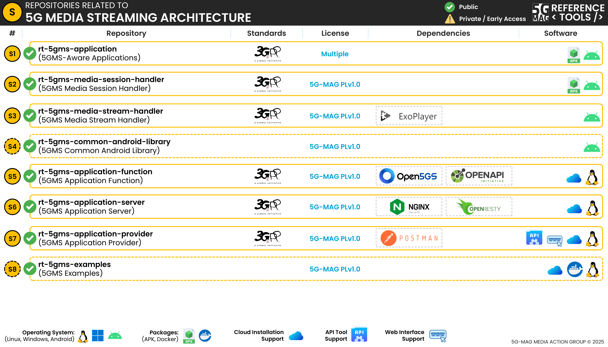

# Context of the repositories

## 5G Media Streaming

### High-level architecture

### Repositories

 * Check [here](./repositories.html#access-to-the-5g-media-streaming-repositories) to access the repositories for 5G Media Streaming

## 5G Media Streaming with 3GPP RAN and Core Platforms

### High-level architecture

 * Check [here](./repositories.html#access-to-the-5g-media-streaming-repositories) to access the repositories for 5G Media Streaming
 * Check [here](../3gpp-ran-and-core-platforms/repositories.html#access-to-the-3gpp-ran-and-core-platforms-repositories) to access the repositories for 3GPP RAN and Core Platforms

## 5G Media Streaming with 5G Core Network Components

### High-level architecture

### Repositories

 * Check [here](./repositories.html#access-to-the-5g-media-streaming-repositories) to access the repositories for 5G Media Streaming
 * Check [here](../5g-core-network-components/repositories.html#access-to-the-5g-core-network-components-repositories) to access the repositories for 5G Core Network Components

## 5G Media Streaming with UE Data Collection, Reporting and Event Exposure

### High-level architecture

### Repositories

 * Check [here](./repositories.html#access-to-the-5g-media-streaming-repositories) to access the repositories for 5G Media Streaming
 * Check [here](../ue-data-collection-reporting-exposure/repositories.html#access-to-the-ue-data-collection-reporting-and-event-exposure-repositories) the repositories for UE Data Collection, Reporting and Event Exposure

# Access to the 5G Media Streaming repositories

Note that 5G Media Streaming makes use of other generic [5G Core Network components](https://5g-mag.github.io/Getting-Started/pages/5g-core-network-components/)
Pre-built APKs are available for the 5GMS Aware Application and the 5GMS Media Session Handler (see below).

## 5GMS Application Provider: [rt-5gms-application-provider](https://github.com/5G-MAG/rt-5gms-application-provider)
* [Information and how to download, build, install and run](https://github.com/5G-MAG/rt-5gms-application-provider#readme)
* [Releases](https://github.com/5G-MAG/rt-5gms-application-provider/releases)
* [Projects](https://github.com/5G-MAG/rt-5gms-application-provider/projects?query=is%3Aopen)

## 5GMSd Application Function: [rt-5gms-application-function](https://github.com/5G-MAG/rt-5gms-application-function)
* [Information and how to download, build, install and run](https://github.com/5G-MAG/rt-5gms-application-function#readme)
* [Guidelines, development and testing](https://github.com/5G-MAG/rt-5gms-application-function/wiki)
* [Releases](https://github.com/5G-MAG/rt-5gms-application-function/releases)
* [Projects](https://github.com/5G-MAG/rt-5gms-application-function/projects?query=is%3Aopen)

## 5GMSd Application Server: [rt-5gms-application-server](https://github.com/5G-MAG/rt-5gms-application-server)
* [Information and how to download, build, install and run](https://github.com/5G-MAG/rt-5gms-application-server#readme)
* [Guidelines, development and testing](https://github.com/5G-MAG/rt-5gms-application-server/wiki)
* [Releases](https://github.com/5G-MAG/rt-5gms-application-server/releases)
* [Projects](https://github.com/5G-MAG/rt-5gms-application-server/projects?query=is%3Aopen)

## 5GMSd Media Session Handler: [rt-5gms-media-session-handler](https://github.com/5G-MAG/rt-5gms-media-session-handler)
* [Information and how to download, build, install and run](https://github.com/5G-MAG/rt-5gms-media-session-handler#readme)
* [Releases](https://github.com/5G-MAG/rt-5gms-media-session-handler/releases) (pre-built APK available)

## 5GMSd Media Stream Handler: [rt-5gms-media-stream-handler](https://github.com/5G-MAG/rt-5gms-media-stream-handler)
* [Information and how to download, build, install and run](https://github.com/5G-MAG/rt-5gms-media-stream-handler#readme)
* [Releases](https://github.com/5G-MAG/rt-5gms-media-stream-handler/releases)
* [Packages](https://github.com/orgs/5G-MAG/packages?repo_name=rt-5gms-media-stream-handler)

## 5GMSd-Aware Applications: [rt-5gms-application](https://github.com/5G-MAG/rt-5gms-application)
* [Information and how to download, build, install and run](https://github.com/5G-MAG/rt-5gms-application#readme)
* [Releases](https://github.com/5G-MAG/rt-5gms-application/releases) (pre-built APK available)

# Auxiliary repositories

## 5GMSd Common Android Library: [rt-5gms-common-android-library](https://github.com/5G-MAG/rt-5gms-common-android-library)
* [Information and how to download, build, install and run](https://github.com/5G-MAG/rt-5gms-common-android-library#readme)
* [Releases](https://github.com/5G-MAG/rt-5gms-common-android-library/releases)
* [Packages](https://github.com/orgs/5G-MAG/packages?repo_name=rt-5gms-common-android-library)

## 5GMSd Examples: [rt-5gms-examples](https://github.com/5G-MAG/rt-5gms-examples)
* [Information](https://github.com/5G-MAG/rt-5gms-examples#readme)
* [Releases](https://github.com/5G-MAG/rt-5gms-examples/releases)

## Tools common to various projects: [rt-common-shared](https://github.com/5G-MAG/rt-common-shared)
* [Information](https://github.com/5G-MAG/rt-common-shared#readme)
