 

[Scope](./scope.html){: .btn .btn-blue } [Project Roadmap](./projects.html){: .btn .btn-blue } [GitHub Repos](./repositories.html){: .btn .btn-github } [Releases](../releases.html#project-5g-media-streaming){: .btn .btn-release } [Tutorials](./tutorials.html){: .btn .btn-tutorial } [Requirements](./requirements.html){: .btn .btn-blue }

# Scope

In the context of 3GPP standards, 5G Media Streaming (5GMS) is defined as a framework designed to enable high-quality, efficient delivery of media. The architecture supports services from mobile network operators and third parties including both Downlink (5GMSd) and Uplink (5GMSu) Media Streaming. The 5GMS architecture is functionally divided into independent components enabling deployments with various degrees of integration between 5G MNOs and Content Providers.

A list of relevant specifications can be found in the link below.

[Specifications](https://hub.5g-mag.com/Standards/pages/5g-media-streaming.html){: .btn .btn-blue }

Technical documentation including explainers can be found in the link below.

[Technical Documentation](https://hub.5g-mag.com/Tech/pages/5g-media-streaming.html){: .btn .btn-blue }

# What is being implemented? 

{: .inshort }
The functional entities of 5G Media Streaming, instantiated for 5G Unicast Downlink Media Streaming (5GMSd), including support for various of the features specified, reference points and APIs.

## 5G Unicast Downlink Media Streaming (5GMSd)

A functional 5GMSd implementation is available with the building blocks highlighted with the green tick below.

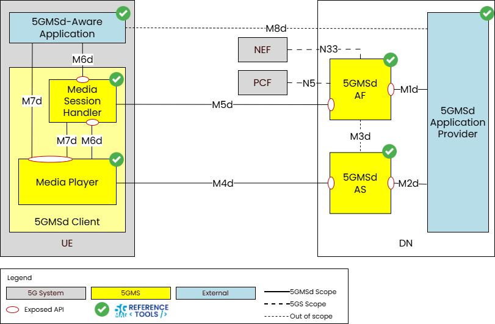

This includes the implementation of the following entities: **5GMSd Application Provider**, **5GMSd AS**, **5GMSd AF**, **5GMSd Client** (with **Media Session Handler** and **Media Player**) and **5GMSd-Aware Application**.

[To the GitHub Repos](./repositories.html){: .btn .btn-github }

The following tutorials cover the deployment of an end-to-end 5GMSd implementation.

[Go to the Tutorial: 5G MSd End-to-End deployment (with Docker)](./tutorials/end-to-end.html){: .btn .btn-tutorial }
[Go to the Tutorial: 5G MSd End-to-End deployment with 5G Network](./tutorials/end-to-end-with-5g.html){: .btn .btn-tutorial }

The following tutorials cover the deployment and testing of 5GMSd AS and AF.

[Go to the Tutorial: Developing and Testing the 5GMS Application Server](./tutorials/testing-AS.html){: .btn .btn-tutorial }
[Go to the Tutorial: Testing the 5GMS Application Function](./tutorials/testing-AF.html){: .btn .btn-tutorial }
[Go to the Tutorial: Testing M1 and M5 APIs with Postman](./tutorials/testing-postman.html){: .btn .btn-tutorial }

Note that before the required features of the 5GMS System can be used by 5GMS Clients, they are first provisioned by a 5GMS Application Provider creating one or more _Provisioning Sessions_. The 5GMSd Application Provider can then specify one or more 5GMSd features in the Provisioning Session. The Provisioning Session information may include Content Hosting Configurations, Content Preparation Templates, Server Certificates, Policy Templates, a Consumption Reporting Configuration, Metrics Reporting Configurations, Edge Resources Configurations and Event Data Processing Configurations.

Once created, this is a representation of a Provisioning Session:

```
{
  "provisioningSessionId": "string",
  "provisioningSessionType": "DOWNLINK",
  "aspId": "string",
  "appId": "string",
  "serverCertificateIds": [
    "string"
  ],
  "contentPreparationTemplateIds": [
    "string"
  ],
  "metricsReportingConfigurationIds": [
    "string"
  ],
  "policyTemplateIds": [
    "string"
  ],
  "edgeResourcesConfigurationIds": [
    "string"
  ],
  "eventDataProcessingConfigurationIds": [
    "string"
  ]
}
```

Where:
- `provisioningSessionId`: String chosen by the 5GMS AF to serve as an identifier in a resource URI.
- `provisioningSessionType`: This string provides forward-compatibility with future extensions to the enumeration but is not used to encode content defined in the present version of this API.
- `aspId`: Contains an identity of an application service provider.
- `appId`: String providing an application identifier.

## Feature: Content Hosting

The content hosting feature provides a service equivalent to a Content Delivery Network (CDN) deployed inside or outside the Trusted DN. It includes selecting the ingest protocol and format, caching and proxying of media objects, content preparation, access protection (e.g. URL signing) and indicating a target distribution area (e.g. through geofencing).

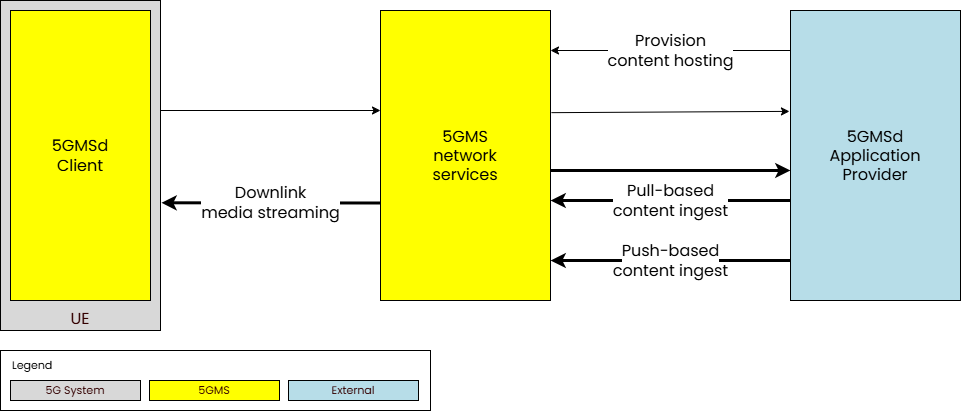

The following are the reference points and APIs.

- At M1:
  - [Provisioning Sessions API](https://jdegre.github.io/loader.html?yaml=TS26512_M1_ProvisioningSessions.yaml)
  - [Content protocols discovery API](https://jdegre.github.io/loader.html?yaml=TS26512_M1_ContentProtocolsDiscovery.yaml)
  - [Server Certificates provisioning API](https://jdegre.github.io/loader.html?yaml=TS26512_M1_ServerCertificatesProvisioning.yaml)
  - [Content Preparation Templates provisioning API](https://jdegre.github.io/loader.html?yaml=TS26512_M1_ContentPreparationTemplatesProvisioning.yaml)
  - [Edge Resources provisioning API](https://jdegre.github.io/loader.html?yaml=TS26512_M1_EdgeResourcesProvisioning.yaml)
  - [Policy Templates provisioning API](https://jdegre.github.io/loader.html?yaml=TS26512_M1_PolicyTemplatesProvisioning.yaml)
  - [Content Hosting provisioning API](https://jdegre.github.io/loader.html?yaml=TS26512_M1_ContentHostingProvisioning.yaml)

- At M5:
  - [Service Access Information API](https://jdegre.github.io/loader.html?yaml=TS26512_M5_ServiceAccessInformation.yaml)

Once a Provisioning Session is established using the API at interface M1d, **Content Hosting** can be configured. The security of the content published to the 5GMS System may be guaranteed by a provisioned **Server Certificate**.

This is a JSON scheme of a Content Hosting Configuration:

```
{
  "name": "string",
  "ingestConfiguration": {
    "pull": true,
    "protocol": "string",
    "baseURL": "string"
  },
  "distributionConfigurations": [
    {
      "entryPoint": {
        "relativePath": "string",
        "contentType": "string",
        "profiles": [
          "string"
        ]
      },
      "contentPreparationTemplateId": "string",
      "edgeResourcesConfigurationId": "string",
      "canonicalDomainName": "string",
      "domainNameAlias": "string",
      "baseURL": "string",
      "pathRewriteRules": [
        {
          "requestPathPattern": "string",
          "mappedPath": "string"
        }
      ],
      "cachingConfigurations": [
        {
          "urlPatternFilter": "string",
          "cachingDirectives": {
            "statusCodeFilters": [
              0
            ],
            "noCache": true,
            "maxAge": 0
          }
        }
      ],
      "geoFencing": {
        "locatorType": "string",
        "locators": [
          "string"
        ]
      },
      "urlSignature": {
        "urlPattern": "string",
        "tokenName": "string",
        "passphraseName": "string",
        "passphrase": "string",
        "tokenExpiryName": "string",
        "useIPAddress": true,
        "ipAddressName": "string"
      },
      "certificateId": "string",
      "supplementaryDistributionNetworks": [
        {
          "distributionNetworkType": "NETWORK_EMBMS",
          "distributionMode": "MODE_EXCLUSIVE"
        }
      ]
    }
  ]
}
```

Examples are available in: [https://github.com/5G-MAG/rt-5gms-examples/example-files](https://github.com/5G-MAG/rt-5gms-examples/example-files)

The following tutorials describe several steps showing how to create a Provisioning Session, add Content Hosting configuration and provisioning of Server Certificates.

[Go to the Tutorial: 5G MSd End-to-End deployment (with Docker)](./tutorials/end-to-end.html){: .btn .btn-tutorial }
[Go to the Tutorial: Testing the 5GMS Application Function](./tutorials/testing-AF.html){: .btn .btn-tutorial }
[Go to the Tutorial: Testing M1 and M5 APIs with Postman](./tutorials/testing-postman.html){: .btn .btn-tutorial }

## Feature: Network Assistance

The network assistance feature enables the 5GMS Client in the UE to interrogate or manipulate the network Quality of Service for an ongoing media streaming session. It defines two mechanisms for obtaining network assistance via interactions with the PCF (AF-based network assistance) or via ANBR signalling interactions between the UE modem and the RAN (ANBR-based network assistance). 

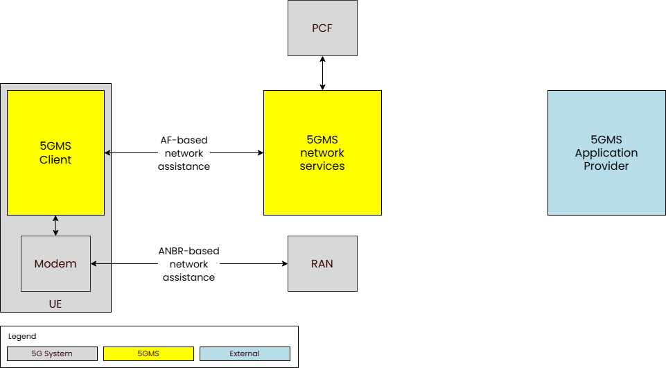

Both mechanisms allow to obtain:

* _Bit Rate Recommendation (Throughput Estimation)_, which allows the 5GMS Client to stay synchronized with the network's current capabilities.
  * The client asks the 5GMS System for a bit rate estimate. The system then queries the Policy Control Function (PCF) to determine the available throughput for that specific session.
  * The client uses this data to proactively adjust its streaming speed—either by switching media quality levels (downlink).
  * It prevents stuttering and lag, ensuring a stable and consistent Quality of Experience (QoE) by staying within the network's "QoS envelope."

* _Delivery Boost_, which is a reactive feature used to request extra network performance when needed.
  * The client requests a temporary increase in bit rate. The 5GMS System asks the PCF to modify the session parameters to grant this extra capacity.
  * If the network has spare capacity, the boost is granted. The client uses this "boost" of speed to quickly refill a depleted buffer or finish a large file transfer faster.
  * It helps the user recover from potential playback interruptions or speeds up time-sensitive data tasks.

The following are the reference points and APIs.

- At M5:
  - [Service Access Information API](https://jdegre.github.io/loader.html?yaml=TS26512_M5_ServiceAccessInformation.yaml)
  - [Network Assistance API](https://jdegre.github.io/loader.html?yaml=TS26512_M5_NetworkAssistance.yaml)

Note that the network assistance feature is not explicitly provisioned by the 5GMS Application Provider. It is either available for a particular media streaming session or not, depending on system pre-configuration and/or policy.

## Feature: Dynamic Policies

The dynamic policies feature enables the 5GMS Client in the UE to manipulate the network traffic handling policies for an ongoing media streaming session.

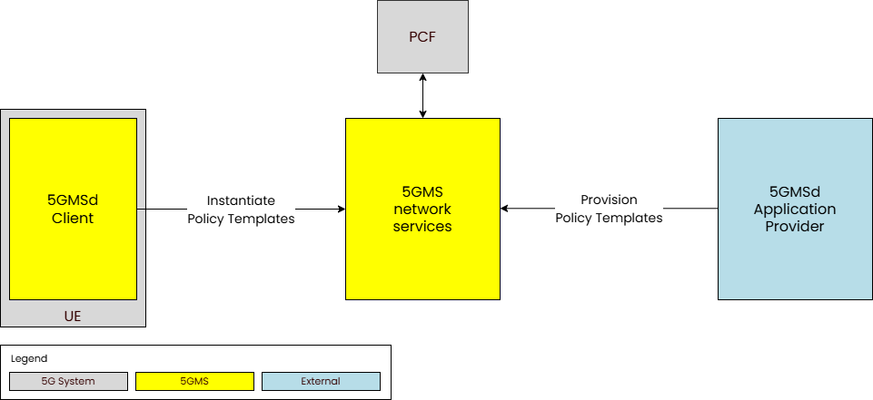

The following are the reference points and APIs.

- At M1:
  - [Provisioning Sessions API](https://jdegre.github.io/loader.html?yaml=TS26512_M1_ProvisioningSessions.yaml)
  - [Policy Templates provisioning API](https://jdegre.github.io/loader.html?yaml=TS26512_M1_PolicyTemplatesProvisioning.yaml)

- At M5:
  - [Service Access Information API](https://jdegre.github.io/loader.html?yaml=TS26512_M5_ServiceAccessInformation.yaml)
  - [Dynamic Policies API](https://jdegre.github.io/loader.html?yaml=TS26512_M5_DynamicPolicies.yaml)

When the dynamic policy feature is offered and selected, the 5GMSd Application Provider specifies a set of policies which can be invoked for the unicast downlink streaming session. The UE becomes aware of the 
selected policies in the form of a list of valid Policy Template Ids.

Examples are available in: [https://github.com/5G-MAG/rt-5gms-examples/example-files](https://github.com/5G-MAG/rt-5gms-examples/example-files)

This is a JSON scheme of a Policy Template:

```
{
  "externalReference": "string",
  "qoSSpecification": {
    "qosReference": "string",
    "maxBtrUl": "string",
    "maxBtrDl": "string",
    "maxAuthBtrUl": "string",
    "maxAuthBtrDl": "string",
    "defPacketLossRateDl": 0,
    "defPacketLossRateUl": 0
  },
  "applicationSessionContext": {
    "sliceInfo": {
      "sst": 255,
      "sd": "string"
    },
    "dnn": "string"
  },
  "chargingSpecification": {
    "sponId": "string",
    "sponStatus": "SPONSOR_DISABLED",
    "gpsi": [
      "string"
    ]
  }
}
```

The following tutorials describe several steps showing how to create and provision Policy Templates.

[Go to the Tutorial: 5G MSd End-to-End deployment (with Docker)](./tutorials/end-to-end.html){: .btn .btn-tutorial }
[Go to the Tutorial: Testing the 5GMS Application Function](./tutorials/testing-AF.html){: .btn .btn-tutorial }
[Go to the Tutorial: Testing M1 and M5 APIs with Postman](./tutorials/testing-postman.html){: .btn .btn-tutorial }

## Feature: Consumption Reporting

The consumption reporting feature allows consumption of downlink media streaming to be logged by the 5GMS System and exposed for analysis.

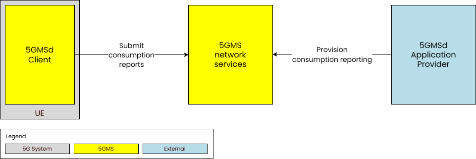

The following are the reference points and APIs.

- At M1:
  - [Provisioning Sessions API](https://jdegre.github.io/loader.html?yaml=TS26512_M1_ProvisioningSessions.yaml)
  - [Consumption Reporting provisioning API](https://jdegre.github.io/loader.html?yaml=TS26512_M1_ConsumptionReportingProvisioning.yaml)

- At M5:
  - [Service Access Information API](https://jdegre.github.io/loader.html?yaml=TS26512_M5_ServiceAccessInformation.yaml)
  - [Consumption Reporting API](https://jdegre.github.io/loader.html?yaml=TS26512_M5_ConsumptionReporting.yaml)

Once a Provisioning Session is established using the API at interface M1d, **Consumption Reporting** can be configured.

This is a JSON scheme of a Consumption Reporting Configuration:

```
{
  "reportingInterval": 1,
  "samplePercentage": 100,
  "locationReporting": true,
  "accessReporting": true
}
```

Examples are available in: [https://github.com/5G-MAG/rt-5gms-examples/example-files](https://github.com/5G-MAG/rt-5gms-examples/example-files)

The following tutorials describe several steps showing how to create a Consumption Reporting Configuration.

[Go to the Tutorial: 5G Media Streaming with Consumption Reporting](./tutorials/consumption-reporting.html){: .btn .btn-tutorial }
[Go to the Tutorial: Testing the 5GMS Application Function](./tutorials/testing-AF.html){: .btn .btn-tutorial }
[Go to the Tutorial: Testing M1 and M5 APIs with Postman](./tutorials/testing-postman.html){: .btn .btn-tutorial }

## Feature: QoE Metrics Reporting

The QoE metrics reporting feature enables the 5GMS System to log and expose streaming performance data for further analysis.

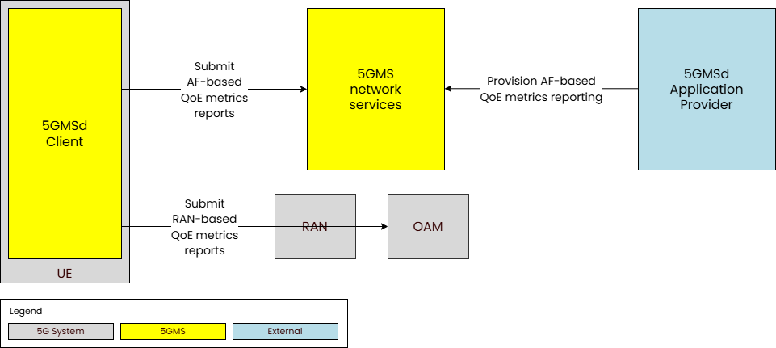

The framework defines two distinct reporting paths:

* RAN-based Reporting: Metrics are sent to the Operations, Administration, and Maintenance (OAM) system via the Radio Access Network.

* AF-based Reporting: Metrics are sent directly to the network-side components (AF) of the 5GMS System.

The following are the reference points and APIs.

- At M1:
  - [Provisioning Sessions API](https://jdegre.github.io/loader.html?yaml=TS26512_M1_ProvisioningSessions.yaml)
  - [Metrics Reporting provisioning API](https://jdegre.github.io/loader.html?yaml=TS26512_M1_MetricsReportingProvisioning.yaml)

- At M5:
  - [Service Access Information API](https://jdegre.github.io/loader.html?yaml=TS26512_M5_ServiceAccessInformation.yaml)
  - [Metrics Reporting API](https://jdegre.github.io/loader.html?yaml=TS26512_M5_MetricsReporting.yaml)

Once a Provisioning Session is established using the API at interface M1d, **QoE Metrics Reporting** can be configured.

This is a JSON scheme of a Metrics Reporting Configuration:

```
{
  "metricsReportingConfigurationId": "string",
  "sliceScope": [
    {
      "sst": 255,
      "sd": "string"
    }
  ],
  "scheme": "string",
  "dataNetworkName": "string",
  "reportingInterval": 0,
  "samplePercentage": 100,
  "urlFilters": [
    "string"
  ],
  "samplingPeriod": 0,
  "metrics": [
    "string"
  ]
}
```

Examples are available in: [https://github.com/5G-MAG/rt-5gms-examples/example-files](https://github.com/5G-MAG/rt-5gms-examples/example-files)

The following tutorials describe several steps showing how to create a QoE Metrics Reporting Configuration.

[Go to the Tutorial: 5G Media Streaming with QoE Metrics Reporting](./tutorials/metrics-reporting.html){: .btn .btn-tutorial }
[Go to the Tutorial: Testing the 5GMS Application Function](./tutorials/testing-AF.html){: .btn .btn-tutorial }
[Go to the Tutorial: Testing M1 and M5 APIs with Postman](./tutorials/testing-postman.html){: .btn .btn-tutorial }

## Feature: Data collection, reporting and exposure (TS 26.510)

The data collection, reporting and exposure feature enables the 5GMS System to log data relating to media streaming sessions and to expose this to 
subscribers in the form of Events.

The following are the reference points and APIs.

- At M1:
  - [Event Data Processing provisioning API](https://jdegre.github.io/loader.html?yaml=TS26512_M1_EventDataProcessingProvisioning.yaml)

- At M5
  - [Metrics Reporting API](https://jdegre.github.io/loader.html?yaml=TS26512_M5_MetricsReporting.yaml)
  - [Consumption Reporting API](https://jdegre.github.io/loader.html?yaml=TS26512_M5_ConsumptionReporting.yaml)

## Summary of features supported by the 5GMS Application Function

The release versions of the 5GMSd Application Function support differing sets of interfaces, as described by the different
versions of the 3GPP specifications, and differing levels of feature support for those interfaces. The following attempts to capture
the feature sets and specification versions for each release, starting with the most recent release or upcoming releases.

### Key

Where a feature of the specifications is supported the entry will be marked with &#x2611;, where it is being worked on and slated for the next release the feature will be marked with &#x270E; and where it is unimplemented in that
version the feature will be marked with &#x2610;.

<table><thead>
<tr><th>Interface reference point</th><th>Specifications & Versions</th><th>Protocols</th><th>Features</th></tr>
</thead>
<tbody>
<tr valign="top"><td>M1 (server)</td><td><ul>
  <li>TS 26.501 v17.6.0</li>
  <li>TS 26.512 v17.6.0</li>
</ul></td><td><ul>
  <li>&#x2611; HTTP/1.1</li>
  <li>&#x2610; HTTP/2.0</li>
  <li>&#x2611; HTTP/1.1 over SSL/TLS</li>
  <li>&#x2610; HTTP/2.0 over SSL/TLS</li>
</ul></td><td><ul>
  <li>&#x2611; Content Hosting Provisioning</li>
  <li>&#x2611; Content Protocols Discovery</li>
  <li>&#x2611; Provisioning Sessions</li>
  <li>&#x2611; Server Certificates Provisioning</li>
  <li>&#x2611; Consumption Reporting Provisioning</li>
  <li>&#x2610; Content Preparation Templates Provisioning</li>
  <li>&#x2610; Edge Resources Provisioning</li>
  <li>&#x2610; Event Data Processing Provisioning</li>
  <li>&#x2611; Metrics Reporting Provisioning</li>
  <li>&#x2611; Policy Templates Provisioning</li>
</ul></td></tr>
<tr valign="top"><td>M3 (client)</td><td><ul>
  <li>5G-MAG prototype</li>
</ul></td><td><ul>
  <li>&#x2611; HTTP/1.1</li>
  <li>&#x2611; HTTP/2.0</li>
  <li>&#x2611; HTTP/1.1 over SSL/TLS</li>
  <li>&#x2611; HTTP/2.0 over SSL/TLS</li>
</ul></td><td><ul>
  <li>&#x2611; Content Hosting Provisioning</li>
  <li>&#x2611; Server Certificates Provisioning</li>
</ul></td></tr>
<tr valign="top"><td>M5 (server)</td><td><ul>
  <li>TS 26.501 v17.6.0</li>
  <li>TS 26.512 v17.6.0</li>
</ul></td><td><ul>
  <li>&#x2611; HTTP/1.1</li>
  <li>&#x2610; HTTP/2.0</li>
  <li>&#x2611; HTTP/1.1 over SSL/TLS</li>
  <li>&#x2610; HTTP/2.0 over SSL/TLS</li>
</ul></td><td><ul>
  <li>&#x2611; Service Access Information</li>
  <li>&#x2611; Consumption Reporting</li>
  <li>&#x2611; Dynamic Policies<br />
      &nbsp; <b>Service Data Flow Description Methods:</b><ul>
    <li>&#x2610; 2 Tuple</li>
    <li>&#x2611; 5 Tuple</li>
    <li>&#x2610; ToS</li>
    <li>&#x2610; Flow Label</li>
    <li>&#x2610; Domain Name</li>
  </ul></li>
  <li>&#x2611; Metrics Reporting</li>
  <li>&#x2611; Network Assistance<ul>
    <li>&#x2610; Throughput Estimation</li>
    <li>&#x2611; Delivery Boost</li>
  </ul></li>
</ul></td></tr>
<tr valign="top"><td>N5 (Npcf client/server)</td><td><ul>
  <li>TS 29.514 v17.8.0</li>
</ul></td><td><ul>
  <li>&#x2611; HTTP/2.0</li>
  <li>&#x2611; HTTP/2.0 over SSL/TLS</li>
</ul></td><td><ul>
  <li>&#x2611; Policy Authorization</li>
  <li>&#x2611; Policy Authorization Notifications</li>
</ul></td></tr>
<tr valign="top"><td>N33 (client)</td><td><ul>
  <li>TS 29.591 v17.9.0</li>
</ul></td><td><ul>
  <li>&#x2610; HTTP/2.0</li>
  <li>&#x2610; HTTP/2.0 over SSL/TLS</li>
</ul></td><td><ul>
  <li>&#x2610; Event Exposure</li>
</ul></td></tr>
<tr valign="top"><td>R4 (server)</td><td><ul>
  <li>TS 26.512 v17.6.0</li>
</ul></td><td><ul>
  <li>&#x2610; HTTP/1.1</li>
  <li>&#x2610; HTTP/2.0</li>
  <li>&#x2610; HTTP/1.1 over SSL/TLS</li>
  <li>&#x2610; HTTP/2.0 over SSL/TLS</li>
</ul></td><td><ul>
  <li>&#x2610; Media Streaming Access</li>
</ul></td></tr>
<tr valign="top"><td>R5/R6 (client/server)</td><td><ul>
  <li>TS 26.512 v17.6.0</li>
  <li>TS 29.517 v17.9.0</li>
</ul></td><td><ul>
  <li>&#x2610; HTTP/1.1</li>
  <li>&#x2610; HTTP/2.0</li>
  <li>&#x2610; HTTP/1.1 over SSL/TLS</li>
  <li>&#x2610; HTTP/2.0 over SSL/TLS</li>
</ul></td><td><ul>
  <li>&#x2610; Media Streaming QoE Event</li>
  <li>&#x2610; Media Streaming Consumption Event</li>
  <li>&#x2610; Media Streaming Network Assistance Invocation Event</li>
  <li>&#x2610; Media Streaming Dynamic Policy Invocation Event</li>
  <li>&#x2610; Media Streaming Access Event</li>
  <li>&#x2610; Event Subscription</li>
</ul></td></tr>
<tr valign="top"><td>Nbsf (client)</td><td><ul>
  <li>TS 29.513 v17.10.0</li>
  <li>TS 29.521 v17.8.0</li>
</ul></td><td><ul>
  <li>&#x2611; HTTP/2.0</li>
  <li>&#x2611; HTTP/2.0 over SSL/TLS</li>
</ul></td><td><ul>
  <li>&#x2611; Binding Information Retrieval</li>
</ul></td></tr>
</tbody>
<tfoot>
<!--<tr><td colspan="4"><b>Notes:</b><br />1: Only the Delivery Boost feature of Network Assistance is implemented, the Throughput Estimation feature is still in development.</td></tr> -->
</tfoot>
</table>

## Summary of APIs supported for 5G Media Streaming

## Relevant specifications
The table contains the 3GPP 5G Media Streaming APIs for Release 17 (TS 26.512) and Release 18 (TS 26.510 & TS 26.512). Note that the current reference implementation of the 5GMSd AF and 5GMSd AS are based on Release 17 (TS 26.510 does not exist in Release 17). In Release 18, the media session handling APIs were moved from TS 26.512 into TS 26.510 to generalise them to support the Real-Time media Communication (RTC) System as well as the 5G Media Streaming (5GMS) System.
More information about the relevant specifications can be found in the following pages:
 - 5G Media Streaming Architecture: [Standards pages](https://5g-mag.github.io/Standards/pages/5g-media-streaming.html)
 - UE Data Collection and Event Exposure: [Standards pages](https://5g-mag.github.io/Standards/pages/data-collection-event-exposure.html)

 Release 17 | Release 18
 ---------- | ----------
 <span style="color: green;font-weight:bold;">TS26512_CommonData.yaml</span> 	| TS26510_CommonData.yaml, TS26512_CommonData.yaml |
 <span style="color: green;font-weight:bold;">TS26512_M1_ConsumptionReportingProvisioning.yaml</span>  | TS26510_Maf_Provisioning_ConsumptionReporting.yaml
 <span style="color: green;font-weight:bold;">TS26512_M1_ContentHostingProvisioning.yaml</span>  | TS26510_Maf_Provisioning_ContentHosting.yaml
 TS26512_M1_ContentPreparationTemplatesProvisioning.yaml | TS26510_Maf_Provisioning_ContentPreparationTemplates.yaml
 <span style="color: green;font-weight:bold;">TS26512_M1_ContentProtocolsDiscovery.yaml</span>  |	TS26510_Maf_Provisioning_ContentProtocols.yaml
 TS26512_M1_EdgeResourcesProvisioning.yaml | TS26510_Maf_Provisioning_EdgeResources.yaml
 TS26512_M1_EventDataProcessingProvisioning.yaml | TS26510_Maf_Provisioning_EventDataProcessing.yaml
 <span style="color: green;font-weight:bold;">TS26512_M1_MetricsReportingProvisioning.yaml</span>  | TS26510_Maf_Provisioning_MetricsReporting.yaml
 <span style="color: green;font-weight:bold;">TS26512_M1_PolicyTemplatesProvisioning.yaml</span>  | TS26510_Maf_Provisioning_PolicyTemplates.yaml
 <span style="color: green;font-weight:bold;">TS26512_M1_ProvisioningSessions.yaml</span>  | TS26510_Maf_Provisioning_ProvisioningSessions.yaml
 <span style="color: green;font-weight:bold;">TS26512_M1_ServerCertificatesProvisioning.yaml</span>  | TS26510_Maf_Provisioning_ServerCertificates.yaml
 N/A | TS26510_Maf_Provisioning_ContentPublishing.yaml
 N/A | TS26510_Maf_Provisioning_RealTimeCommunication.yaml
 <span style="color: green;font-weight:bold;">TS26512_M5_ConsumptionReporting.yaml</span>  | TS26510_Maf_SessionHandling_ConsumptionReporting.yaml
 <span style="color: green;font-weight:bold;">TS26512_M5_DynamicPolicies.yaml</span>  | TS26510_Maf_SessionHandling_DynamicPolicy.yaml
 <span style="color: green;font-weight:bold;">TS26512_M5_MetricsReporting.yaml</span>  | TS26510_Maf_SessionHandling_MetricsReporting.yaml
 <span style="color: green;font-weight:bold;">TS26512_M5_NetworkAssistance.yaml</span>  | TS26510_Maf_SessionHandling_NetworkAssistance.yaml
 <span style="color: green;font-weight:bold;">TS26512_M5_ServiceAccessInformation.yaml</span>  | TS26510_Maf_SessionHandling_ServiceAccessInformation.yaml
 PreStd* | TS26512_Mas_Configuration_ContentHosting.yaml
 PreStd* | TS26512_Mas_Configuration_ContentPreparationTemplates.yaml
 PreStd* | TS26512_Mas_Configuration_ContentPublishing.yaml
 PreStd* | TS26512_Mas_Configuration_ServerCertificates.yaml
 N/A | <span style="color: orange;font-weight:bold;">TS26512_R2_DataReporting.yaml</span>
 TS26512_R4_DataReporting.yaml | <span style="color: orange;font-weight:bold;">TS26512_R4_DataReporting.yaml</span>
 N/A | <span style="color: orange;font-weight:bold;">TS26512_EventExposure.yaml</span>

### Legend

<span style="color: green;font-weight:bold;">TEXT</span> = Already implemented in 5G-MAG Reference Tools

<span style="color: orange;font-weight:bold;">TEXT</span> = In the implementation roadmap in 5G-MAG Reference Tools

PreStd* = Implementatio of a pre-standardisation variant of the 5GMS AS configuration API at reference point M3d that is similar to what eventually appeared in Release 18. The service name is different and so are some details.
 
{: .note }
Note that not all aspects of these APIs are implemented. For example Content Preparation, Edge resources, Geo-fencing and URL signing in TS26512_M1_ContentHostingProvisioning.yaml are not implemented.

# High-level architectures

## 5G Downlink Media Streaming (5GMSd)

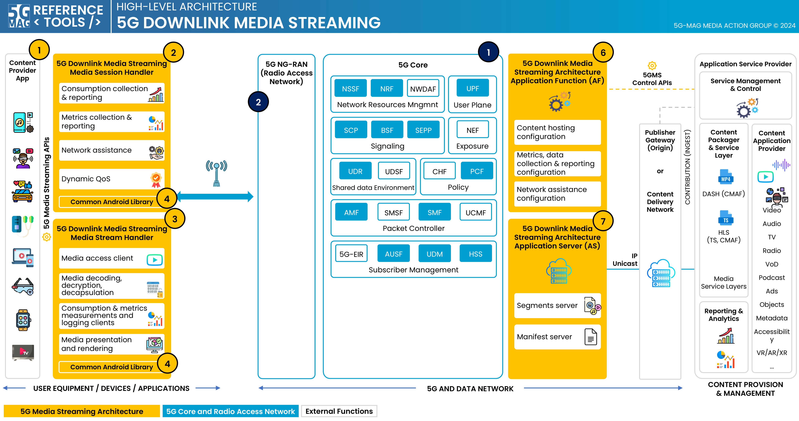

[5G Media Streaming: Repositories](../5g-media-streaming/repositories.html){: .btn .btn-5gms }
[3GPP RAN and Core Platforms: Repositories](../3gpp-ran-and-core-platforms/repositories.html){: .btn .btn-3gpp }
[Common Tools: Repositories](../common-tools/){: .btn .btn-common }

## 5G Downlink Media Streaming (5GMSd) with UE Data Collection Reporting and Event Exposure

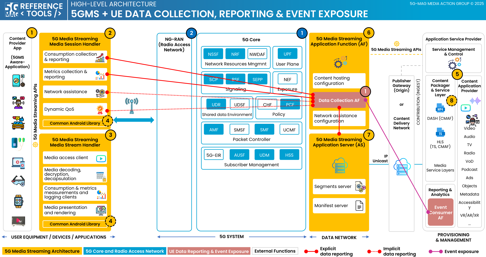

[5G Media Streaming: Repositories](../5g-media-streaming/repositories.html){: .btn .btn-5gms }
[UE Data Collection, Reporting and Event Exposure: Repositories](../ue-data-collection-reporting-exposure/repositories.html){: .btn .btn-uedc }
[3GPP RAN and Core Platforms: Repositories](../3gpp-ran-and-core-platforms/repositories.html){: .btn .btn-3gpp }
[Common Tools: Repositories](../common-tools/){: .btn .btn-common }

## 5G Downlink Media Streaming (5GMSd) with 5GC Service Consumers

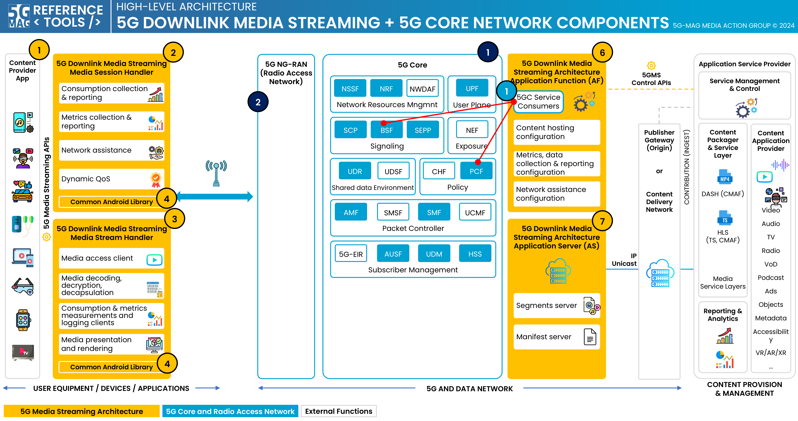

[5G Media Streaming: Repositories](../5g-media-streaming/repositories.html){: .btn .btn-5gms }
[5GC Service Consumers: Repositories](../5g-core-service-consumers/repositories.html){: .btn .btn-5gcsc }
[3GPP RAN and Core Platforms: Repositories](../3gpp-ran-and-core-platforms/repositories.html){: .btn .btn-3gpp }
[Common Tools: Repositories](../common-tools/){: .btn .btn-common }

## 5G Downlink Media Streaming (5GMSd) over eMBMS

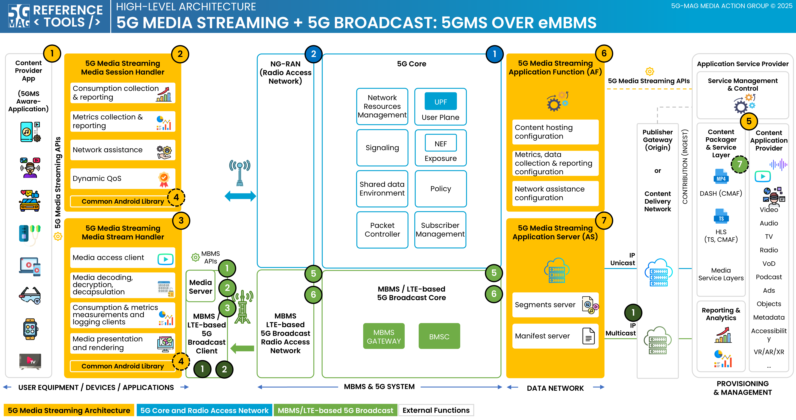

[5G Media Streaming: Repositories](../5g-media-streaming/repositories.html){: .btn .btn-5gms }
[5G Broadcast: Repositories](../lte-based-5g-broadcast/repositories.html){: .btn .btn-5gbc }
[Multimedia content delivery protocols: Repositories](../multimedia-content-delivery/repositories.html){: .btn .btn-md }
[3GPP RAN and Core Platforms: Repositories](../3gpp-ran-and-core-platforms/repositories.html){: .btn .btn-3gpp }
[Common Tools: Repositories](../common-tools/){: .btn .btn-common }

# Docker deployment support
Docker-Compose setups are provided to run the 5GMS Application Function, the 5GMS Application Server and the 5GMS Application Provider in Docker container environments.

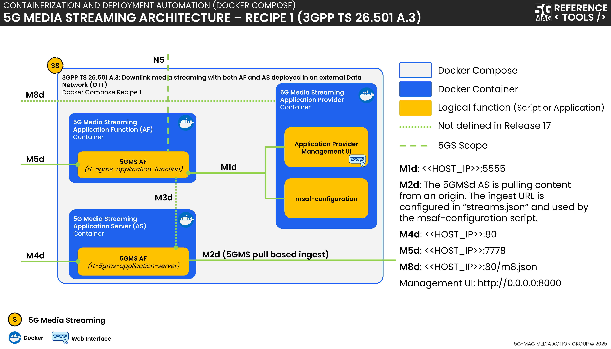

[5G Media Streaming: Repositories](../5g-media-streaming/repositories.html){: .btn .btn-5gms }
