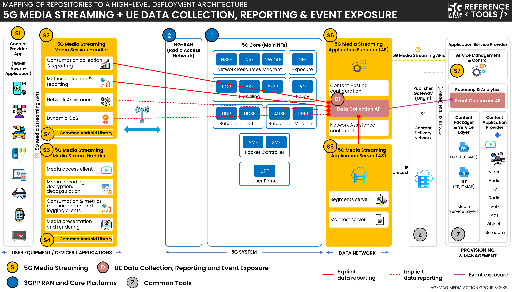

 

[Scope & Architectures](./scope.html){: .btn .btn-blue } [Project Roadmap](./projects.html){: .btn .btn-blue } [Features](./features.html){: .btn .btn-blue } [GitHub Repos](./repositories.html){: .btn .btn-github } [Releases](../releases.html#project-5g-media-streaming){: .btn .btn-release } [Tutorials](./tutorials.html){: .btn .btn-blue } [Requirements](./requirements.html){: .btn .btn-blue }

# Scope and Architectures

This page contains information such as the specifications within the scope of the tools and high-level architectures that bring context to their applicability.

## Technical Resources and Specifications

[Technical Resources](https://hub.5g-mag.com/Tech/pages/5g-media-streaming.html){: .btn .btn-blue } [Specifications](https://hub.5g-mag.com/Standards/pages/5g-media-streaming.html){: .btn .btn-blue }

# High-level architectures

## 5G Downlink Media Streaming (5GMSd)

[5G Media Streaming: Repositories](../5g-media-streaming/repositories.html){: .btn .btn-5gms }
[3GPP RAN and Core Platforms: Repositories](../3gpp-ran-and-core-platforms/repositories.html){: .btn .btn-3gpp }
[Common Tools: Repositories](../common-tools/){: .btn .btn-common }

## 5G Downlink Media Streaming (5GMSd) with UE Data Collection Reporting and Event Exposure

[5G Media Streaming: Repositories](../5g-media-streaming/repositories.html){: .btn .btn-5gms }
[UE Data Collection, Reporting and Event Exposure: Repositories](../ue-data-collection-reporting-exposure/repositories.html){: .btn .btn-uedc }
[3GPP RAN and Core Platforms: Repositories](../3gpp-ran-and-core-platforms/repositories.html){: .btn .btn-3gpp }
[Common Tools: Repositories](../common-tools/){: .btn .btn-common }

## 5G Downlink Media Streaming (5GMSd) with 5GC Service Consumers

[5G Media Streaming: Repositories](../5g-media-streaming/repositories.html){: .btn .btn-5gms }
[5GC Service Consumers: Repositories](../5g-core-service-consumers/repositories.html){: .btn .btn-5gcsc }
[3GPP RAN and Core Platforms: Repositories](../3gpp-ran-and-core-platforms/repositories.html){: .btn .btn-3gpp }
[Common Tools: Repositories](../common-tools/){: .btn .btn-common }

## 5G Downlink Media Streaming (5GMSd) over eMBMS

[5G Media Streaming: Repositories](../5g-media-streaming/repositories.html){: .btn .btn-5gms }
[5G Broadcast: Repositories](../lte-based-5g-broadcast/repositories.html){: .btn .btn-5gbc }
[Multimedia content delivery protocols: Repositories](../multimedia-content-delivery/repositories.html){: .btn .btn-md }
[3GPP RAN and Core Platforms: Repositories](../3gpp-ran-and-core-platforms/repositories.html){: .btn .btn-3gpp }
[Common Tools: Repositories](../common-tools/){: .btn .btn-common }

# Docker deployment support
Docker-Compose setups are provided to run the 5GMS Application Function, the 5GMS Application Server and the 5GMS Application Provider in Docker container environments.

[5G Media Streaming: Repositories](../5g-media-streaming/repositories.html){: .btn .btn-5gms }
