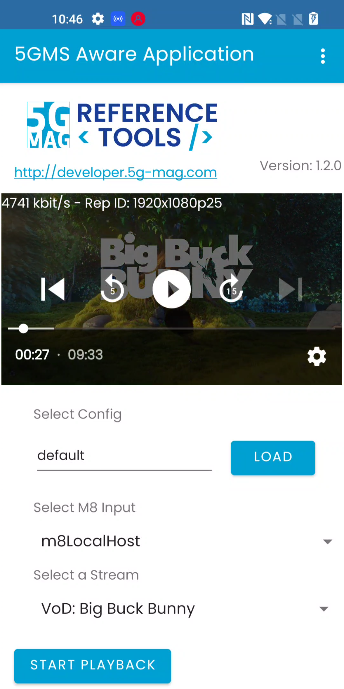
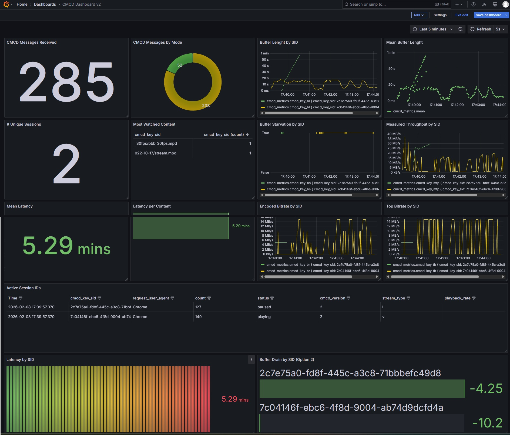
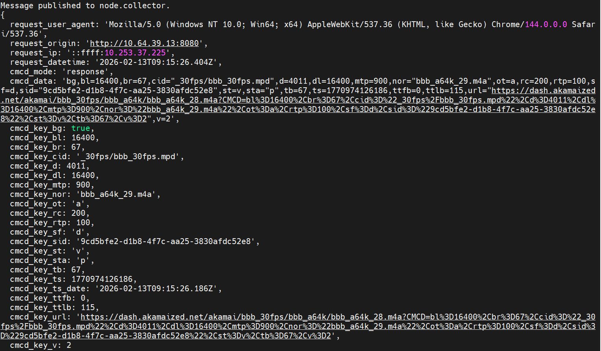

 

# Tutorial - CMCD Reporting
 
## Introduction
 
CMCD Reporting enables the collection of Common Media Client Data (CMCD, [CTA-5004](https://cdn.cta.tech/cta/media/media/resources/standards/pdfs/cta-5004-final.pdf)), a standardized mechanism that allows media players to expose playback metrics to the network. Reported metrics may include bitrate, measured throughput, buffer length, and playback status, providing visibility into media delivery performance and end-user QoE.
 
CMCD metrics are conveyed in-band with media requests using HTTP request headers or query parameters. During media delivery, the Application Server extracts the CMCD information from incoming requests and forwards the collected metrics to a CMCD Collector. The collected metrics can then be visualized through a dashboard, enabling operators and developers to monitor media sessions and analyze delivery behavior in real time.
 
This tutorial describes how to configure and enable CMCD Reporting in the 5G-MAG Reference Tools.

## Server-side Setup

### Step 1: Install the Application Function

For details please refer to the [corresponding section](end-to-end.html#1-installing-the-application-function) in
the [basic end-to-end guide](end-to-end.html).

### Step 2: Basic Configuration of the Application Function

Follow the [basic configuration steps](end-to-end.html#configuration-of-the-af) documented in
the [basic end-to-end guide](end-to-end.html).

### Step 3: Start the Application Function

Follow the [command](end-to-end.html#starting-the-af) documented in the [basic end-to-end guide](end-to-end.html).

### Step 4: Install the Application Server

For details please refer to the [corresponding section](end-to-end.html#2-installing-the-application-server) in
the [basic end-to-end guide](end-to-end.html).

### Step 5: Enable/Disable CMCD in the Application Server

Config the URL of CMCD Collector in `src/rt_5gms_as/context.py`:
- If you would like to enable CMCD Reporting, set the `cmcd_collector_url` like `"cmcd_collector_url = http://<CMCD_DASHBOARD_IP>:3000/cmcd/response-mode"`; just replace the `<CMCD_DASHBOARD_IP>` with the IP of the machine where the CMCD dashboard is running on. As an example, the `cmcd_collector_url` can look like this `http://10.64.39.13:3000/cmcd/response-mode`.
- If you would like to disable CMCD Reporting, leave the cmcd_collector_url NULL as default.

### Step 6: Start the Application Server

For details please refer to the [corresponding section](end-to-end.html#3-running-the-application-server) in
the [basic end-to-end guide](end-to-end.html).

### Step 7: Deploy the cmcd-toolkit

#### Step 7.1 Clone cmcd-toolkit 
````bash
git clone https://github.com/5G-MAG/cmcd-toolkit.git
````

#### Step 7.2 Compose
````bash
chmod 777 cmcd-toolkit/grafana/local-stack/dashboards/cmcd-dashboard.json
RUN docker compose up
````

#### Step 7.3 Login to grafana at http://<CMCD_DASHBOARD_IP>:8081
    + User: admin
    + Password: grafana

### Step 8: Verify the dashboard with fake CMCD message
Run the cmd below(replace the `<YOUR_MACHINE_IP_HERE>` with the IP of the machine that the 5GMS Application Server is running on). If works, you should see a new CMCD reporting has been received in the dashboard.
````bash
ts=$(date +%s%3N)
curl -i "http://<YOUR_MACHINE_IP_HERE>/media/test.m4s?CMCD=\
cid=\"_30fps/bbb2_30fps.mpd\",\
sid=\"demo\",\
su,\
br=1500,\
d=4000,\
bl=3500,\
tb=8000,\
dl=0,\
mtp=18000,\
nor=\"bbb2_30fps_2.m4s\",\
nrr=\"0-2000\",\
pr=1.0,\
sf=d,\
st=v,\
ot=i,\
ts=${ts},\
v=1"
````


## Client-side Setup
As we are all set on the server-side now we can focus on the client side.

### Step 1: Installation, Configuration and Running the 5GMSd Client
Please follow the instructions documented in the basic end-to-end guide setup guide.

### Step 2: Creating CMCD Report
While consuming content via our previously installed 5GMSd Application Server and 5GMSd Application Function the client is automatically collecting and sending CMCD Reports.

 

### Step 3: Inspecting the CMCD Report in Dashboard
Navigate to `http://<CMCD_DASHBOARD_IP>:8081/dashboards` in your browser, like below you should see:

 


## Network Impairment
To demonstrate how CMCD provides visibility into adaptive bitrate streaming behavior under changing network conditions, we use the NetEmu from the 5G-MAG 6G-Testbed project to add impairments to the network.

### Step 1: Clone the Repository

```bash
git clone https://github.com/5G-MAG/6G-Testbed.git
```

### Step 2: Install NetEmu
```bash
cd 6G-Testbed/netemu
pip install -e .
```

For details please refer to the [corresponding section](https://github.com/5G-MAG/6G-Testbed/tree/main/netemu).

### Step 3: Create an Impairment Profile
Add a new profile `1 Mbps bandwidth, 300 ms latency, 50 ms jitter, and 1% packet loss` to the `examples/profiles.yaml`:

```yaml
# Congested network profile
congested-test:
  description: "Heavy network congestion"
  delay_ms: 300
  jitter_ms: 50
  loss_pct: 1.0
  rate_mbit: 1  # Bandwidth limit (Mbps)
```

[!NOTE]
Remember to replace the `<network-interface>` with your network interface in the `profiles.yaml`, like this `default_interface: "eth0"`
`
```yaml
    # Default interface for network emulation
    default_interface: "<network-interface>"
```

### Apply the impairments

```bash
cd ..
python3 impair.py
```

### Check the applied impairments

```bash
tc class show dev <network-interface>
```

Example:

```bash
root@~$ tc class show dev eno1

class htb 1:11 parent 1:1 leaf 10: prio 0 rate 1Mbit ceil 1Mbit burst 1600b cburst 1600b
class htb 1:1 root rate 1Mbit ceil 1Mbit burst 1600b cburst 1600b
```

### Remove the Impairments

```bash
tc qdisc del dev <network-interface> root
```


## Logs for Debugging
### Nginx access（watch the CMCD msg AS received）:   
````bash
    docker exec -it <AS container ID> bash # enter the container
    ps -ef | grep nginx # Find log path
    tail -n 0 -f <Your access log path>
````

### Nginx error : 
````bash   
    docker exec -it <AS container ID> bash # enter the container
    ps -ef | grep nginx # Find log path
    tail -n 0 -f <Your error log path>
````

### CMCD Collector(watch the conversion result from CMCD v1 to v2):   
````bash
    docker logs -f --tail 10 cmcd-toolkit-collector-1
````
 

### Fluentd(watch the log of the dashboard database)
````bash
    docker logs cmcd-toolkit-fluentd-1 | grep -i "node.collector"
````

### Grafana(watch the log of the dashboard) 
````bash
    docker compose logs grafana | egrep -i "provision|dashboard|yaml|error|warn" | tail -n 200
````
    
    
## Database for Debugging
````bash
shilding@jianqin-gv:~$docker exec -it cmcd-toolkit-influxdb-1 influx
--------------
USE analytics;
SHOW MEASUREMENTS;
---------
SHOW FIELD KEYS FROM "cmcd_metrics";
SHOW TAG KEYS   FROM "cmcd_metrics"


SHOW TAG VALUES FROM "cmcd_metrics" WITH KEY = "cmcd_key_sid"
WHERE time > now() - 30m;

SELECT * FROM "cmcd_metrics" WHERE "cmcd_key_sid"='3f63f118-a5c5-44ba-a155-9522904b44cb' ORDER BY time DESC LIMIT 5;
SELECT * FROM "cmcd_metrics" WHERE "cmcd_key_sid"='demo' ORDER BY time DESC LIMIT 5;
SELECT COUNT(*) FROM "cmcd_metrics" WHERE "cmcd_key_sid"='demo';

shilding@jianqin-gv:~$ docker exec -it cmcd-toolkit-influxdb-1 influx
Connected to http://localhost:8086 version 1.8.10
InfluxDB shell version: 1.8.10
> USE analytics;
Using database analytics
> SHOW MEASUREMENTS;
name: measurements
name
----
cmcd_metrics
> SHOW FIELD KEYS FROM "cmcd_metrics";
name: cmcd_metrics
fieldKey         fieldType
--------         ---------
cmcd_data        string
cmcd_key_bg      boolean
cmcd_key_bl      integer
cmcd_key_br      integer
cmcd_key_bs      boolean
cmcd_key_d       integer
cmcd_key_dl      integer
cmcd_key_e       string
cmcd_key_ltc     integer
cmcd_key_msd     integer
cmcd_key_mtp     integer
cmcd_key_nor     string
cmcd_key_ot      string
cmcd_key_pr      float
cmcd_key_rc      integer
cmcd_key_rtp     integer
cmcd_key_sf      string
cmcd_key_st      string
cmcd_key_sta     string
cmcd_key_su      boolean
cmcd_key_tb      integer
cmcd_key_ts      integer
cmcd_key_ts_date string
cmcd_key_ttfb    integer
cmcd_key_ttlb    integer
cmcd_key_url     string
cmcd_key_v       integer
request_datetime string
request_origin   string
> SHOW TAG KEYS   FROM "cmcd_metrics"
name: cmcd_metrics
tagKey
------
cmcd_key_cid
cmcd_key_sid
cmcd_mode
request_ip
request_user_agent
````