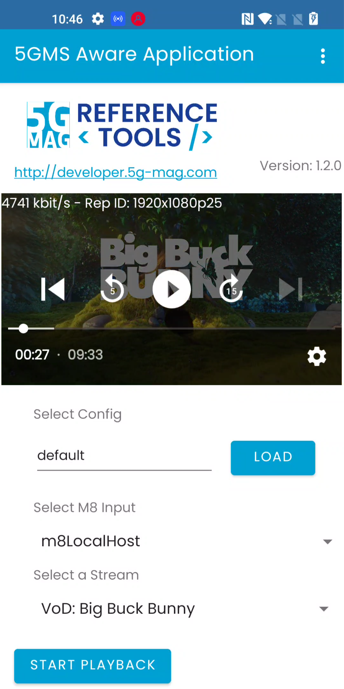

# Tutorial - Consumption Reporting

## Introduction

Consumption Collection and Reporting executes the collection of content consumption measurement logs
from the Media Player and sending of consumption reports to a 5GMSd AF about the currently consumed media
within the available presentation, about the UE capabilities and about the environment of the media session for
potential transport optimizations by the network or consumption report analysis.

To setup and enable Consumption Reporting we must first configure the 5GMS Application Function and the 5GMS Application
Server. Next, we start a 5GMS media streaming downlink session on the client-side. The resulting Consumption Reporting
reports can then be accessed from the local hard-drive.

## Server-side Setup

### Step 1: Install the Application Function

For details please refer to the [corresponding section](end-to-end.html#1-installing-the-application-function) in
the [basic end-to-end guide](end-to-end.html).

### Step 2: Install the Application Server

For details please refer to the [corresponding section](end-to-end.html#2-installing-the-application-server) in
the [basic end-to-end guide](end-to-end.html).

### Step 3: Start the Application Server

For details please refer to the [corresponding section](end-to-end.html#3-running-the-application-server) in
the [basic end-to-end guide](end-to-end.html).

### Step 4: Basic Configuration of the Application Function

Follow the [basic configuration steps](end-to-end.html#configuration-of-the-af) documented in
the [basic end-to-end guide](end-to-end.html).

### Step 5: Start the Application Function

Follow the [command](end-to-end.html#starting-the-af) documented in the [basic end-to-end guide](end-to-end.html).

### Step 6: Basic configuration of the Application Function

Follow the [steps](end-to-end.html#creating-a-content-hosting-configuration) to create a content hosting configuration
and a provisioning session using the `msaf-configuration` tool.

### Step 7: Adding a Consumption Reporting Configuration

Now that we have created a provisioning session we can add a Consumption configuration to that provisioning
session. In this guide we use
the [Postman Collection](https://github.com/5G-MAG/rt-5gms-application-provider/tree/master/postman) for this. However,
the same configuration is possible using any other REST client or
the [Management UI](https://github.com/5G-MAG/rt-5gms-application-provider/tree/master/management-ui).

#### Step 7.1 Install and Import the Postman Collection

Follow the instructions [here](https://github.com/5G-MAG/rt-5gms-application-provider/tree/master/postman) to install
and import the Postman collection.

#### Step 7.2 Retrieving the Provisioning Session ID

Open a browser and navigate to `http://<YOUR_MACHINE_IP>/m8.json`. Replace `<YOUR_MACHINE_IP_HERE>` with the IP of the
machine that the 5GMS Application Function is running on. Then copy the `provisioningSessionId` from the JSON to your
clipboard. As an example, the `m8.json` can look like this with a `provisioningSessionId` set
to `1fd61716-fe25-41ee-8d9e-cb36a16378a2`.

````json
{
  "m5BaseUrl": "http://192.168.2.7:7778/3gpp-m5/v2/",
  "serviceList": [
    {
      "provisioningSessionId": "1fd61716-fe25-41ee-8d9e-cb36a16378a2",
      "name": "VoD: Elephant's Dream",
      "entryPoints": [
        {
          "locator": "http://192.168.2.7/m4d/provisioning-session-1fd61716-fe25-41ee-8d9e-cb36a16378a2/elephants_dream/1/client_manifest-all.mpd",
          "contentType": "application/dash+xml",
          "profiles": [
            "urn:mpeg:dash:profile:isoff-live:2011"
          ]
        }
      ]
    },
    {
      "provisioningSessionId": "1fd61716-fe25-41ee-8d9e-cb36a16378a2",
      "name": "VoD: Big Buck Bunny",
      "entryPoints": [
        {
          "locator": "http://192.168.2.7/m4d/provisioning-session-1fd61716-fe25-41ee-8d9e-cb36a16378a2/bbb/2/client_manifest-common_init.mpd",
          "contentType": "application/dash+xml",
          "profiles": [
            "urn:mpeg:dash:profile:isoff-live:2011"
          ]
        }
      ]
    },
    {
      "provisioningSessionId": "1fd61716-fe25-41ee-8d9e-cb36a16378a2",
      "name": "VoD: Testcard",
      "entryPoints": [
        {
          "locator": "http://192.168.2.7/m4d/provisioning-session-1fd61716-fe25-41ee-8d9e-cb36a16378a2/testcard/vod/manifests/avc-full.mpd",
          "contentType": "application/dash+xml",
          "profiles": [
            "urn:mpeg:dash:profile:isoff-live:2011"
          ]
        },
        {
          "locator": "http://192.168.2.7/m4d/provisioning-session-1fd61716-fe25-41ee-8d9e-cb36a16378a2/testcard/vod/manifests/avc-full.m3u8",
          "contentType": "application/x-mpegURL"
        }
      ]
    }
  ]
}
````

#### Step 7.3 Postman - Environment Configuration

Start Postman and navigate to the Postman `Environments` located on the left side. Replace the `provisioning_session_id`
variable with the value from the JSON file:


#### Step 7.4 Postman - Create Consumption Reporting Configuration

In Postman navigate to `Collections` and select `5G-MAG M1`. Navigate to `Consumption Reporting` and
select `Create Consumption Reporting Configuration`. Then adjust the attributes in the payload section based on the
desired
configuration. An example configuration looks the following:

````json
{
  "reportingInterval": 10,
  "samplePercentage": 100,
  "locationReporting": true,
  "accessReporting": true
}
````

Click on `Send` once the configuration is set:


The REST call should return a `201` response code indicating that the call was accepted by the Application Function.

#### Step 7.5 Postman - Validate the Service Access Information

Now that we have provided a Consumption Reporting configuration via the `M1` interface our Service Access Information
should contain the relevant information for the 5GMSd Client. We can validate that via the M5 interface.
Select `Collections` in Postman and navigate to `5G-MAG M5`. Select `Service Access Information API` and then `GET SAI`.
Click `Send` and confirm that the Service Access Information contains a `clientMetricsReportingConfigurations`:


## Client-side Setup

As we are all set on the server-side now we can focus on the client side.

### Step 1: Installation, Configuration and Running the 5GMSd Client

Please follow the [instructions](end-to-end.html#client-side-setup) documented in
the [basic end-to-end guide](end-to-end.html) setup guide.

### Step 2: Creating Consumption Report

While consuming content configured and provided via our previously installed 5GMSd Application Server and 5GMSd
Application Function the client is automatically creating and sending Consumption Reports.



### Step 3: Inspecting the Consumption Report

By default the Consumption Reports provided via the `M5` interface from the Media Session Handler to the 5GMS
Application Function are saved to disk. We can simply access and open them in our favorite editor. On the machine that
is running the Application Function:

1. Navigate to `/var/local/log/open5gs/reports/`
2. For each provisioning session id a dedicated folder is created. Open the right folder by using the right provisioning
   session identifier. In this example the folder is name `79a776f8-039e-41ef-8bf9-f9bbd0b74fa3`. Open the
   folder: `cd 79a776f8-039e-41ef-8bf9-f9bbd0b74fa3`.
3. Open the consumption reports folder: `cd consumption_reports`
4. Type `ls` to get an overview of the different reports.
5. Open the reports and check the data. It should look similar to the example below:

````json
{
  "mediaPlayerEntry": "http://192.168.2.7/m4d/provisioning-session-79a776f8-039e-41ef-8bf9-f9bbd0b74fa3/elephants_dream/1/client_manifest-all.mpd",
  "reportingClientId": "730cf565-59d3-4ab0-ab01-94b44cd2ff45",
  "consumptionReportingUnits": [
    {
      "mediaConsumed": "704x396p25",
      "clientEndpointAddress": {
        "ipv4Addr": "192.168.2.8",
        "portNumber": 443
      },
      "serverEndpointAddress": {
        "domainName": "vod-dash-ww-rd-live.akamaized.net",
        "portNumber": 443
      },
      "startTime": "2024-04-26T10:11:30Z",
      "duration": 0,
      "locations": []
    },
    {
      "mediaConsumed": "128kbps",
      "clientEndpointAddress": {
        "ipv4Addr": "192.168.2.8",
        "portNumber": 443
      },
      "serverEndpointAddress": {
        "domainName": "vod-dash-ww-rd-live.akamaized.net",
        "portNumber": 443
      },
      "startTime": "2024-04-26T10:11:30Z",
      "duration": 0,
      "locations": []
    }
  ]
}
````


