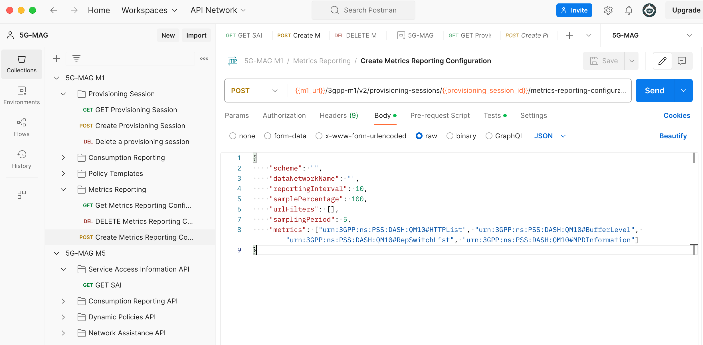

# Tutorial - QoE Metrics Reporting

## Introduction

QoE Metrics Reporting allows the Quality of Experience of media streaming sessions to be logged by the 5GMS System and
exposed for analysis. The 5G-MAG Reference Tools support the scenario in which the metrics collection and reporting is
configured by the 5GMSd Application Function. The metrics configuration provided by the 5GMSd AF to the 5GMSd client
comprises instructions and rules regarding metrics collection (i.e. measurement and logging) and reporting for different
schemes. Each metrics scheme requires the 5GMSd Client to perform metrics collection and subsequent metrics reporting to
the 5GMSd AF according to the configuration rules of that scheme. In the simplest case the resulting QoE metrics reports
are then saved to disk by the 5GMS Application Function.

To setup and enable QoE Metrics Reporting we must first configure the 5GMS Application Function and the 5GMS Application
Server. Next, we start a 5GMS media streaming downlink session on the client-side. The resulting QoE metrics reports can
then be accessed from the local hard-drive.

## Demo Video

A demo video illustrating the same setup as described in this tutorial can be found [here](TODO).

## Server-side Setup

### Step 1: Install the Application Function

For details please refer to the [corresponding section](end-to-end.html#1-installing-the-application-function) in
the [basic end-to-end guide](end-to-end.html).

### Step 2: Install the Application Server

For details please refer to the [corresponding section](end-to-end.html#2-installing-the-application-server) in
the [basic end-to-end guide](end-to-end.html).

### Step 3: Start the Application Server

For details please refer to the [corresponding section](end-to-end.html#3-running-the-application-server) in
the [basic end-to-end guide](end-to-end.html).

### Step 4: Basic Configuration of the Application Function

Follow the [basic configuration steps](end-to-end.html#configuration-of-the-af) documented in
the [basic end-to-end guide](end-to-end.html).

### Step 5: Start the Application Function

Follow the [command](end-to-end.html#starting-the-af) documented in the [basic end-to-end guide](end-to-end.html).

### Step 6: Basic configuration of the Application Function

Follow the [steps](end-to-end.html#creating-a-content-hosting-configuration) to create a content hosting configuration
and a provisioning session using the `msaf-configuration` tool.

### Step 7: Adding a QoE Metrics Reporting Configuration

Now that we have created a provisioning session we can add a QoE Metrics Reporting configuration to that provisioning
session. In this guide we use
the [Postman Collection](https://github.com/5G-MAG/rt-5gms-application-provider/tree/master/postman) for this. However,
the same configuration is possible using any other REST client.

#### Step 7.1 Install and Import the Postman Collection

Follow the instructions [here](https://github.com/5G-MAG/rt-5gms-application-provider/tree/master/postman) to install
and import the Postman collection.

#### Step 7.2 Retrieving the Provisioning Session ID

Open a browser and navigate to `http://<YOUR_MACHINE_IP>/m8.json`. Replace `<YOUR_MACHINE_IP_HERE>` with the IP of the
machine that the 5GMS Application Function is running on. Then copy the `provisioningSessionId` from the JSON to your
clipboard. As an example, the `m8.json` can look like this with a `provisioningSessionId` set
to `1fd61716-fe25-41ee-8d9e-cb36a16378a2`.

````json
{
  "m5BaseUrl": "http://192.168.2.7:7778/3gpp-m5/v2/",
  "serviceList": [
    {
      "provisioningSessionId": "1fd61716-fe25-41ee-8d9e-cb36a16378a2",
      "name": "VoD: Elephant's Dream",
      "entryPoints": [
        {
          "locator": "http://192.168.2.7/m4d/provisioning-session-1fd61716-fe25-41ee-8d9e-cb36a16378a2/elephants_dream/1/client_manifest-all.mpd",
          "contentType": "application/dash+xml",
          "profiles": [
            "urn:mpeg:dash:profile:isoff-live:2011"
          ]
        }
      ]
    },
    {
      "provisioningSessionId": "1fd61716-fe25-41ee-8d9e-cb36a16378a2",
      "name": "VoD: Big Buck Bunny",
      "entryPoints": [
        {
          "locator": "http://192.168.2.7/m4d/provisioning-session-1fd61716-fe25-41ee-8d9e-cb36a16378a2/bbb/2/client_manifest-common_init.mpd",
          "contentType": "application/dash+xml",
          "profiles": [
            "urn:mpeg:dash:profile:isoff-live:2011"
          ]
        }
      ]
    },
    {
      "provisioningSessionId": "1fd61716-fe25-41ee-8d9e-cb36a16378a2",
      "name": "VoD: Testcard",
      "entryPoints": [
        {
          "locator": "http://192.168.2.7/m4d/provisioning-session-1fd61716-fe25-41ee-8d9e-cb36a16378a2/testcard/vod/manifests/avc-full.mpd",
          "contentType": "application/dash+xml",
          "profiles": [
            "urn:mpeg:dash:profile:isoff-live:2011"
          ]
        },
        {
          "locator": "http://192.168.2.7/m4d/provisioning-session-1fd61716-fe25-41ee-8d9e-cb36a16378a2/testcard/vod/manifests/avc-full.m3u8",
          "contentType": "application/x-mpegURL"
        }
      ]
    }
  ]
}
````

#### Step 7.3 Postman - Environment Configuration

Start Postman and navigate to the Postman `Environments` located on the left side. Replace the `provisioning_session_id`
variable with the value from the JSON file:


#### Step 7.4 Postman - Create Metrics Reporting Configuration

In Postman navigate to `Collections` and select `5G-MAG M1`. Navigate to `Metrics-Reporting` and
select `Create Metrics Reporting Configuration`. Then adjust the attributes in the payload section based on the desired
configuration. An example configuration looks the following:

````json
{
   "scheme": "urn:3GPP:ns:PSS:DASH:QM10",
   "dataNetworkName": "",
   "reportingInterval": 10,
   "samplePercentage": 100,
   "urlFilters": [],
   "samplingPeriod": 5,
   "metrics": [
      "urn:3GPP:ns:PSS:DASH:QM10#HTTPList",
      "urn:3GPP:ns:PSS:DASH:QM10#BufferLevel",
      "urn:3GPP:ns:PSS:DASH:QM10#RepSwitchList",
      "urn:3GPP:ns:PSS:DASH:QM10#MPDInformation"
   ]
}
````

Click on `Send` once the configuration is set:



The REST call should return a `201` response code indicating that the call was accepted by the Application Function.

#### Step 7.5 Postman - Validate the Service Access Information

Now that we have provided a QoE Metrics Reporting configuration via the `M1` interface our Service Access Information
should contain the relevant information for the 5GMSd Client. We can validate that via the M5 interface.
Select `Collections` in Postman and navigate to `5G-MAG M5`. Select `Service Access Information API` and then `GET SAI`.
Click `Send` and confirm that the Service Access Information contains a `clientMetricsReportingConfigurations`:


## Client-side Setup

As we are all set on the server-side now we can focus on the client side.

### Step 1: Installation, Configuration and Running the 5GMSd Client

Please follow the [instructions](end-to-end.html#client-side-setup) documented in
the [basic end-to-end guide](end-to-end.html) setup guide.

### Step 2: Creating QoE Metrics Report

While consuming content configured and provided via our previously installed 5GMSd Application Server and 5GMSd
Application Function the client is automatically creating and sending QoE Metrics Reports.


### Step 3: Inspecting the QoE Metrics Report

By default the QoE Metrics Reports provided via the `M5` interface from the Media Session Handler to the 5GMS
Application Function are saved to disk. We can simply access and open them in our favorite editor. On the machine that
is running the Application Function:

1. Navigate to `/var/local/log/open5gs/reports/`
2. For each provisioning session id a dedicated folder is created. Open the right folder by using the right provisioning
   session identifier. In this example the folder is name `1fd61716-fe25-41ee-8d9e-cb36a16378a2`. Open the
   folder: `cd 1fd61716-fe25-41ee-8d9e-cb36a16378a2`.
3. Open the metrics reports folder: `cd metrics_reports`
4. Type `ls` to get an overview of the different reports.
5. Open the reports and check the data. It should look similar to the example below:

````xml
<?xml version="1.0" encoding="utf-8"?>
<ReceptionReport clientID="04a3f67b-aaf6-46ee-960d-30d336873e64"
                 contentURI="http://192.168.2.7/m4d/provisioning-session-1fd61716-fe25-41ee-8d9e-cb36a16378a2/bbb/2/client_manifest-common_init.mpd"
                 xsi:schemaLocation="urn:3gpp:metadata:2011:HSD:receptionreport DASH-QoE-Report.xsd"
                 xmlns:sv="urn:3gpp:metadata:2016:PSS:schemaVersion" xmlns="urn:3gpp:metadata:2011:HSD:receptionreport"
                 xmlns:xsi="http://www.w3.org/2001/XMLSchema-instance">
    <QoeReport recordingSessionId="1992b9e33a59419f88fae51eac909ef8" reportPeriod="10"
               reportTime="2024-04-19T08:46:07.011Z" periodID="">
        <QoeMetric>
            <BufferLevel>
                <BufferLevelEntry level="6256" t="2024-04-19T08:45:57.032Z"/>
                <BufferLevelEntry level="6222" t="2024-04-19T08:45:57.061Z"/>
                <BufferLevelEntry level="6193" t="2024-04-19T08:45:57.089Z"/>
                <BufferLevelEntry level="6172" t="2024-04-19T08:45:57.270Z"/>
                <BufferLevelEntry level="9503" t="2024-04-19T08:45:57.617Z"/>
                <BufferLevelEntry level="9452" t="2024-04-19T08:45:57.669Z"/>
                <BufferLevelEntry level="9392" t="2024-04-19T08:45:57.727Z"/>
                <BufferLevelEntry level="8576" t="2024-04-19T08:45:58.710Z"/>
                <BufferLevelEntry level="11999" t="2024-04-19T08:45:58.959Z"/>
                <BufferLevelEntry level="11977" t="2024-04-19T08:45:59.006Z"/>
                <BufferLevelEntry level="11477" t="2024-04-19T08:45:59.496Z"/>
                <BufferLevelEntry level="11004" t="2024-04-19T08:45:59.960Z"/>
                <BufferLevelEntry level="14119" t="2024-04-19T08:46:00.679Z"/>
                <BufferLevelEntry level="14061" t="2024-04-19T08:46:01.508Z"/>
                <BufferLevelEntry level="16861" t="2024-04-19T08:46:01.937Z"/>
                <BufferLevelEntry level="16861" t="2024-04-19T08:46:02.724Z"/>
                <BufferLevelEntry level="18221" t="2024-04-19T08:46:03.144Z"/>
                <BufferLevelEntry level="21741" t="2024-04-19T08:46:03.898Z"/>
                <BufferLevelEntry level="21741" t="2024-04-19T08:46:04.496Z"/>
                <BufferLevelEntry level="21741" t="2024-04-19T08:46:04.543Z"/>
                <BufferLevelEntry level="25581" t="2024-04-19T08:46:05.873Z"/>
                <BufferLevelEntry level="25581" t="2024-04-19T08:46:06.326Z"/>
            </BufferLevel>
        </QoeMetric>
        <QoeMetric>
            <HttpList>
                <HttpListEntry
                        actualurl="http://192.168.2.7/m4d/provisioning-session-1fd61716-fe25-41ee-8d9e-cb36a16378a2/redir-7ad1c0d6-af9a-4694-5e53-488c34113c73/avc3/896x504p25/000001.m4s"
                        interval="878" range="" responsecode="200" trequest="2024-04-19T08:45:56.147Z"
                        tresponse="2024-04-19T08:45:56.150Z" type="MediaSegment"
                        url="http://192.168.2.7/m4d/provisioning-session-1fd61716-fe25-41ee-8d9e-cb36a16378a2/redir-7ad1c0d6-af9a-4694-5e53-488c34113c73/avc3/896x504p25/000001.m4s">
                    <Trace b="619502" d="878" s="2024-04-19T08:45:56.150Z"/>
                </HttpListEntry>
                <HttpListEntry
                        actualurl="http://192.168.2.7/m4d/provisioning-session-1fd61716-fe25-41ee-8d9e-cb36a16378a2/redir-7ad1c0d6-af9a-4694-5e53-488c34113c73/audio/128kbps/000002.m4s"
                        interval="407" range="" responsecode="200" trequest="2024-04-19T08:45:56.646Z"
                        tresponse="2024-04-19T08:45:56.650Z" type="MediaSegment"
                        url="http://192.168.2.7/m4d/provisioning-session-1fd61716-fe25-41ee-8d9e-cb36a16378a2/redir-7ad1c0d6-af9a-4694-5e53-488c34113c73/audio/128kbps/000002.m4s">
                    <Trace b="60915" d="407" s="2024-04-19T08:45:56.650Z"/>
                </HttpListEntry>
                <HttpListEntry
                        actualurl="http://192.168.2.7/m4d/provisioning-session-1fd61716-fe25-41ee-8d9e-cb36a16378a2/redir-7ad1c0d6-af9a-4694-5e53-488c34113c73/avc3/896x504p25/000002.m4s"
                        interval="823" range="" responsecode="200" trequest="2024-04-19T08:45:56.258Z"
                        tresponse="2024-04-19T08:45:56.262Z" type="MediaSegment"
                        url="http://192.168.2.7/m4d/provisioning-session-1fd61716-fe25-41ee-8d9e-cb36a16378a2/redir-7ad1c0d6-af9a-4694-5e53-488c34113c73/avc3/896x504p25/000002.m4s">
                    <Trace b="644503" d="823" s="2024-04-19T08:45:56.262Z"/>
                </HttpListEntry>
                <HttpListEntry
                        actualurl="http://192.168.2.7/m4d/provisioning-session-1fd61716-fe25-41ee-8d9e-cb36a16378a2/redir-7ad1c0d6-af9a-4694-5e53-488c34113c73/audio/128kbps/000003.m4s"
                        interval="1298" range="" responsecode="200" trequest="2024-04-19T08:45:55.961Z"
                        tresponse="2024-04-19T08:45:55.966Z" type="MediaSegment"
                        url="http://192.168.2.7/m4d/provisioning-session-1fd61716-fe25-41ee-8d9e-cb36a16378a2/redir-7ad1c0d6-af9a-4694-5e53-488c34113c73/audio/128kbps/000003.m4s">
                    <Trace b="61006" d="1298" s="2024-04-19T08:45:55.966Z"/>
                </HttpListEntry>
                <HttpListEntry
                        actualurl="http://192.168.2.7/m4d/provisioning-session-1fd61716-fe25-41ee-8d9e-cb36a16378a2/redir-7ad1c0d6-af9a-4694-5e53-488c34113c73/avc3/896x504p25/000003.m4s"
                        interval="1084" range="" responsecode="200" trequest="2024-04-19T08:45:56.517Z"
                        tresponse="2024-04-19T08:45:56.526Z" type="MediaSegment"
                        url="http://192.168.2.7/m4d/provisioning-session-1fd61716-fe25-41ee-8d9e-cb36a16378a2/redir-7ad1c0d6-af9a-4694-5e53-488c34113c73/avc3/896x504p25/000003.m4s">
                    <Trace b="667295" d="1084" s="2024-04-19T08:45:56.526Z"/>
                </HttpListEntry>
                <HttpListEntry
                        actualurl="http://192.168.2.7/m4d/provisioning-session-1fd61716-fe25-41ee-8d9e-cb36a16378a2/redir-7ad1c0d6-af9a-4694-5e53-488c34113c73/audio/128kbps/000004.m4s"
                        interval="422" range="" responsecode="200" trequest="2024-04-19T08:45:57.238Z"
                        tresponse="2024-04-19T08:45:57.242Z" type="MediaSegment"
                        url="http://192.168.2.7/m4d/provisioning-session-1fd61716-fe25-41ee-8d9e-cb36a16378a2/redir-7ad1c0d6-af9a-4694-5e53-488c34113c73/audio/128kbps/000004.m4s">
                    <Trace b="60933" d="422" s="2024-04-19T08:45:57.242Z"/>
                </HttpListEntry>
                <HttpListEntry
                        actualurl="http://192.168.2.7/m4d/provisioning-session-1fd61716-fe25-41ee-8d9e-cb36a16378a2/redir-7ad1c0d6-af9a-4694-5e53-488c34113c73/audio/160kbps/IS.mp4"
                        interval="38" range="" responsecode="200" trequest="2024-04-19T08:45:57.680Z"
                        tresponse="2024-04-19T08:45:57.684Z" type="InitializationSegment"
                        url="http://192.168.2.7/m4d/provisioning-session-1fd61716-fe25-41ee-8d9e-cb36a16378a2/redir-7ad1c0d6-af9a-4694-5e53-488c34113c73/audio/160kbps/IS.mp4">
                    <Trace b="600" d="38" s="2024-04-19T08:45:57.684Z"/>
                </HttpListEntry>
                <HttpListEntry
                        actualurl="http://192.168.2.7/m4d/provisioning-session-1fd61716-fe25-41ee-8d9e-cb36a16378a2/redir-7ad1c0d6-af9a-4694-5e53-488c34113c73/audio/160kbps/000005.m4s"
                        interval="976" range="" responsecode="200" trequest="2024-04-19T08:45:57.728Z"
                        tresponse="2024-04-19T08:45:57.731Z" type="MediaSegment"
                        url="http://192.168.2.7/m4d/provisioning-session-1fd61716-fe25-41ee-8d9e-cb36a16378a2/redir-7ad1c0d6-af9a-4694-5e53-488c34113c73/audio/160kbps/000005.m4s">
                    <Trace b="76766" d="976" s="2024-04-19T08:45:57.731Z"/>
                </HttpListEntry>
                <HttpListEntry
                        actualurl="http://192.168.2.7/m4d/provisioning-session-1fd61716-fe25-41ee-8d9e-cb36a16378a2/redir-7ad1c0d6-af9a-4694-5e53-488c34113c73/avc3/896x504p25/000004.m4s"
                        interval="1340" range="" responsecode="200" trequest="2024-04-19T08:45:57.611Z"
                        tresponse="2024-04-19T08:45:57.615Z" type="MediaSegment"
                        url="http://192.168.2.7/m4d/provisioning-session-1fd61716-fe25-41ee-8d9e-cb36a16378a2/redir-7ad1c0d6-af9a-4694-5e53-488c34113c73/avc3/896x504p25/000004.m4s">
                    <Trace b="630481" d="1340" s="2024-04-19T08:45:57.615Z"/>
                </HttpListEntry>
                <HttpListEntry
                        actualurl="http://192.168.2.7/m4d/provisioning-session-1fd61716-fe25-41ee-8d9e-cb36a16378a2/redir-7ad1c0d6-af9a-4694-5e53-488c34113c73/avc3/1920x1080p25/IS.mp4"
                        interval="39" range="" responsecode="200" trequest="2024-04-19T08:45:58.960Z"
                        tresponse="2024-04-19T08:45:58.963Z" type="InitializationSegment"
                        url="http://192.168.2.7/m4d/provisioning-session-1fd61716-fe25-41ee-8d9e-cb36a16378a2/redir-7ad1c0d6-af9a-4694-5e53-488c34113c73/avc3/1920x1080p25/IS.mp4">
                    <Trace b="627" d="39" s="2024-04-19T08:45:58.963Z"/>
                </HttpListEntry>
                <HttpListEntry
                        actualurl="http://192.168.2.7/m4d/provisioning-session-1fd61716-fe25-41ee-8d9e-cb36a16378a2/redir-7ad1c0d6-af9a-4694-5e53-488c34113c73/audio/160kbps/000006.m4s"
                        interval="926" range="" responsecode="200" trequest="2024-04-19T08:45:59.029Z"
                        tresponse="2024-04-19T08:45:59.032Z" type="MediaSegment"
                        url="http://192.168.2.7/m4d/provisioning-session-1fd61716-fe25-41ee-8d9e-cb36a16378a2/redir-7ad1c0d6-af9a-4694-5e53-488c34113c73/audio/160kbps/000006.m4s">
                    <Trace b="75972" d="926" s="2024-04-19T08:45:59.032Z"/>
                </HttpListEntry>
                <HttpListEntry
                        actualurl="http://192.168.2.7/m4d/provisioning-session-1fd61716-fe25-41ee-8d9e-cb36a16378a2/redir-7ad1c0d6-af9a-4694-5e53-488c34113c73/avc3/1920x1080p25/000005.m4s"
                        interval="1651" range="" responsecode="200" trequest="2024-04-19T08:45:59.022Z"
                        tresponse="2024-04-19T08:45:59.025Z" type="MediaSegment"
                        url="http://192.168.2.7/m4d/provisioning-session-1fd61716-fe25-41ee-8d9e-cb36a16378a2/redir-7ad1c0d6-af9a-4694-5e53-488c34113c73/avc3/1920x1080p25/000005.m4s">
                    <Trace b="2210933" d="1651" s="2024-04-19T08:45:59.025Z"/>
                </HttpListEntry>
                <HttpListEntry
                        actualurl="http://192.168.2.7/m4d/provisioning-session-1fd61716-fe25-41ee-8d9e-cb36a16378a2/redir-7ad1c0d6-af9a-4694-5e53-488c34113c73/audio/160kbps/000007.m4s"
                        interval="795" range="" responsecode="200" trequest="2024-04-19T08:46:00.709Z"
                        tresponse="2024-04-19T08:46:00.711Z" type="MediaSegment"
                        url="http://192.168.2.7/m4d/provisioning-session-1fd61716-fe25-41ee-8d9e-cb36a16378a2/redir-7ad1c0d6-af9a-4694-5e53-488c34113c73/audio/160kbps/000007.m4s">
                    <Trace b="76423" d="795" s="2024-04-19T08:46:00.711Z"/>
                </HttpListEntry>
                <HttpListEntry
                        actualurl="http://192.168.2.7/m4d/provisioning-session-1fd61716-fe25-41ee-8d9e-cb36a16378a2/redir-7ad1c0d6-af9a-4694-5e53-488c34113c73/avc3/1920x1080p25/000006.m4s"
                        interval="1251" range="" responsecode="200" trequest="2024-04-19T08:46:00.679Z"
                        tresponse="2024-04-19T08:46:00.682Z" type="MediaSegment"
                        url="http://192.168.2.7/m4d/provisioning-session-1fd61716-fe25-41ee-8d9e-cb36a16378a2/redir-7ad1c0d6-af9a-4694-5e53-488c34113c73/avc3/1920x1080p25/000006.m4s">
                    <Trace b="2110450" d="1251" s="2024-04-19T08:46:00.682Z"/>
                </HttpListEntry>
                <HttpListEntry
                        actualurl="http://192.168.2.7/m4d/provisioning-session-1fd61716-fe25-41ee-8d9e-cb36a16378a2/redir-7ad1c0d6-af9a-4694-5e53-488c34113c73/audio/160kbps/000008.m4s"
                        interval="765" range="" responsecode="200" trequest="2024-04-19T08:46:01.956Z"
                        tresponse="2024-04-19T08:46:01.957Z" type="MediaSegment"
                        url="http://192.168.2.7/m4d/provisioning-session-1fd61716-fe25-41ee-8d9e-cb36a16378a2/redir-7ad1c0d6-af9a-4694-5e53-488c34113c73/audio/160kbps/000008.m4s">
                    <Trace b="76469" d="765" s="2024-04-19T08:46:01.957Z"/>
                </HttpListEntry>
                <HttpListEntry
                        actualurl="http://192.168.2.7/m4d/provisioning-session-1fd61716-fe25-41ee-8d9e-cb36a16378a2/redir-7ad1c0d6-af9a-4694-5e53-488c34113c73/avc3/1920x1080p25/000007.m4s"
                        interval="1184" range="" responsecode="200" trequest="2024-04-19T08:46:01.954Z"
                        tresponse="2024-04-19T08:46:01.957Z" type="MediaSegment"
                        url="http://192.168.2.7/m4d/provisioning-session-1fd61716-fe25-41ee-8d9e-cb36a16378a2/redir-7ad1c0d6-af9a-4694-5e53-488c34113c73/avc3/1920x1080p25/000007.m4s">
                    <Trace b="2160691" d="1184" s="2024-04-19T08:46:01.957Z"/>
                </HttpListEntry>
            </HttpList>
        </QoeMetric>
        <sv:delimiter>0</sv:delimiter>
    </QoeReport>
</ReceptionReport>
````

## Optional: Visualize the reports

The [Application Provider repository](https://github.com/5G-MAG/rt-5gms-application-provider) ships with a
very [basic user interface](https://github.com/5G-MAG/rt-5gms-application-provider/tree/master/qoe-metrics-reporting-ui)
to visualize individual QoE Metrics Reports:


