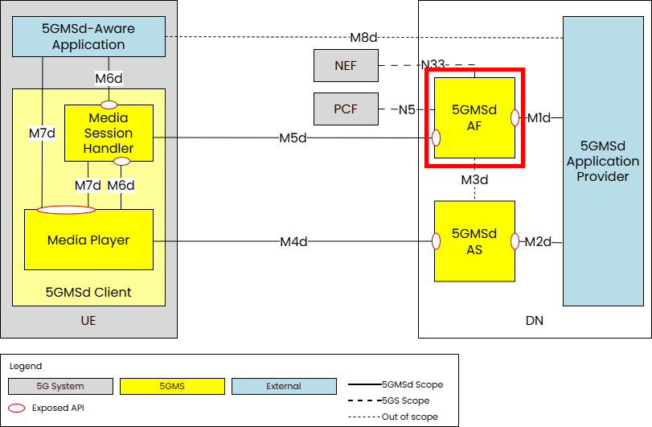

 

[Scope](../scope.html){: .btn .btn-blue } [Project Roadmap](../projects.html){: .btn .btn-blue } [GitHub Repos](../repositories.html){: .btn .btn-github } [Releases](../../releases.html#project-5g-media-streaming){: .btn .btn-release } [Tutorials](../tutorials.html){: .btn .btn-tutorial } [Requirements](../requirements.html){: .btn .btn-blue }

# Tutorial - Testing the 5GMS Application Function

 

This tutorial allows to:
- Setup the 5GMSd AF
- Test the M1 Interface APIs:
  - Provisioning Sessions
  - Server Certificates
  - Content Protocol Discovery
  - Content Hosting
  - Consumption Reporting
- Test the M3 Interface APIs:
  - Simple HTTP configuration
  - HTTP configuration and certificate sending
- Test the M5 Interface APIs:
  - Service Access Information

## Installation of the 5GMS AF as a Local User or as a System Service

Follow the instructions in this [page](./application-function/installation-local-user-5GMSAF.html) for setting up a test environment without requiring fullsystem installation.

Follow the instructions in this [page](./application-function/installation-system-service-5GMSAF.html) for setting up a full system installation.

## Configuration of the 5GMS AF

Follow the instructions in this [page](./application-function/configuration-5GMSAF.html) for setting up a full system installation.

## Testing APIs

### Testing: M1 Interface

The details of these tests change with different versions of the 5GMSd Application Function.

If you are testing the v1.2.x versions then please visit the [Testing the M1 Interface on v1.2.0](./application-function/testing-m1-v120.html)
page.

If you are testing the M1 interface on 5GMSd Application Function v1.3.0 to v1.4.0 then please visit the
[Testing the M1 Interface on v1.3.0](./application-function/testing-m1-v130.html) page.

For testing the M1 interface on 5GMSd Application Function v1.4.1 or later, then please visit the
[Testing the M1 Interface on v1.4.1](./application-function/testing-m1-v141.html) page.

### Testing: M3 Interface

Depending on which version of the 5GMSd Application Function you wish to test, the commands to test the interface at
reference point M3 change.

If you wish to test 5GMSd Application Function v1.1.x then please see
the [Testing the M3 Interface on v1.1.0](./application-function/testing-m3-v110.html) page.

For versions after v1.1.x (i.e. v1.2.0 and above) please use the [Testing the M3 Interface](./application-function/testing-m3-v120.html) page.

### Testing: M5 Interface

The details of these tests change with different versions of the 5GMSd Application Function.

If you are testing versions up to v1.1.x then please visit the [Testing: M5 Interface on v1.0.0](./application-function/testing-m5-v100.html)
page.

If you are testing the M5 interface on 5GMSd Application Function v1.2.x please visit the
[Testing the M5 Interface on v1.2.0](./application-function/testing-m5-v120.html) page.

If you are testing the M5 interface on 5GMSd Application Function v1.3.0 or later please visit the
[Testing the M5 Interface on v1.3.0](./application-function/testing-m5-v130.html) page.

### Testing with Postman

Postman is a popular API development and testing tool that allows users to create, send, and manage HTTP requests.
Postman comes in very handy when testing and working with the M1 and M5 interfaces of the Application Function. Plese
visit the [Testing with Postman](./application-function/testing-postman.html)
