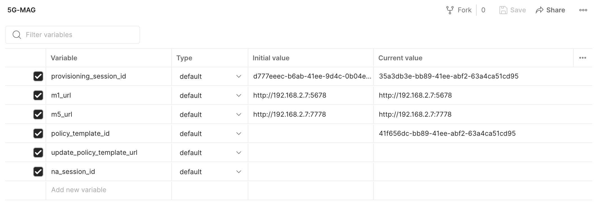
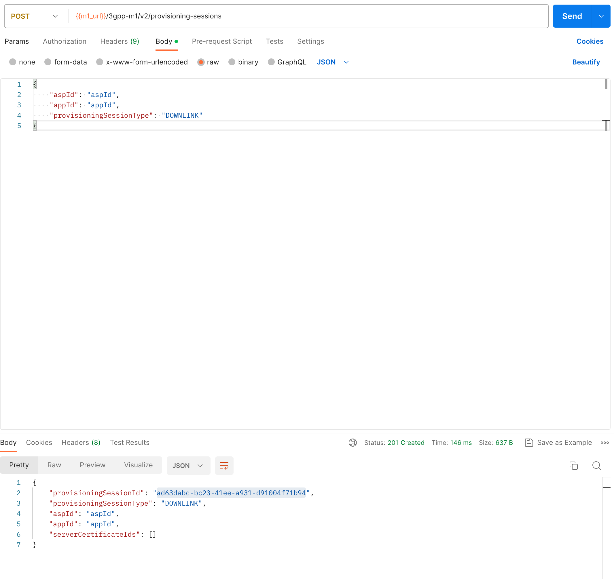
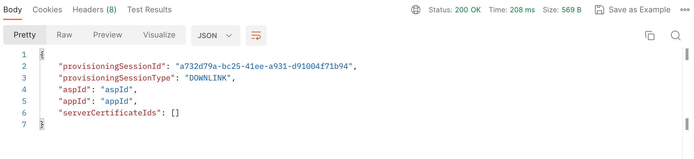

# Testing with Postman

{: .inshort }
> This tutorial allows to:
> - Test the M1 and M5 APIs of the 5GMSd AF with Postman

 

[Postman](https://www.postman.com/) is a popular API development and testing tool that allows users to create, send, and
manage HTTP requests. It provides a user-friendly interface for building and testing API endpoints, making it easier for
developers to collaborate and streamline the API development process. Postman comes in very handy when testing and
working with the `M1` and `M5` interfaces of the Application Function.

# Importing the 5G-MAG Postman Collection

Postman provides an easy way to export and import a collection of REST calls. To facilitate getting started, you can
download our pre-defined Postman collections and environment here:

* [5G-MAG M1.postman_collection.json](https://github.com/5G-MAG/rt-5gms-application-provider/blob/development/postman/5G-MAG%20M1.postman_collection.json)
* [5G-MAG M5.postman_collection.json](https://github.com/5G-MAG/rt-5gms-application-provider/blob/development/postman/5G-MAG%20M5.postman_collection.json)
* [5G-MAG MAF.postman_collection.json](https://github.com/5G-MAG/rt-5gms-application-provider/blob/development/postman/5G-MAG%20MAF.postman_collection.json)
* [5G-MAG.postman_environment.json](https://github.com/5G-MAG/rt-5gms-application-provider/blob/development/postman/5G-MAG.postman_environment.json)

After the download, open Postman and select `File->Import`. After a successful import, you should see two collections
like this:


## Postman Configuration

A very useful feature of Postman is the possibility to define variables. These variables can afterward be used in any of
our routes or payloads. The first variables we need to define are the `m1_url`, `m5_url`, `maf_url` variables. For that
reason,
select `Environments` on the left side and then select the `5G-MAG` environment. Now you should see a list of variables
similar to this:



Add the URL to the `M1`, the `M5` and the `maf` endpoint of your Application Function here. In the example above, we are
running
the Application Function in a local network. Note that both URLs also need to contain the port. The configuration
options for the Application Function are
documented [here](./application-function/configuration-5GMSAF.md).

# Using M1

Now that we have defined the `M1` endpoint, we can start using it:

## Provisioning Session

### Creating a Provisioning Session

Navigate to the `Provisioning Session` folder in the Postman Collection and select `Create Provisioning Session`. Check
the URL on the top that we are sending the request to: `{{m1_url}}/3gpp-m1/v2/provisioning-sessions`. Here you can see
that we are using the `m1_url` variable that we defined earlier. If the endpoint changes at some point we only need to
change our variable instead of all the M1 calls in our Postman collection.

Click on `Send` on the top right. You should see a successful response (status code `201`) and the payload of the
response on the bottom:



The response body contains the `provisioningSessionId` of our created provisioning session. The `provisioningSessionId`
is an important identifier and used in many of the `M1` and `M5` endpoints. Consequently, it makes sense to assign
the `provisioningSessionId` to a variable as well. Our collection contains a small script that automatically assigns
the `provisioningSessionId` value of the response body to the `provisioning_session_id` variable:

````js
var responseBody = pm.response.json();
var provisioningSessionId = responseBody.provisioningSessionId;
pm.environment.set("provisioning_session_id", provisioningSessionId);
````

### Retrieving a Provisioning Session

Now that we have created a provisioning session and assigned its `provisioningSessionId` to our variable, we can
directly call the `GET Provisioning Session` endpoint. As expected, our route contains the `m1_url` and
the `provisioning_session_id` variable: `{{m1_url}}/3gpp-m1/v2/provisioning-sessions/{{provisioning_session_id}}`.

Sending this request should result in a response similar to this:


### Deleting a Provisioning Session

Deleting a provisioning session is straight forward as well. As we already defined the required variables, you can
simply execute the call and should receive a `202 Accepted` response.

## Content Hosting

To manage content hosting configurations, proceed similarly to managing provisioning sessions. Note that
the `create` and `purge` functions contain a `JSON` structure in the payload to define the content hosting parameters.

## Consumption Reporting

To manage consumption reporting configurations, proceed similarly to managing provisioning sessions. Note that
the `create` and `update` functions contain a `JSON` structure in the payload to define the consumption reporting parameters.

## Policy Templates

To manage policy templates, proceed similarly to managing provisioning sessions. Note that the `create` and `update`
functions contain a `JSON` structure in the payload to define the required parameters. Moreover, `open5gsIntegration`
must be enabled in the configuration of the Application Function. For more details, refer to
the [Configuration Guide](./application-function/configuration-5GMSAF.md).

After successfully creating a policy template, the new `policyTemplateId` contained in the `Location` header is
automatically assigned to the `policy_template_id` variable:

````js
var policyTemplateId = pm.response.headers.get("Location").split("/").pop()
pm.environment.set("policy_template_id", policyTemplateId);
````

## Metrics Reporting

To manage metrics reporting configurations, proceed similarly to managing provisioning sessions. Note that
the `create` function contain a `JSON` structure in the payload to define the metrics reporting parameters.

# Using M5

The `M5` routes to query the Service Access Information, send a Consumption Report, create a Dynamic Policy resource and
provision a new Network Assistance Session can be found in the `5G-MAG M5` folder. There is no additional configuration
required, the routes for `M5` use the variables that we defined earlier as part of the configuration and the execution
of `M1` endpoints.

# Using custom endpoints

The 5G-MAG implementation of the Application Function provides additional endpoints that are not part of the TS 26.512
Rel-17 specification. These endpoints are proprietary and offer additional functionality to improve the user experience.
The custom endpoints are located in the `5G-MAG MAF` collection.

## Querying all provisioning sessions

It is possible to query the ID of all the available provisioning sessions. For that reason,
choose `enumerateProvisioningSessions` in the `5G-MAG MAF` collection and click on send. The result should look like
this:

````json
[
  "c8fb07b0-092f-41ef-ba64-af7091b62997",
  "c7b38e0e-092f-41ef-ba64-af7091b62997"
]
````
