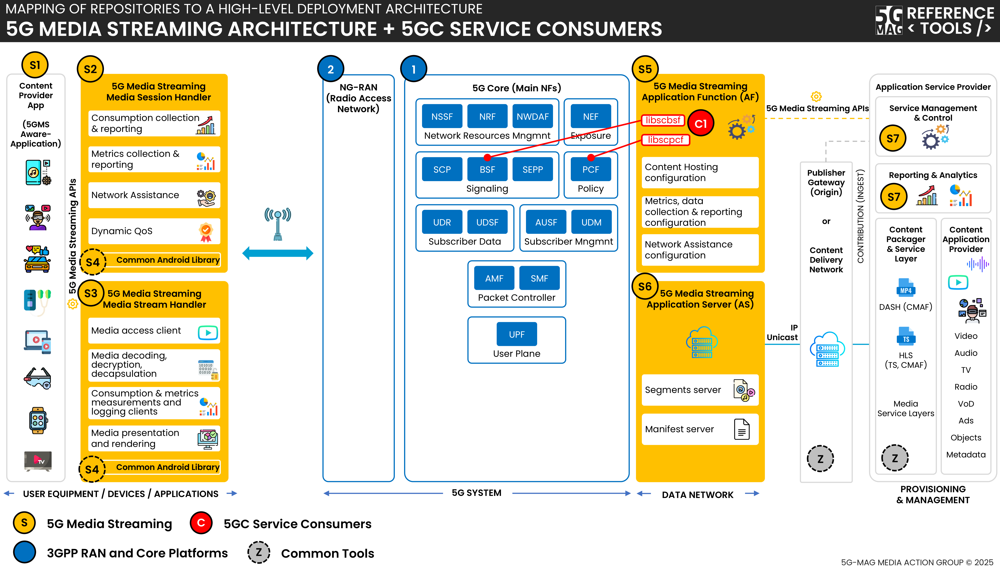

# Under Development

## Specifications
Visit the [Standards repository](https://5g-mag.github.io/Standards/pages/5g-media-streaming.html) for details.

## High-level architecture

### High-level architecture: 5G Media Streaming (5GMSd)

 * Check [here](./repositories.html) to access the repositories for 5G Downlink Media Streaming
 * Check [here](../3gpp-ran-and-core-platforms/repositories.html) to access the repositories for 3GPP RAN and Core Platforms

### High-level architecture: 5G Downlink Media Streaming (5GMSd) with 5G Core Network Components

 * Check [here](./repositories.html) to access the repositories for 5G Downlink Media Streaming
 * Check [here](../3gpp-ran-and-core-platforms/repositories.html) to access the repositories for 3GPP RAN and Core Platforms
 * Check [here](../5g-core-network-components/repositories.html) to access the repositories for 5G Core Network Components

### High-level architecture: 5G Downlink Media Streaming (5GMSd) with UE Data Collection Reporting and Event Exposure

 * Check [here](./repositories.html) to access the repositories for 5G Downlink Media Streaming
 * Check [here](../3gpp-ran-and-core-platforms/repositories.html) to access the repositories for 3GPP RAN and Core Platforms
 * Check [here](../ue-data-collection-reporting-exposure/repositories.html) the repositories for UE Data Collection, Reporting and Event Exposure

### High-level architecture: 5G Downlink Media Streaming (5GMSd) over eMBMS

 * Check [here](./repositories.html) to access the repositories for 5G Downlink Media Streaming
 * Check [here](../3gpp-ran-and-core-platforms/repositories.html) to access the repositories for 3GPP RAN and Core Platforms
 * Check [here](../lte-based-5g-broadcast/repositories.html) the repositories for 5G Broadcast
