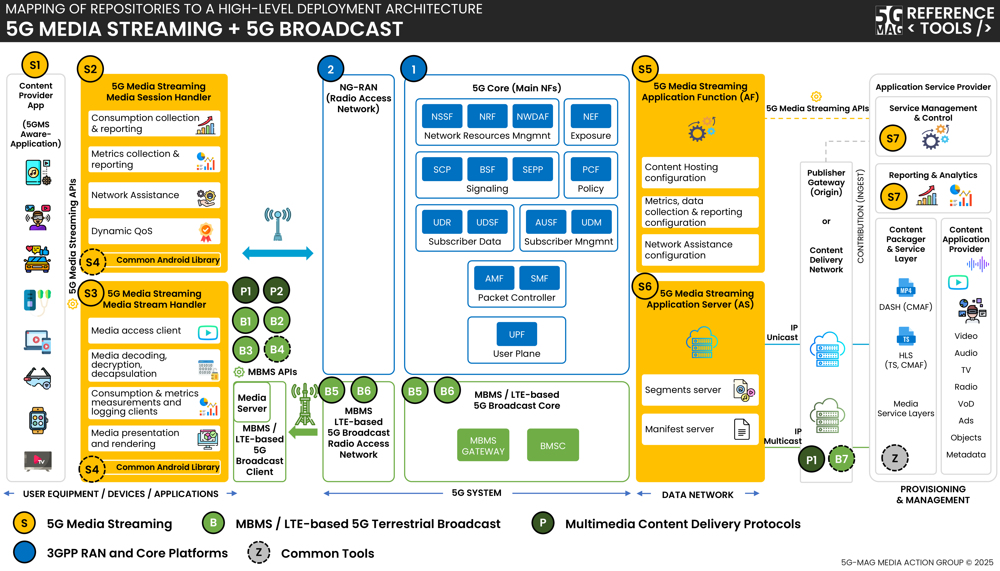

 

1. TOC
{:toc}

# Scope
This page contains information such as the specifications within the scope of the tools, high-level architecture, APIs under implementation,...

## Specifications
Visit the [Standards repository](https://5g-mag.github.io/Standards/pages/5g-media-streaming.html) for more details on the specifications within the scope of the tools.

## High-level architecture

### High-level architecture: 5G Downlink Media Streaming (5GMSd)

 * Check [here](./repositories.html) to access the repositories for 5G Downlink Media Streaming
 * Check [here](../3gpp-ran-and-core-platforms/repositories.html) to access the repositories for 3GPP RAN and Core Platforms

### High-level architecture: 5G Downlink Media Streaming (5GMSd) with UE Data Collection Reporting and Event Exposure

 * Check [here](./repositories.html) to access the repositories for 5G Downlink Media Streaming
 * Check [here](../3gpp-ran-and-core-platforms/repositories.html) to access the repositories for 3GPP RAN and Core Platforms
 * Check [here](../ue-data-collection-reporting-exposure/repositories.html) the repositories for UE Data Collection, Reporting and Event Exposure

### High-level architecture: 5G Downlink Media Streaming (5GMSd) over eMBMS

 * Check [here](./repositories.html) to access the repositories for 5G Downlink Media Streaming
 * Check [here](../3gpp-ran-and-core-platforms/repositories.html) to access the repositories for 3GPP RAN and Core Platforms
 * Check [here](../lte-based-5g-broadcast/repositories.html) the repositories for 5G Broadcast

## 5GMS Application Function Supported Features

The release versions of the 5GMSd Application Function support differing sets of interfaces, as described by the different
versions of the 3GPP specifications, and differing levels of feature support for those interfaces. The page attempts to capture
the feature sets and specification versions for each release, starting with the most recent release or upcoming releases.

### Key

Where a feature of the specifications is supported the entry will be marked with &#x2611;, where it is being worked on and slated for the next release the feature will be marked with &#x270E; and where it is unimplemented in that
version the feature will be marked with &#x2610;.

<table><thead>
<tr><th>Interface reference point</th><th>Specifications & Versions</th><th>Protocols</th><th>Features</th></tr>
</thead>
<tbody>
<tr valign="top"><td>M1 (server)</td><td><ul>
  <li>TS 26.501 v17.6.0</li>
  <li>TS 26.512 v17.6.0</li>
</ul></td><td><ul>
  <li>&#x2611; HTTP/1.1</li>
  <li>&#x2610; HTTP/2.0</li>
  <li>&#x2611; HTTP/1.1 over SSL/TLS</li>
  <li>&#x2610; HTTP/2.0 over SSL/TLS</li>
</ul></td><td><ul>
  <li>&#x2611; Content Hosting Provisioning</li>
  <li>&#x2611; Content Protocols Discovery</li>
  <li>&#x2611; Provisioning Sessions</li>
  <li>&#x2611; Server Certificates Provisioning</li>
  <li>&#x2611; Consumption Reporting Provisioning</li>
  <li>&#x2610; Content Preparation Templates Provisioning</li>
  <li>&#x2610; Edge Resources Provisioning</li>
  <li>&#x2610; Event Data Processing Provisioning</li>
  <li>&#x2611; Metrics Reporting Provisioning</li>
  <li>&#x2611; Policy Templates Provisioning</li>
</ul></td></tr>
<tr valign="top"><td>M3 (client)</td><td><ul>
  <li>5G-MAG prototype</li>
</ul></td><td><ul>
  <li>&#x2611; HTTP/1.1</li>
  <li>&#x2611; HTTP/2.0</li>
  <li>&#x2611; HTTP/1.1 over SSL/TLS</li>
  <li>&#x2611; HTTP/2.0 over SSL/TLS</li>
</ul></td><td><ul>
  <li>&#x2611; Content Hosting Provisioning</li>
  <li>&#x2611; Server Certificates Provisioning</li>
</ul></td></tr>
<tr valign="top"><td>M5 (server)</td><td><ul>
  <li>TS 26.501 v17.6.0</li>
  <li>TS 26.512 v17.6.0</li>
</ul></td><td><ul>
  <li>&#x2611; HTTP/1.1</li>
  <li>&#x2610; HTTP/2.0</li>
  <li>&#x2611; HTTP/1.1 over SSL/TLS</li>
  <li>&#x2610; HTTP/2.0 over SSL/TLS</li>
</ul></td><td><ul>
  <li>&#x2611; Service Access Information</li>
  <li>&#x2611; Consumption Reporting</li>
  <li>&#x2611; Dynamic Policies 
      &nbsp; <b>Service Data Flow Description Methods:</b><ul>
    <li>&#x2610; 2 Tuple</li>
    <li>&#x2611; 5 Tuple</li>
    <li>&#x2610; ToS</li>
    <li>&#x2610; Flow Label</li>
    <li>&#x2610; Domain Name</li>
  </ul></li>
  <li>&#x2611; Metrics Reporting</li>
  <li>&#x2611; Network Assistance<ul>
    <li>&#x2610; Throughput Estimation</li>
    <li>&#x2611; Delivery Boost</li>
  </ul></li>
</ul></td></tr>
<tr valign="top"><td>N5 (Npcf client/server)</td><td><ul>
  <li>TS 29.514 v17.8.0</li>
</ul></td><td><ul>
  <li>&#x2611; HTTP/2.0</li>
  <li>&#x2611; HTTP/2.0 over SSL/TLS</li>
</ul></td><td><ul>
  <li>&#x2611; Policy Authorization</li>
  <li>&#x2611; Policy Authorization Notifications</li>
</ul></td></tr>
<tr valign="top"><td>N33 (client)</td><td><ul>
  <li>TS 29.591 v17.9.0</li>
</ul></td><td><ul>
  <li>&#x2610; HTTP/2.0</li>
  <li>&#x2610; HTTP/2.0 over SSL/TLS</li>
</ul></td><td><ul>
  <li>&#x2610; Event Exposure</li>
</ul></td></tr>
<tr valign="top"><td>R4 (server)</td><td><ul>
  <li>TS 26.512 v17.6.0</li>
</ul></td><td><ul>
  <li>&#x2610; HTTP/1.1</li>
  <li>&#x2610; HTTP/2.0</li>
  <li>&#x2610; HTTP/1.1 over SSL/TLS</li>
  <li>&#x2610; HTTP/2.0 over SSL/TLS</li>
</ul></td><td><ul>
  <li>&#x2610; Media Streaming Access</li>
</ul></td></tr>
<tr valign="top"><td>R5/R6 (client/server)</td><td><ul>
  <li>TS 26.512 v17.6.0</li>
  <li>TS 29.517 v17.9.0</li>
</ul></td><td><ul>
  <li>&#x2610; HTTP/1.1</li>
  <li>&#x2610; HTTP/2.0</li>
  <li>&#x2610; HTTP/1.1 over SSL/TLS</li>
  <li>&#x2610; HTTP/2.0 over SSL/TLS</li>
</ul></td><td><ul>
  <li>&#x2610; Media Streaming QoE Event</li>
  <li>&#x2610; Media Streaming Consumption Event</li>
  <li>&#x2610; Media Streaming Network Assistance Invocation Event</li>
  <li>&#x2610; Media Streaming Dynamic Policy Invocation Event</li>
  <li>&#x2610; Media Streaming Access Event</li>
  <li>&#x2610; Event Subscription</li>
</ul></td></tr>
<tr valign="top"><td>Nbsf (client)</td><td><ul>
  <li>TS 29.513 v17.10.0</li>
  <li>TS 29.521 v17.8.0</li>
</ul></td><td><ul>
  <li>&#x2611; HTTP/2.0</li>
  <li>&#x2611; HTTP/2.0 over SSL/TLS</li>
</ul></td><td><ul>
  <li>&#x2611; Binding Information Retrieval</li>
</ul></td></tr>
</tbody>
<tfoot>
<!--<tr><td colspan="4"><b>Notes:</b> 1: Only the Delivery Boost feature of Network Assistance is implemented, the Throughput Estimation feature is still in development.</td></tr> -->
</tfoot>
</table>

## Supported APIs for 5G Media Streaming

### Relevant specifications
The table contains the 3GPP 5G Media Streaming APIs for Release 17 (TS 26.512) and Release 18 (TS 26.510 & TS 26.512). Note that the current reference implementation of the 5GMSd AF and 5GMSd AS are based on Release 17 (TS 26.510 does not exist in Release 17). In Release 18, the media session handling APIs were moved from TS 26.512 into TS 26.510 to generalise them to support the Real-Time media Communication (RTC) System as well as the 5G Media Streaming (5GMS) System.
More information about the relevant specifications can be found in the following pages:
 - 5G Media Streaming Architecture: [Standards pages](https://5g-mag.github.io/Standards/pages/5g-media-streaming.html)
 - UE Data Collection and Event Exposure: [Standards pages](https://5g-mag.github.io/Standards/pages/data-collection-event-exposure.html)

### Classification

 Release 17 | Release 18
 ---------- | ----------
 TS26512_CommonData.yaml 	| TS26510_CommonData.yaml, TS26512_CommonData.yaml |
 TS26512_M1_ConsumptionReportingProvisioning.yaml  | TS26510_Maf_Provisioning_ConsumptionReporting.yaml
 TS26512_M1_ContentHostingProvisioning.yaml  | TS26510_Maf_Provisioning_ContentHosting.yaml
 TS26512_M1_ContentPreparationTemplatesProvisioning.yaml | TS26510_Maf_Provisioning_ContentPreparationTemplates.yaml
 TS26512_M1_ContentProtocolsDiscovery.yaml  |	TS26510_Maf_Provisioning_ContentProtocols.yaml
 TS26512_M1_EdgeResourcesProvisioning.yaml | TS26510_Maf_Provisioning_EdgeResources.yaml
 TS26512_M1_EventDataProcessingProvisioning.yaml | TS26510_Maf_Provisioning_EventDataProcessing.yaml
 TS26512_M1_MetricsReportingProvisioning.yaml  | TS26510_Maf_Provisioning_MetricsReporting.yaml
 TS26512_M1_PolicyTemplatesProvisioning.yaml  | TS26510_Maf_Provisioning_PolicyTemplates.yaml
 TS26512_M1_ProvisioningSessions.yaml  | TS26510_Maf_Provisioning_ProvisioningSessions.yaml
 TS26512_M1_ServerCertificatesProvisioning.yaml  | TS26510_Maf_Provisioning_ServerCertificates.yaml
 N/A | TS26510_Maf_Provisioning_ContentPublishing.yaml
 N/A | TS26510_Maf_Provisioning_RealTimeCommunication.yaml
 TS26512_M5_ConsumptionReporting.yaml  | TS26510_Maf_SessionHandling_ConsumptionReporting.yaml
 TS26512_M5_DynamicPolicies.yaml  | TS26510_Maf_SessionHandling_DynamicPolicy.yaml
 TS26512_M5_MetricsReporting.yaml  | TS26510_Maf_SessionHandling_MetricsReporting.yaml
 TS26512_M5_NetworkAssistance.yaml  | TS26510_Maf_SessionHandling_NetworkAssistance.yaml
 TS26512_M5_ServiceAccessInformation.yaml  | TS26510_Maf_SessionHandling_ServiceAccessInformation.yaml
 PreStd* | TS26512_Mas_Configuration_ContentHosting.yaml
 PreStd* | TS26512_Mas_Configuration_ContentPreparationTemplates.yaml
 PreStd* | TS26512_Mas_Configuration_ContentPublishing.yaml
 PreStd* | TS26512_Mas_Configuration_ServerCertificates.yaml
 N/A | TS26512_R2_DataReporting.yaml
 TS26512_R4_DataReporting.yaml | TS26512_R4_DataReporting.yaml
 N/A | TS26512_EventExposure.yaml

### Legend

TEXT = Already implemented in 5G-MAG Reference Tools

TEXT = In the implementation roadmap in 5G-MAG Reference Tools

PreStd* = Implementatio of a pre-standardisation variant of the 5GMS AS configuration API at reference point M3d that is similar to what eventually appeared in Release 18. The service name is different and so are some details.
 
{: .note }
Note that not all aspects of these APIs are implemented. For example Content Preparation, Edge resources, Geo-fencing and URL signing in TS26512_M1_ContentHostingProvisioning.yaml are not implemented.
