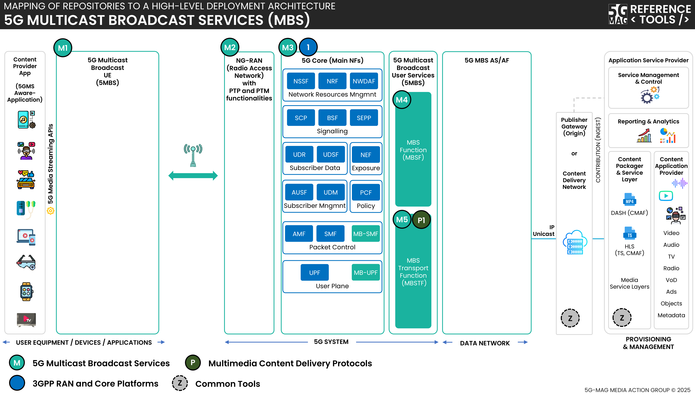

 

1. TOC
{:toc}

# High-level architecture

## 5G Downlink Media Streaming (5GMSd) over 5G Multicast Broadcast Services (MBS)

 * Check [here](../3gpp-ran-and-core-platforms/repositories.html) to access the repositories for 3GPP RAN and Core Platforms
 * Check [here](../5g-media-streaming/repositories.html) to access the repositories for 5G Media Streaming

# Repositories

Please note that 5G Multicast Broadcast Services is implemented as an extension of [Open5GS](https://github.com/5G-MAG/open5gs)

---

## 5G UE (with MBS components): [srsRAN_4G (5mbs branch)](https://github.com/5G-MAG/srsRAN_4G/tree/5mbs)

## NG-RAN (with MBS components): [rt-srsRAN_Project (5mbs branch)](https://github.com/5G-MAG/rt-srsRAN_Project/tree/5mbs)

## 5GC (with MBS components): [open5gs/tree/5mbs (5mbs branch)](https://github.com/5G-MAG/open5gs/tree/5mbs)

## MBS User Service: MBS Function (MBSF): [https://github.com/5G-MAG/rt-mbs-function](https://github.com/5G-MAG/rt-mbs-function)

## MBS User Services: MBS Transport Function (MBSTF): [https://github.com/5G-MAG/rt-mbs-transport-function](https://github.com/5G-MAG/rt-mbs-transport-function)

## Auxiliary repositories:

### MBS Examples: [rt-mbs-examples](https://github.com/5G-MAG/rt-mbs-examples)
* [Information and how to download, build, install and run](https://github.com/5G-MAG/rt-mbs-examples#readme)
* [Releases](https://github.com/5G-MAG/rt-mbs-examples/releases)

# Packages

This project also provides or makes use of the following packages GitHub Container packages. Images and docker compose deployments for MBS are located in the following repository: [https://github.com/5G-MAG/rt-mbs-examples](https://github.com/5G-MAG/rt-mbs-examples)

## Standard Open5GS packages:

Components | Package
 --|--
 NRF | [https://github.com/5G-MAG/open5gs/pkgs/container/nrf](https://github.com/5G-MAG/open5gs/pkgs/container/nrf)
 UDM | [https://github.com/5G-MAG/open5gs/pkgs/container/udm](https://github.com/5G-MAG/open5gs/pkgs/container/udm)
 PCF | [https://github.com/5G-MAG/open5gs/pkgs/container/pcf](https://github.com/5G-MAG/open5gs/pkgs/container/pcf)
 WebUI | [https://github.com/5G-MAG/open5gs/pkgs/container/webui](https://github.com/5G-MAG/open5gs/pkgs/container/webui)
 BSF | [https://github.com/5G-MAG/open5gs/pkgs/container/bsf](https://github.com/5G-MAG/open5gs/pkgs/container/bsf)
 UDR | [https://github.com/5G-MAG/open5gs/pkgs/container/udr](https://github.com/5G-MAG/open5gs/pkgs/container/udr)
 NSSF | [https://github.com/5G-MAG/open5gs/pkgs/container/nssf](https://github.com/5G-MAG/open5gs/pkgs/container/nssf)
 AUSF | [https://github.com/5G-MAG/open5gs/pkgs/container/ausf](https://github.com/5G-MAG/open5gs/pkgs/container/ausf)
 SMF | [https://github.com/5G-MAG/open5gs/pkgs/container/smf](https://github.com/5G-MAG/open5gs/pkgs/container/smf)
 UPF | [https://github.com/5G-MAG/open5gs/pkgs/container/upf](https://github.com/5G-MAG/open5gs/pkgs/container/upf)
 AMF | [https://github.com/5G-MAG/open5gs/pkgs/container/amf](https://github.com/5G-MAG/open5gs/pkgs/container/amf)
 SCP | [https://github.com/5G-MAG/open5gs/pkgs/container/scp](https://github.com/5G-MAG/open5gs/pkgs/container/scp)
 SEPP | [https://github.com/5G-MAG/open5gs/pkgs/container/sepp](https://github.com/5G-MAG/open5gs/pkgs/container/sepp)

## MBS related packages:

Components | Package
 --|--
 UPF and MB-UPF | [https://github.com/5G-MAG/rt-mbs-examples/pkgs/container/upf_mb-upf](https://github.com/5G-MAG/rt-mbs-examples/pkgs/container/upf_mb-upf)
 Test MBS AF/AS | [https://github.com/5G-MAG/rt-mbs-examples/pkgs/container/test_mbs_af_as](https://github.com/5G-MAG/rt-mbs-examples/pkgs/container/test_mbs_af_as)
 SMF and MB-SMF | [https://github.com/5G-MAG/rt-mbs-examples/pkgs/container/smf_mb-smf](https://github.com/5G-MAG/rt-mbs-examples/pkgs/container/smf_mb-smf)
 gNB with MBS | [https://github.com/5G-MAG/rt-mbs-examples/pkgs/container/gnb_with_mbs](https://github.com/5G-MAG/rt-mbs-examples/pkgs/container/gnb_with_mbs)
 AMF with MBS | [https://github.com/5G-MAG/rt-mbs-examples/pkgs/container/amf_with_mbs](https://github.com/5G-MAG/rt-mbs-examples/pkgs/container/amf_with_mbs)
 UE with MBS | [https://github.com/5G-MAG/rt-mbs-examples/pkgs/container/ue_with_mbs](https://github.com/5G-MAG/rt-mbs-examples/pkgs/container/ue_with_mbs)
