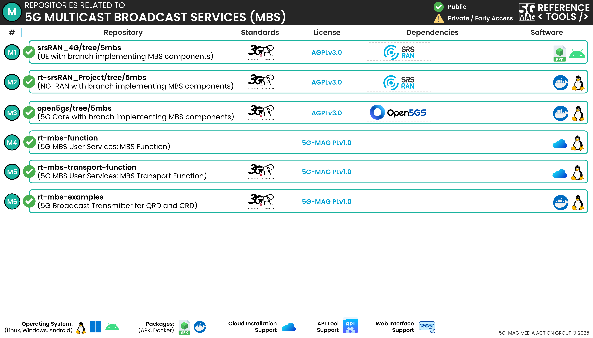

# Repositories

Please note that 5G Multicast Broadcast Services is implemented as an extension of [Open5GS](https://github.com/5G-MAG/open5gs)

---

## 5G Core (with MBS components): [open5gs/tree/upv-mbs](https://github.com/5G-MAG/open5gs/tree/upv-mbs)

## Auxiliary repositories:

### MBS Examples: [rt-mbs-examples](https://github.com/5G-MAG/rt-mbs-examples)
* [Information and how to download, build, install and run](https://github.com/5G-MAG/rt-mbs-examples#readme)
* [Releases](https://github.com/5G-MAG/rt-mbs-examples/releases)

