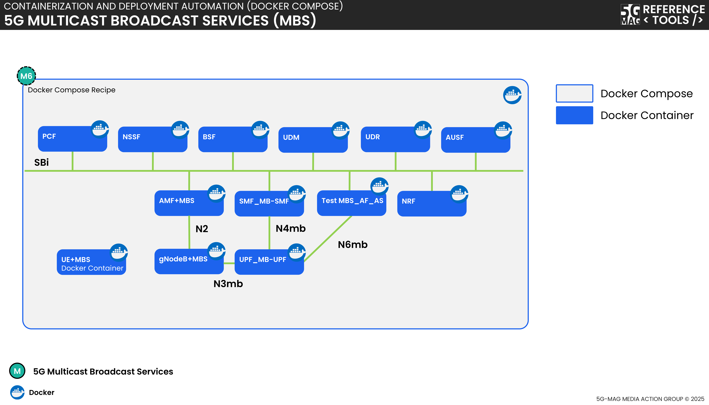

 

[Scope](./scope.html){: .btn .btn-blue } [Project Roadmap](./projects.html){: .btn .btn-blue } [GitHub Repos](./repositories.html){: .btn .btn-github } [Releases](../releases.html#project-5g-multicast-broadcast-services){: .btn .btn-release } [Tutorials](./tutorials.html){: .btn .btn-tutorial } [Video Library](./tutorials.html#video-library){: .btn .btn-video } [Requirements](./requirements.html){: .btn .btn-blue }

# Scope

In the context of 3GPP standards, the Multicast Broadcast Services System, **MBS System**, is designed to support multicast and broadcast services in 5G networks. It introduces a flexible architecture that supports both Multicast (for specific groups with high reliability) and Broadcast (for wide-area distribution to all users), allowing the network to dynamically switch between point-to-point and point-to-multipoint delivery. While the MBS System handles the heavy lifting of moving data through the 5G core and radio, **MBS User Services** defines how that content is actually packaged, discovered, and consumed by the end-user's application.

A list of relevant specifications can be found in the link below.

[Specifications](https://hub.5g-mag.com/Standards/pages/5g-multicast-broadcast-services.html){: .btn .btn-blue }

Technical documentation including explainers can be found in the link below.

[Technical Documentation](https://hub.5g-mag.com/Tech/pages/5g-multicast-broadcast-services.html){: .btn .btn-blue }

# What is being implemented? 

{: .inshort }
Some of the functional entities of the MBS System and MBS User Services, including support in the application provider side, the 5GC, NG-RAN and UE.

## MBS User Services

### Features under implementation

The 5G-MAG Reference Tools for **MBS User Services** add the following functionality:
- MBSTF Distribution Session management (e.g. by an MBSF) via reference point Nmb2.
- Ingest of objects by the MBSTF from the MBS Application Provider (AF/AS) via reference point Nmb8, using either a pull- or push-based object acquisition method.
- Delivery of ingested objects in a FLUTE Session multicast sent as multicast ALC packets from an MBSTF to an MB-UPF via a reference point Nmb9 unicast tunnel.

The following features are supported:
- `MB-SMF TMGI Service API` (Following 3GPP TS 29.532 V17.4.0)
  - TMGI Allocate Service operation
  - TMGI Deallocate Service operation
- `MB-SMF MBS Session Service API` (Following 3GPP TS 29.532 - Release 17.4.0)
  - MBS Session Create Service operation
  - MBS Session Release Service operation
- `MB-SMF PFCP Session Establishment extensions` (Following 3GPP TS 29.244 - Release 17.9.0)
  - PFCP Session Establishment Request extensions
- `MB-UPF PFCP Session Establishment extensions` (Following 3GPP TS 29.244 - Release 17.9.0)
  - PFCP Session Establishment Response extensions
- `Multicast/Broadcast Service Transport Services (MBSTF)` (Following 3GPP TS 29.581 V18.5.0)
  - Object distribution method
    - **Single shot operating mode**: Individual objects are sent once in a FLUTE Session by the MBSTF
      - Pull-based object acquisition (MBSTF pulls objects from a media server)
      - Push-based object acquisition (objects are pushed into the MBSTF)
    - **Streaming operating mode**: Objects are scheduled and sent in real time according to a presentation manifest, such as a DASH MPD.
      - Pull-based object acquisition (MBSTF pulls a Service Entry Point object, such as a presentation manifest, and then schedules the pulling of further objects, such as media segments and updates of the presentation manifest)
      - Push-based object acquisition (MBSTF waits for a Service Entry Point object, such as a presentation manifest, to be pushed to it, and then schedules the pulling of media segment objects)
      - For this operating mode, the supported Service Entry Point formats are:
         - MPEG-DASH MPD (live profile only).

The following features are not yet supported:
- `AMF MBS Broadcast Service API` (Following 3GPP TS 29.518 V17.11.0)
  - MBS Broadcast ContextCreate Service operation
  - MBS Broadcast ContextRelease Service operation
- `AMF NGAP extensions` (Following 3GPP TS 38.413 - Release 17.6.0)
  - BROADCAST SESSION SETUP REQUEST
- `gNB NGAP extensions` (Following 3GPP TS 38.413 - Release 17.6.0)
  - BROADCAST SESSION SETUP RESPONSE
- `NRF NFDiscovery Service API extensions` (Following 3GPP TS 29.510 - Release 17.11.0)
  - MB-SMF TMGI Service API extensions
  - MB-SMF MBS Session Service API extensions
  - AMF MBS Broadcast Service API extensions
- `MBSTF Distribution Session management` (Following 3GPP TS 29.581 V18.5.0)
  - **Packet distribution method**
    - Use direct multicast packet ingest by the MB-UPF at reference point N6mb instead for now.
  - **Object distribution method**
    - **Collection operating mode**: One or more objects described by a simple manifest are sent once in the FLUTE Session.
    - **Carousel operating mode**: One or more objects described by a simple manifest are repeatedly sent in the FLUTE Session according to a schedule.
    - **Streaming operating mode**: Objects are sent in a FLUTE Session in real time according to a schedule specified in a streaming presentation manifest.
      - Presentation manifest types other than MPEG-DASH MPD (live profile).
  - Status notification subscription

## MBS System

### MBS development over Open5GS

The 5G-MAG Reference Tools for MBS currently target:
- MBS Session provisioning in the MB-SMF (e.g. by an MBSF) via reference point Nmb1.
- Direct multicast data ingest by the MB-UPF from an AF/AS via reference point N6mb.
- Shared delivery of multicast packets from the MB-UPF via individual GTP-U tunnels to one or more gNodeBs in the 5G Core.
- Point-to-Multipoint (PTM) delivery of multicast packets from a gNodeB to UEs via the RAN.

# High-level architectures

## 5G Multicast Broadcast Services (MBS)

[5G Multicast Broadcast Services: Repositories](../5g-multicast-broadcast-services/repositories.html){: .btn .btn-5mbs }
[Multimedia content delivery protocols: Repositories](../multimedia-content-delivery/repositories.html){: .btn .btn-md }
[3GPP RAN and Core Platforms: Repositories](../3gpp-ran-and-core-platforms/repositories.html){: .btn .btn-3gpp }
[Common Tools: Repositories](../common-tools/){: .btn .btn-common }

## 5G Multicast Broadcast Services (MBS) with 5GC Service Consumers

[5G Multicast Broadcast Services: Repositories](../5g-multicast-broadcast-services/repositories.html){: .btn .btn-5mbs }
[Multimedia content delivery protocols: Repositories](../multimedia-content-delivery/repositories.html){: .btn .btn-md }
[5GC Service Consumers: Repositories](../5g-core-service-consumers/repositories.html){: .btn .btn-5gcsc }
[3GPP RAN and Core Platforms: Repositories](../3gpp-ran-and-core-platforms/repositories.html){: .btn .btn-3gpp }
[Common Tools: Repositories](../common-tools/){: .btn .btn-common }

# Docker deployment support
Docker-Compose setups are provided to run the 5GC Network Functions related to MBS in Docker container environments.

[5G Multicast Broadcast Services: Repositories](../5g-multicast-broadcast-services/repositories.html){: .btn .btn-5mbs }
