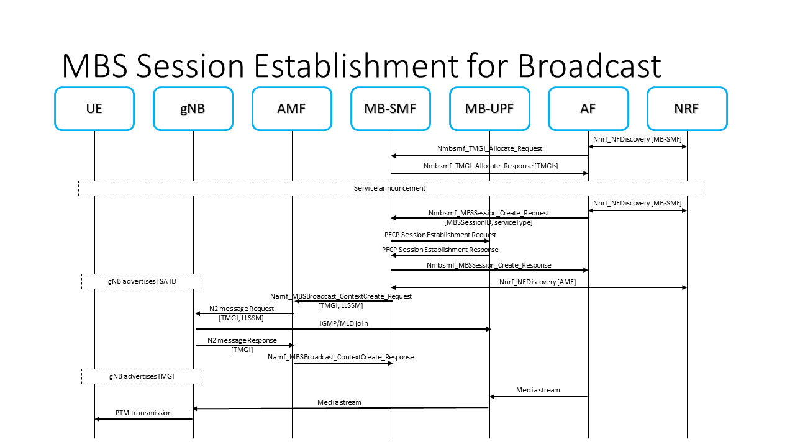

# Creating TMGI and MBS Broadcast Session



MBS Sessions can be of two different types, Broadcast MBS Sessions and Multicast MBS Sessions. Broadcast MBS Sessions
can be seen as a subset of the Multicast MBS Sessions functionality. In the MBS Sessions context, two kinds of
identifiers exist, TMGI (Temporary Mobile Group Identifier) and SSM (Source Specific Multicast). Broadcast MBS Sessions
are identified by a TMGI, while Multicast MBS Sessions can be identified by using TMGI or SSM. Even if SSM is selected
as identifier, a TMGI is **always** allocated.

The current implementation lets you create a TMGI by sending an HTTP/2 request to the MB-SMF.

The TMGI can be created in two ways:

1. Sending an HTTP/2 request to the MB-SMF to the `MB-SMF TMGI Service API` using the _TMGI Allocate Service
   operation_ (this way only the TMGI is created)
2. Sending an HTTP/2 request to the MB-SMF to the `MB-SMF MBS Session Service API` using the _MBS Session Create Service
   operation_ with `tmgiAllocReq` property set to _true_ (this way a TMGI and MBS Session are created)

In this implementation, the TMGI stores the expiration time for the MBS Session. Currently the Network Functions local
time is set in UTC and everytime a TMGI is created the _expiration time_ is set to two hours.
The `MB-SMF TMGI Service API` using the _TMGI Allocate Service operation_ can be used to refresh the _expiration time_of
an existing TMGI. This process adds two extra hours to the _expiration time_ of the TMGIs specified in the request.

The MBS Session can be created in various ways, depending on the service type of the session, the existing service types
are _BROADCAST_ or _MULTICAST_.

A Broadcast MBS Session can be created in two ways:

1. If the TMGI has been previously allocated using the `MB-SMF TMGI Service API`, an MBS Session must be created sending
   an HTTP/2 request to the MB-SMF to the `MB-SMF MBS Session Service API` using the _MBS Session Create Service
   operation_ with `tmgiAllocReq` property set to _false_ (this way only a MBS Session is created). The request must
   contain the previously allocated TMGI in the `tmgi` object
2. If the TMGI has not been previously allocated, TMGI allocation and MBS Session creation can be done at the same time,
   as explained before. Sending an HTTP/2 request to the MB-SMF to the `MB-SMF MBS Session Service API` using the _MBS
   Session Create Service operation_ with `tmgiAllocReq` property set to _true_ (this way a TMGI and MBS Session are
   created)

A Multicast MBS Session can be created in three ways:

> Note: To be documented

After sending the request for the MBS Session creation, some side effects occur:

- MB-SMF and MB-UPF start the PFCP Session Establishment with the `MB-SMF PFCP Session Establishment extensions` using
  _PFCP Session Establishment Request extensions_ and the `MB-UPF PFCP Session Establishment extensions` using _PFCP
  Session Establishment Response extensions_
- MB-SMF sends the AMF MBS Broadcast ContextCreate with the `AMF MBS Broadcast Service API` using _MBS Broadcast
  ContextCreate Service operation_
- AMF sends the NGAP BROADCAST SESSION SETUP to the gNBs with the `AMF NGAP extensions` using _BROADCAST SESSION SETUP
  REQUEST_ and the gNBs respond with the `gNB NGAP extensions` using _BROADCAST SESSION SETUP RESPONSE_

### Detailed explanations of the side effects

#### [MB-SMF <-> MB-UPF]: PFCP Session Establishment side effects

Due to the use of multicast transport on the N6mb interface, the SSM identifier must be present on
the `MB-SMF MBS Session Service API` request using the _MBS Session Create Service operation_. It does not matter if the
requested service type is of type _BROADCAST_ or _MULTICAST_.

The placement of the SSM in the request selects which kind of identifier is being used. In the JSON data of the request,
if the SSM is present inside the `mbsSession` object, right at the `ssm` object, the TMGI is being used as identifier.
If the SSM is present inside the `mbsSession` object and inside the `mbsSessionId` object, at the `ssm` object, then SSM
is being used as identifier. The addresses defined in the `ssm` object are the ones being used by the MB-UPF as Packet
Detection Rules (PDR) to identify the N6mb multicast traffic.

The MB-UPF detects the traffic coming from the SSM and forwards it to the gNBs that have joined the multicast group
defined by the LLSSM (Lower Layer Source Specific Multicast). Because of the use of GTPU, a TEID must be selected to
forward the traffic, in the case of multicast transport, a C-TEID (Common TEID) is selected and is shared between all
the gNBs receiving the multicast traffic.

> Important note: Currently, there is a limit of 20 MBS Sessions per MB-UPF. The range of IP multicast addresses being
> used for the MB-UPF to forward the multicast traffic to the gNB using the LLSSM is `239.0.0.4-239.0.0.24`. That is why
> it is recommended to start the range for the SSM on the IP multicast address `239.0.0.25` onwards.

#### [MB-SMF <-> AMF]: AMF MBS Broadcast ContextCreate side effect

> Note: To be implemented and to be documented

#### [AMF <-> gNBs]: NGAP BROADCAST SESSION SETUP side effect

> Note: To be implemented and to be documented

## Creating/Allocating a TMGI

The TMGI can be created by using the `TMGI Service API` or by using the `MBS Session Service API` with
the `tmgiAllocReq` set to _true_.

### Method 1: TMGI Service API

With this method, the AF/AS will ask the MB-SMF to allocate the number of TMGIs present on the `tmgiNumber` field in the
JSON data of the request.

```bash
# Execute this command inside the AF/AS container
# TMGI Allocate (allocate) request: /nmbsmf-tmgi/v1/tmgi
curl --http2-prior-knowledge \
  --request POST \
  --header "Content-Type: application/json" \
  --data '{ "tmgiNumber": 1 }' \
  smf-mb-smf.5g-mag.org:80/nmbsmf-tmgi/v1/tmgi
```

The response of the MB-SMF, should send the list of allocated TMGIs:

```json
{
  "tmgiList": [
    {
      "mbsServiceId": "9236F7",
      "plmnId": {
        "mcc": "001",
        "mnc": "01"
      }
    }
  ],
  "expirationTime": "2024-06-04T16:59:10.628193+00:00"
}
```

### Method 2: MBS Session Service API

With this method, the AF/AS will ask the MB-SMF to allocate one TMGI and an MBS Session will be created and associated
with this TMGI in the same request. The SSM is used for the detection of the multicast transport over N6mb.

```bash
# Execute this command inside the AF/AS container
# MBS Session Create request with TMGI allocate: /nmbsmf-mbssession/v1/mbs-sessions with multicast source
curl --http2-prior-knowledge \
  --request POST \
  --header "Content-Type: application/json" \
  --data '{ "mbsSession": { "ssm": { "sourceIpAddr": { "ipv4Addr": "<af_as_container_ip>" }, "destIpAddr": { "ipv4Addr": "<n6mb_ip_multicast_destination_address>" } },"tmgiAllocReq": true, "serviceType":"BROADCAST" } }' \
  smf-mb-smf.5g-mag.org:80/nmbsmf-mbssession/v1/mbs-sessions
```

The response of the MB-SMF, should send the MBS Session with the allocated TMGI:

```json
{
  "mbsSession": {
    "mbsSessionId": {
      "tmgi": {
        "mbsServiceId": "0D3BE6",
        "plmnId": {
          "mcc": "001",
          "mnc": "01"
        }
      }
    },
    "tmgi": {
      "mbsServiceId": "0D3BE6",
      "plmnId": {
        "mcc": "001",
        "mnc": "01"
      }
    },
    "serviceType": "BROADCAST"
  }
}
```

## Updating an existing TMGI

### TMGI Service API

With this method, the AF/AS will ask the MB-SMF to refresh an existing TMGI. This method is only accesible through
the `TMGI Service API` but can be combined with the allocation too:

```bash
# Execute this command inside the AF/AS container
# TMGI Allocate (refresh) request: /nmbsmf-tmgi/v1/tmgi
curl --http2-prior-knowledge \
  --request POST \
  --header "Content-Type: application/json" \
  --data '{ "tmgiList": [ { "mbsServiceId": "9236F7", "plmnId": { "mcc": "001", "mnc": "01" } } ] }' \
  smf-mb-smf.5g-mag.org:80/nmbsmf-tmgi/v1/tmgi
```

The response of the MB-SMF, should send the new expiration time for the refreshed TMGIs:

```json
{
  "tmgiList": [],
  "expirationTime": "2024-06-04T17:02:07.119039+00:00"
}
```

Combination of TMGI allocate request and TMGI refresh:

```bash
# Execute this command inside the AF/AS container
# TMGI Allocate (allocate + refresh) request: /nmbsmf-tmgi/v1/tmgi
curl --http2-prior-knowledge \
  --request POST \
  --header "Content-Type: application/json" \
  --data '{ "tmgiNumber": 1, "tmgiList": [ { "mbsServiceId": "9236F7", "plmnId": { "mcc": "001", "mnc": "01" } } ] }' \
  smf-mb-smf.5g-mag.org:80/nmbsmf-tmgi/v1/tmgi
```

The response of the MB-SMF, should send the allocated TMGIs and the new expiration time for the refreshed TMGIs:

```json
{
  "tmgiList": [
    {
      "mbsServiceId": "E79DA9",
      "plmnId": {
        "mcc": "001",
        "mnc": "01"
      }
    }
  ],
  "expirationTime": "2024-06-04T17:03:01.036961+00:00"
}
```

## Creating an MBS Broadcast Session

### Method 1: Creating an MBS Broadcast Session and a TMGI in the same request

With this method, the AF/AS will ask the MB-SMF to allocate one TMGI and an MBS Session will be created and associated
with this TMGI in the same request. The SSM is used for the detection of the multicast transport over N6mb.

```bash
# Execute this command inside the AF/AS container
# MBS Session Create request with TMGI allocate: /nmbsmf-mbssession/v1/mbs-sessions with multicast source
curl --http2-prior-knowledge \
  --request POST \
  --header "Content-Type: application/json" \
  --data '{ "mbsSession": { "ssm": { "sourceIpAddr": { "ipv4Addr": "<af_as_container_ip>" }, "destIpAddr": { "ipv4Addr": "<n6mb_ip_multicast_destination_address>" } },"tmgiAllocReq": true, "serviceType":"BROADCAST" } }' \
  smf-mb-smf.5g-mag.org:80/nmbsmf-mbssession/v1/mbs-sessions
```

The response of the MB-SMF contains the allocated TMGI as MBS Session identifier and also de SSM specified in the
request:

```json
{
  "mbsSession": {
    "mbsSessionId": {
      "tmgi": {
        "mbsServiceId": "F9ECB4",
        "plmnId": {
          "mcc": "001",
          "mnc": "01"
        }
      }
    },
    "tmgi": {
      "mbsServiceId": "F9ECB4",
      "plmnId": {
        "mcc": "001",
        "mnc": "01"
      }
    },
    "serviceType": "BROADCAST"
  }
}
```

### Method 2: Creating a Broadcast MBS Session using an existing TMGI

With this method, the AF/AS will ask the MB-SMF to create an MBS Session and the existing TMGI will be associated with
it. The SSM is used for the detection of the multicast transport over N6mb.

```bash
# Execute this command inside the AF/AS container
# MBS Session Create request with existing TMGI: /nmbsmf-mbssession/v1/mbs-sessions
curl --http2-prior-knowledge \
  --request POST \
  --header "Content-Type: application/json" \
  --data '{ "mbsSession": { "mbsSessionId": { "tmgi": { "mbsServiceId": "9236F7", "plmnId": { "mcc":"001", "mnc":"01" } } }, "ssm": { "sourceIpAddr": { "ipv4Addr": "<af_as_container_ip>" }, "destIpAddr": { "ipv4Addr": "<n6mb_ip_multicast_destination_address>" } }, "serviceType":"BROADCAST" } }' \
  smf-mb-smf.5g-mag.org:80/nmbsmf-mbssession/v1/mbs-sessions
```

The response of the MB-SMF contains the specified TMGI and SSM, using the TMGI as MBS Session identifier as specified in
the request:

```json
{
  "mbsSession": {
    "mbsSessionId": {
      "tmgi": {
        "mbsServiceId": "9236F7",
        "plmnId": {
          "mcc": "001",
          "mnc": "01"
        }
      }
    },
    "tmgi": {
      "mbsServiceId": "9236F7",
      "plmnId": {
        "mcc": "001",
        "mnc": "01"
      }
    },
    "serviceType": "BROADCAST"
  }
}
```

### Method 3: Creating a Broadcast MBS Session using SSM as identifier

> Note: To be documented

