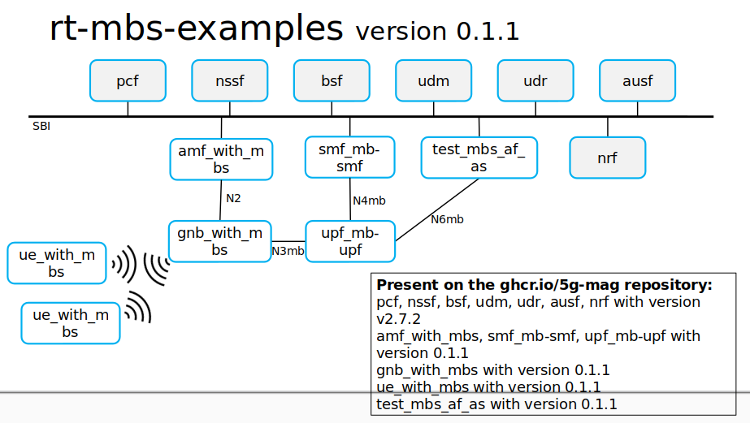

# Initial MBS support in the 5GC

This tutorial showcases the current features present in the 5G-MAG MBS implementation. You can check out the video to
see more details or follow the write-up tutorial.

## Tutorial video

<iframe width="560" height="315" src="https://www.youtube.com/embed/lJh2F0xXxpE?si=qtvABXQwNoHkaveH" title="YouTube video player" frameborder="0" allow="accelerometer; autoplay; clipboard-write; encrypted-media; gyroscope; picture-in-picture; web-share" referrerpolicy="strict-origin-when-cross-origin" allowfullscreen></iframe>

## Prerequisites

Before starting with this tutorial please follow
the [Docker installation instructions](https://github.com/5G-MAG/rt-mbs-examples?tab=readme-ov-file#running) for the
5MBS stack. This tutorial assumes that you have cloned
the [rt-mbs-examples repository](https://github.com/5G-MAG/rt-mbs-examples) and started the 5MBS Docker images with the
internal deployment mode.

You can verify that all Docker containers are running by executing `docker ps -a` on the host machine.

## Description

In this tutorial a Broadcast MBS Session will be created in order to send traffic from the AF/AS to a multicast group (
SSM) and see the traffic going through the 5G Core and leaving the MB-UPF (LLSSM) in order to reach the gNB. The basic
architecture of the different components/containers is depicted in the illustration below.




> Note: Currently there is no way to receive the multicast traffic on the gNB, that feature is under development, but
> while performing the MBS Session setup you can see an MBS related message being sent between the AMF and the gNB
> through
> the N2 interface!

In order to create a Broadcast MBS Session a TMGI will be used as identifier but an SSM address needs to be specified
too. This SSM will be the address that the AF/AS will use to send the multicast traffic to the MB-UPF through the N6mb
interface. The LLSSM is the lower layer SSM that the MB-UPF will use in order to reach the gNBs that need to receive the
multicast traffic.

> Important note: Currently, there is a limit of 20 MBS Sessions per MB-UPF. The range of IP multicast addresses being
> used for the MB-UPF to forward the multicast traffic to the gNB using the LLSSM is `239.0.0.4-239.0.0.24`. That is why
> it is recommended to start the range for the SSM on the IP multicast address `239.0.0.25` onwards

### Step 1: Creating an MBS Session

Connect to the shell of the `test_mbs_af_as` container:

```bash
# Connect to the test_mbs_af_as container
docker exec -it test_mbs_af_as sh
```

From the `test_mbs_af_as` container execute the following command to create an MBS session.
Replace `<af_as_container_ip>` with the IP of the `test_mbs_af_as` container. You can derive the IP by
calling `ip address` in the shell and copying the `eth0` interface address. In addition,
replace `<n6mb_ip_multicast_destination_address>`  with a valid multicast address such as `239.0.0.25` or higher.

```bash
# MBS Session Create request with TMGI allocate: /nmbsmf-mbssession/v1/mbs-sessions with multicast source
curl --http2-prior-knowledge \
  --request POST \
  --header "Content-Type: application/json" \
  --data '{ "mbsSession": { "ssm": { "sourceIpAddr": { "ipv4Addr": "<af_as_container_ip>" }, "destIpAddr": { "ipv4Addr": "<n6mb_ip_multicast_destination_address>" } },"tmgiAllocReq": true, "serviceType":"BROADCAST" } }' \
  smf_mb-smf.5g-mag.org:80/nmbsmf-mbssession/v1/mbs-sessions
```

This command will create an MBS Session of type `BROADCAST`, specifying the SSM address from which the MB-UPF will
receive the traffic from `test_mbs_af_as`. With the parameter `tmgiAllocReq` set to `true`, the request also tells the
MB-SMF
to create a TMGI for this MBS Session.

### Step 2: MB-UPF traffic configuration

In order for the MB-UPF to receive the traffic being sent to this multicast group (SSM) and then forward it to the
LLSSM, we need to connect to the `MB-UPF` container

```bash
# Connect to the MB-UPF container
docker exec -it upf_mb-upf sh
```

and then execute the following command to configure the MB-UPF:

```bash
# Execute this command inside the MB-UPF container
smcroutectl add eth0 <n6mb_ip_multicast_destination_address> ogstun
```

Replace `n6mb_ip_multicast_destination_address` with the multicast address that you chose in the previous step,
e.g. `239.0.0.25`.

This command will update the MFC of the MB-UPF to receive the traffic for the multicast
group `<n6mb_ip_multicast_destination_address>` and forward it internally using the `ogstun` interface.

After all of this is configured, the MB-UPF has been configured through PFCP to forward the traffic received to the
LLSSM. The first LLSSM created uses the multicast destination address `239.0.0.4` and random C-TEID.

### Step 3: Sending multicast IP packets

Through the `test_mbs_af_as` with IP address `<af_as_container_ip>` you can send an IP packet to the multicast
destination `<n6mb_ip_multicast_destination_address>`. This causes the MB-UPF to forward the traffic using GTPU to the
LLSSM

To verify that the traffic is being forwarded to the LLSSM execute the following command on your host machine:

```bash
tcpdump -i br-5g-mag udp port 2152
```

Connect to test_mbs_af or use the previously connected terminal:

```bash
# Connect to test_mbs_af or use the previously connected terminal
docker exec -it test_mbs_af_as sh
```

Then send traffic from the test_mbs_af_as container:

```bash
sendip -p ipv4 -is <af_as_container_ip> -id <n6mb_ip_multicast_destination_address> upf-mb-upf.5g-mag.org
```

Again replace `<af_as_container_ip>` and `<n6mb_ip_multicast_destination_address>` with the respective IP addresses.

> Note: When the gNB part is done, this traffic will be received by the gNBs configured to listen to the LLSSM and
> forward it to the UEs using PTM.
