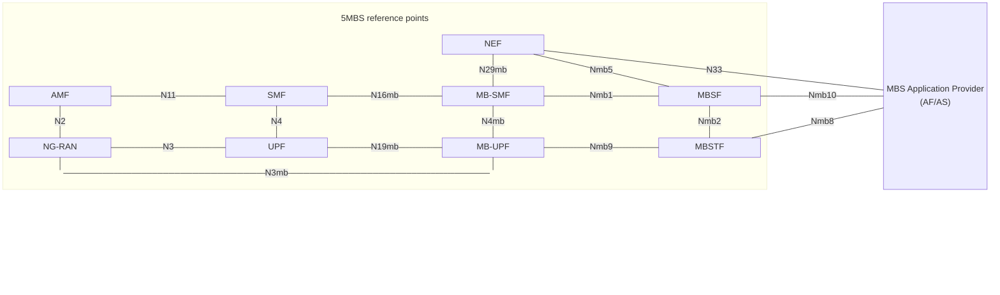
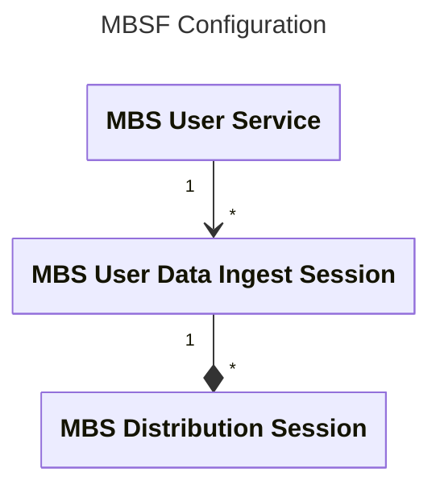

 

[Scope](../scope.html){: .btn .btn-blue } [Project Roadmap](../projects.html){: .btn .btn-blue } [GitHub Repos](../repositories.html){: .btn .btn-github } [Releases](../../releases.html#project-5g-multicast-broadcast-services){: .btn .btn-release } [Tutorials](../tutorials.html){: .btn .btn-tutorial } [Requirements](../requirements.html){: .btn .btn-blue }

# Introduction to the MBS Function

The MBS Function is responsible for controlling the MBS User Services sessions. It does this by managing MBS Sessions with the
MB-SMF, managing MBS Distribution Sessions with the MBSTF(s) and creating and propagating the User Service Announcements. 

The initial implementation of the MBSF performs the first two tasks, managing the MB-SMF and MBSTF(s), but does not implement the Service Announcement at this time.

The MBSF is configured by an Application Provider using the API at reference point Nmb10. This tutorial covers the use of the APIs at Nmb10 to configure the MBSF.

# Tutorial on Operating the MBS Function

## Tutorial videos

<iframe width="560" height="315" src="https://www.youtube.com/embed/0re77KNmxYQ?si=PVTIFSEPJr6rMMPU" title="YouTube video player" frameborder="0" allow="accelerometer; autoplay; clipboard-write; encrypted-media; gyroscope; picture-in-picture; web-share" referrerpolicy="strict-origin-when-cross-origin" allowfullscreen></iframe>


## Architecture



## Prerequisites

This tutorial assumes that you have cloned and built the [rt-mbs-function repository](https://github.com/5G-MAG/rt-mbs-function), [rt-mbs-transport-function repository](https://github.com/5G-MAG/rt-mbs-transport-function) and the [5MBS branch of the open5gs repository](https://github.com/5G-MAG/open5gs/tree/5mbs).

A 5G Core must be running for these examples with at least the NRF, SCP, MB-SMF, MB-UPF, MB-AMF and UDM Network Functions (see the instructions in our [Open5GS 5MBS branch](https://github.com/5G-MAG/open5gs/tree/5mbs) README).

There should also be an MBSTF running (see the instructions in the [rt-mbs-transport-function](https://github.com/5G-MAG/rt-mbs-transport-function) README).

## Description

In this tutorial we will cover the configuration of the MBSF via the APIs at reference point Nmb10. The configuration is split into 2 main areas, the MBS User Services and the MBS User Data Ingest Sessions.



The MBS User Service contains high level metadata about the Media Service being provided and may have multiple MBS User Data Ingest Sessions attached to it.

The MBS User Data Ingest Session contains one or more MBS Distribution Session descriptions and is attached to an MBS User Service.

An MBS Distribution Session contains the information that will tell an MBSTF how to receive a media stream and send it on the User
Plane.

## Running the MBSF for this tutorial

Copy the following into a `local-mbsf.yaml` file:

```yaml
global:
    max:
      ue: 128

logger:
    level: debug

mbsf:
    sbi:
      server:
        - address: 127.0.0.68
          port: 7777
      client:
        scp:
          - uri: http://127.0.0.200:7777
        nrf:
          - uri: http://127.0.0.10:7777
    mbsUserServices:
      - addr: 127.0.0.68
        port: 7777
    mbsUserDataIngestSession:
      - addr: 127.0.0.68
        port: 7777
    serverResponseCacheControl:
      - maxAge: 60
        mbsUserServiceMaxAge: 60
        mbsUserDataIngestSessionMaxAge: 60
    activeDistributionSessionsSoftLimit: 1000
    activeUserServicesSoftLimit: 50
    actPeriodGoToEstablishedState: 60 
```

With an MBS aware 5G Core running, and an MBSTF running (see above in [Prerequisites](#prerequisites)), the MBSF can be started with our tutorial configuration.

```bash
/usr/local/bin/open5gs-mbsfd -c local-mbsf.yaml
```

## MBS User Service Operations

### Create MBS User Service

This operation sends an *MBSUserService* (TS 29.580 Clause 6.1.6.2.2), to create a new MBS User Service, to the API with a `.../nmbsf-mbs-us/v1/mbs-user-services` path suffix. If the Create operation is successful then a *201 Created* response will be sent with the new MBS User Service resource location in the `Location` HTTP header.

Create a `mbs-user-service.json` file with the following contents:

```json
{
  "extServiceIds": ["https://example.broadcaster.com/services/first-service"],
  "servType": "MULTICAST",
  "servClass": "urn:oma:bcast:oma_bsc:st:1.0",
  "servAnnModes": ["VIA_MBS_5", "VIA_MBS_DISTRIBUTION_SESSION", "PASSED_BACK"],
  "servNameDescs": [
    {
      "servName": "First Service",
      "servDescrip": "The first service, operated by Example Broadcaster, is our general entertainment channel",
      "language": "eng"
    }
  ],
  "mainServLang": "eng"
}
```

The fields above represent:
- *extServiceIds*
   - An array of external service identifiers so that this service can be correlated to the same service received from another network.
- *servType*
   - The type of service, `MULTICAST` or `BROADCAST`.
- *servClass*
   - The [OMA BCast Service Class](https://www.openmobilealliance.org/omna/bcast/bcast-service-class-registry.html) for this service.
- *servAnnModes*
   - A array of one or more Service Announcement publication modes from the list of:
      - `VIA_MBS_5` - Service announcement is provided via reference point Mbs5 when an MBS client on the UE requests it.
      - `VIA_MBS_DISTRIBUTION_SESSION` - The Service Announcement is carried on the Service Announcement channel of the MBS Service.
      - `PASSED_BACK` - The Service Announcement is passed back to the Application Provider for private distribution via Mbs8.
- *servNameDescs*
   - An array of service name descriptions in different languages:
      - *servName* contains a short service name in the language denoted by *language*.
      - *servDescrip* is a description of the service in the language denoted by *language*.
      - *language* The language used for *servName* and *servDescrip*.
      - Note: there must be at least one of *servName* or *servDescrip*.
- *mainServLang*
   - The main language of this service.

This file can be sent as a Create MBS User Service request using the following command:

```bash
curl -v --http2-prior-knowledge -H 'Content-Type: application/json' -X POST --data-binary @mbs-user-service.json http://127.0.0.68:7777/nmbsf-mbs-us/v1/mbs-user-services
```

If the MBSF is working correctly the response will look like:

```
< HTTP/2 201 
< server: Open5GS v2.6.4-563-g4342250
< date: Wed, 17 Dec 2025 16:10:01 GMT
< content-length: 445
< etag: b2adb87203ec4e63b16fbd2f7e4b7dd8581870ab604af93f873e78994cc6a360
< last-modified: Wed, 17 Dec 2025 16:10:01 UTC
< cache-control: max-age=60
< server: MBSF-localhost/18 (info.title=nmbsf-mbs-us; info.version=1.1.0) rt-mbs-function/0.1.0
< location: /nmbsf-mbs-us/v1/mbs-user-services/d72a4394-db62-41f0-8e26-9174558de382
< content-type: application/json
< 
{
	"extServiceIds":	["https://example.broadcaster.com/services/first-service"],
	"servType":	"MULTICAST",
	"servClass":	"urn:oma:bcast:oma_bsc:st:1.0",
	"servAnnModes":	["VIA_MBS_5", "VIA_MBS_DISTRIBUTION_SESSION", "PASSED_BACK"],
	"servNameDescs":	[{
			"servName":	"First Service",
			"servDescrip":	"The first service, operated by Example Broadcaster, is our general entertainment channel",
			"language":	"eng"
		}],
	"mainServLang":	"eng"
}
```

We need to make a note of the MBS User Service Id, which is found in the `location:` header. To make it easier for later commands we will store the Id in a shell variable. So for the example response above this would be:

```bash
mbs_user_service_id=d72a4394-db62-41f0-8e26-9174558de382
```

### Updating an MBS User Service

The Update operation uses the same *MBSUserService* JSON data structure as the Create operation to replace the details of an existing MBS User Service. This is done using a *PUT* request to the API URL ending in `.../nmbsf-mbs-us/v1/mbs-user-services/{mbs_user_service_id}`.

To demonstrate this we will take a copy of `mbs-user-service.json` as `mbs-user-service-altered.json` and change the `"servDescrip"` attribute to `"The description has been changed!"` to change the service description.

The update to the MBS User Service can be requested using the following command:

```bash
curl -v --http2-prior-knowledge -H 'Content-Type: application/json' -X PUT --data-binary @mbs-user-service-altered.json http://127.0.0.68:7777/nmbsf-mbs-us/v1/mbs-user-services/${mbs_user_service_id}
```

The response will look like:

```
< HTTP/2 200 
< server: Open5GS v2.6.4-563-g4342250
< date: Wed, 17 Dec 2025 16:43:59 GMT
< content-length: 390
< server: MBSF-localhost/18 (info.title=nmbsf-mbs-us; info.version=1.1.0) rt-mbs-function/0.1.0
< location: /nmbsf-mbs-us/v1/mbs-user-services/d72a4394-db62-41f0-8e26-9174558de382
< content-type: application/json
< etag: b2adb87203ec4e63b16fbd2f7e4b7dd8581870ab604af93f873e78994cc6a360
< last-modified: Wed, 17 Dec 2025 16:10:01 UTC
< cache-control: max-age=60
< 
{
	"extServiceIds":	["https://example.broadcaster.com/services/first-service"],
	"servType":	"MULTICAST",
	"servClass":	"urn:oma:bcast:oma_bsc:st:1.0",
	"servAnnModes":	["VIA_MBS_5", "VIA_MBS_DISTRIBUTION_SESSION", "PASSED_BACK"],
	"servNameDescs":	[{
			"servName":	"First Service",
			"servDescrip":	"The description has been changed!",
			"language":	"eng"
		}],
	"mainServLang":	"eng"
}
```

### Retrieving an MBS User Service

An *MBSUserService* JSON data structure can be retrieved for a given MBS User Service Id by doing an HTTP *GET* request to the API URL ending in `.../nmbsf-mbs-us/v1/mbs-user-services/{mbs_user_service_id}`.

This can be done using the following command:

```bash 
curl -v --http2-prior-knowledge -X GET http://127.0.0.68:7777/nmbsf-mbs-us/v1/mbs-user-services/${mbs_user_service_id}
```

The response will look like:

```
< HTTP/2 200 
< server: Open5GS v2.6.4-563-g4342250
< date: Wed, 17 Dec 2025 16:48:37 GMT
< content-length: 390
< etag: b2adb87203ec4e63b16fbd2f7e4b7dd8581870ab604af93f873e78994cc6a360
< last-modified: Wed, 17 Dec 2025 16:10:01 UTC
< cache-control: max-age=60
< server: MBSF-localhost/18 (info.title=nmbsf-mbs-us; info.version=1.1.0) rt-mbs-function/0.1.0
< location: /nmbsf-mbs-us/v1/mbs-user-services/d72a4394-db62-41f0-8e26-9174558de382
< content-type: application/json
< 
{
	"extServiceIds":	["https://example.broadcaster.com/services/first-service"],
	"servType":	"MULTICAST",
	"servClass":	"urn:oma:bcast:oma_bsc:st:1.0",
	"servAnnModes":	["VIA_MBS_5", "VIA_MBS_DISTRIBUTION_SESSION", "PASSED_BACK"],
	"servNameDescs":	[{
			"servName":	"First Service",
			"servDescrip":	"The description has been changed!",
			"language":	"eng"
		}],
	"mainServLang":	"eng"
}
```

### Deleting an MBS User Service

An MBS User Service can be deleted by doing an HTTP *DELETE* request for the API URL ending in `.../nmbsf-mbs-us/v1/mbs-user-services/{mbs_user_service_id}`.

This can be done using the following command:

```bash
curl -v --http2-prior-knowledge -X DELETE http://127.0.0.68:7777/nmbsf-mbs-us/v1/mbs-user-services/${mbs_user_service_id}
```

Upon successful deletion of the MBS User Service, the response will be a *204 No Content* and will look like:

```
< HTTP/2 204 
< server: Open5GS v2.6.4-563-g4342250
< date: Wed, 17 Dec 2025 16:53:15 GMT
< server: MBSF-localhost/18 (info.title=nmbsf-mbs-us; info.version=1.1.0) rt-mbs-function/0.1.0
< 
```

## MBS User Data Ingest Session Operations

### Create an MBS User Data Ingest Session

The MBS User Data Ingest Session contains information about which streams make up an MBS User Service.

The *MBSUserDataIngSession* structure (TS 29.580 clause 6.2.6.2.2) is sent using the HTTP *POST* method to the API URL ending
`.../nmbsf-mbs-ud-ingest/v1/sessions`.

Example *MBSUserDataIngSession* structures can be found in the `rt-mbs-function/tests/json` directory along with a helper script
to rewrite the MBS User Service Id in the files. To generate suitable *MBSUserDataIngSession* structures, based on the MBS User
Service created in [Create MBS User Service](#create-mbs-user-service) above, you can run a script in the
`rt-mbs-function/tests/json` directory passing it the MBS User Service Id captured in the shell variable:

```bash
cd ~/rt-mbs-function
tests/json/change_serv_id.sh "$mbs_user_service_id"
```

A simple *STREAMING* object stream based on *PULL* requests can be configured using the `obj_distr_info.updated.json` file:

```bash
cd ~/rt-mbs-function
curl -v -X POST -H 'Content-Type: application/json' --http2-prior-knowledge --data-binary @tests/json/obj_distr_info.updated.json http://127.0.0.68:7777/nmbsf-mbs-ud-ingest/v1/sessions
```

The resulting response should be a *201 Created* HTTP status code with the body containing the *MBSUserDataIngSession* structure, e.g.:

```
< HTTP/2 201 
< server: Open5GS v2.6.4-563-g4342250
< date: Thu, 18 Dec 2025 15:10:20 GMT
< content-length: 779
< etag: 57cfa61265f7b63f996499206b58bfa7b968acad27aa9435505aef5d1618ae69
< last-modified: Thu, 18 Dec 2025 15:10:20 UTC
< cache-control: max-age=60
< server: MBSF-localhost/18 (info.title=nmbsf-mbs-ud-ingest; info.version=1.1.2) rt-mbs-function/0.1.0
< location: /nmbsf-mbs-ud-ingest/v1/sessions/ab8ca684-dc23-41f0-8261-a322be7890ea
< content-type: application/json
< 
{
	"mbsUserServId":	"d72a4394-db62-41f0-8e26-9174558de382",
	"mbsDisSessInfos":	{
		"AP_MBS_SESSION_1":	{
			"mbsDistSessionId":	"99ba10f3-a37b-4d0c-bea5-023af9da4acb",
			"mbsDistSessState":	"INACTIVE",
			"mbsSessionId":	{
				"tmgi":	{
					"mbsServiceId":	"7CF398",
					"plmnId":	{
						"mcc":	"000",
						"mnc":	"000"
					}
				},
				"ssm":	{
					"sourceIpAddr":	{
						"ipv4Addr":	"127.0.0.5"
					},
					"destIpAddr":	{
						"ipv4Addr":	"232.10.0.5"
					}
				}
			},
			"maxContBitRate":	"10 Mbps",
			"distrMethod":	"OBJECT",
			"objDistrInfo":	{
				"operatingMode":	"STREAMING",
				"objAcqMethod":	"PULL",
				"objAcqIds":	["stream.mpd"],
				"objIngUri":	"https://livesim2.dashif.org/livesim2/WAVE/vectors/cfhd_sets/12.5_25_50/t1/2022-10-17/"
			}
		}
	}
}
```

The `location:` HTTP header in the response contains the MBS User Data Ingest Session Id, which we will capture in a shell variable for later use, e.g. from the example response above:

```bash
mbs_user_data_ing_session_id=ab8ca684-dc23-41f0-8261-a322be7890ea
```

### Update an MBS User Data Ingest Session

The Update operation for an MBS User Data Ingest Session is performed by using an HTTP *PUT* to the API URL ending in `.../nmbsf-mbs-ud-ingest/v1/session/{mbs_user_data_ing_session_id}`. The body of the request is a modified *MBSUserDataIngSession* structure.

For this example we will change the *mbsDistSessState* attribute from `INACTIVE` to `ACTIVE`. To do this, edit the `tests/json/obj_distr_info.updated.json` file we used in the previous step to change the value of the *mbsDistSessState* attribute.

Once the file has been edited you can use the following command to perform the Update operation:
```bash
curl -v -X PUT -H 'Content-Type: application/json' --http2-prior-knowledge --data-binary @tests/json/obj_distr_info.updated.json "http://127.0.0.68:7777/nmbsf-mbs-ud-ingest/v1/sessions/$mbs_user_data_ing_session_id"
```

If successful, the response will be a *200 OK* response with the new *MBSUserDataIngSession* structure as the body:

```
< HTTP/2 200 
< server: Open5GS v2.6.4-563-g4342250
< date: Thu, 18 Dec 2025 15:37:35 GMT
< content-length: 777
< last-modified: Thu, 18 Dec 2025 15:10:20 UTC
< cache-control: max-age=60
< server: MBSF-localhost/18 (info.title=nmbsf-mbs-ud-ingest; info.version=1.1.2) rt-mbs-function/0.1.0
< location: /nmbsf-mbs-ud-ingest/v1/sessions/ab8ca684-dc23-41f0-8261-a322be7890ea
< content-type: application/json
< etag: 57cfa61265f7b63f996499206b58bfa7b968acad27aa9435505aef5d1618ae69
< 
{
	"mbsUserServId":	"d72a4394-db62-41f0-8e26-9174558de382",
	"mbsDisSessInfos":	{
		"AP_MBS_SESSION_1":	{
			"mbsDistSessionId":	"99ba10f3-a37b-4d0c-bea5-023af9da4acb",
			"mbsDistSessState":	"ACTIVE",
			"mbsSessionId":	{
				"tmgi":	{
					"mbsServiceId":	"7CF398",
					"plmnId":	{
						"mcc":	"000",
						"mnc":	"000"
					}
				},
				"ssm":	{
					"sourceIpAddr":	{
						"ipv4Addr":	"127.0.0.5"
					},
					"destIpAddr":	{
						"ipv4Addr":	"232.10.0.5"
					}
				}
			},
			"maxContBitRate":	"10 Mbps",
			"distrMethod":	"OBJECT",
			"objDistrInfo":	{
				"operatingMode":	"STREAMING",
				"objAcqMethod":	"PULL",
				"objAcqIds":	["stream.mpd"],
				"objIngUri":	"https://livesim2.dashif.org/livesim2/WAVE/vectors/cfhd_sets/12.5_25_50/t1/2022-10-17/"
			}
		}
	}
}
```

### Retrieve an MBS User Data Ingest Session

This operation retrieves an existing MBS User Data Ingest Session object structure from the MBSF.

To do this an HTTP *GET* request is sent to the API URL ending in `.../nmbsf-mbs-ud-ingest/v1/session/{mbs_user_data_ing_session_id}`.

```bash
curl -v --http2-prior-knowledge "http://127.0.0.68:7777/nmbsf-mbs-ud-ingest/v1/sessions/$mbs_user_data_ing_session_id"
```

If an MBS User Data Ingest Session can be found with the given Id then a *200 OK* response will be received with the body containing the *MBSUserDataIngSession* structure as a JSON object.

For example:

```
< HTTP/2 200 
< server: Open5GS v2.6.4-563-g4342250
< date: Thu, 18 Dec 2025 15:46:06 GMT
< content-length: 777
< server: MBSF-localhost/18 (info.title=nmbsf-mbs-ud-ingest; info.version=1.1.2) rt-mbs-function/0.1.0
< location: /nmbsf-mbs-ud-ingest/v1/sessions/ab8ca684-dc23-41f0-8261-a322be7890ea
< content-type: application/json
< etag: 57cfa61265f7b63f996499206b58bfa7b968acad27aa9435505aef5d1618ae69
< last-modified: Thu, 18 Dec 2025 15:10:20 UTC
< cache-control: max-age=60
< 
{
	"mbsUserServId":	"d72a4394-db62-41f0-8e26-9174558de382",
	"mbsDisSessInfos":	{
		"AP_MBS_SESSION_1":	{
			"mbsDistSessionId":	"99ba10f3-a37b-4d0c-bea5-023af9da4acb",
			"mbsDistSessState":	"ACTIVE",
			"mbsSessionId":	{
				"tmgi":	{
					"mbsServiceId":	"7CF398",
					"plmnId":	{
						"mcc":	"000",
						"mnc":	"000"
					}
				},
				"ssm":	{
					"sourceIpAddr":	{
						"ipv4Addr":	"127.0.0.5"
					},
					"destIpAddr":	{
						"ipv4Addr":	"232.10.0.5"
					}
				}
			},
			"maxContBitRate":	"10 Mbps",
			"distrMethod":	"OBJECT",
			"objDistrInfo":	{
				"operatingMode":	"STREAMING",
				"objAcqMethod":	"PULL",
				"objAcqIds":	["stream.mpd"],
				"objIngUri":	"https://livesim2.dashif.org/livesim2/WAVE/vectors/cfhd_sets/12.5_25_50/t1/2022-10-17/"
			}
		}
	}
}
```

### Delete an MBS User Data Ingest Session

To remove an MBS User Data Ingest Session the Delete operation is used. This is done using an HTTP *DELETE* request to the API URL ending in `.../nmbsf-mbs-ud-ingest/v1/session/{mbs_user_data_ing_session_id}`.

For example, you can use the command:

```bash
curl -v -X DELETE --http2-prior-knowledge "http://127.0.0.68:7777/nmbsf-mbs-ud-ingest/v1/sessions/$mbs_user_data_ing_session_id"
```

The response, if the MBS User Data Ingest Session can be found, will be an HTTP *204 No Content* response to indicate successful deletion. This response will look like:

```
< HTTP/2 204 
< server: Open5GS v2.6.4-563-g4342250
< date: Thu, 18 Dec 2025 15:49:20 GMT
< server: MBSF-localhost/18 (info.title=nmbsf-mbs-ud-ingest; info.version=1.1.2) rt-mbs-function/0.1.0
< 
```

{: .note }
The MBSF can also parse MbsServiceArea. Where a TAC is specified, the DistributionSessionInfo part of the UserDataIngSession includes the optional tgtServAreas property with the format: `"tgtServAreas": {"taiList": [{"plmnId": {"mcc": "001", "mnc": "001"}, "tac": "<TAC-value>"}]}`
