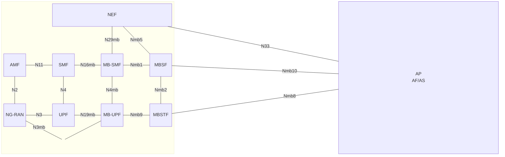
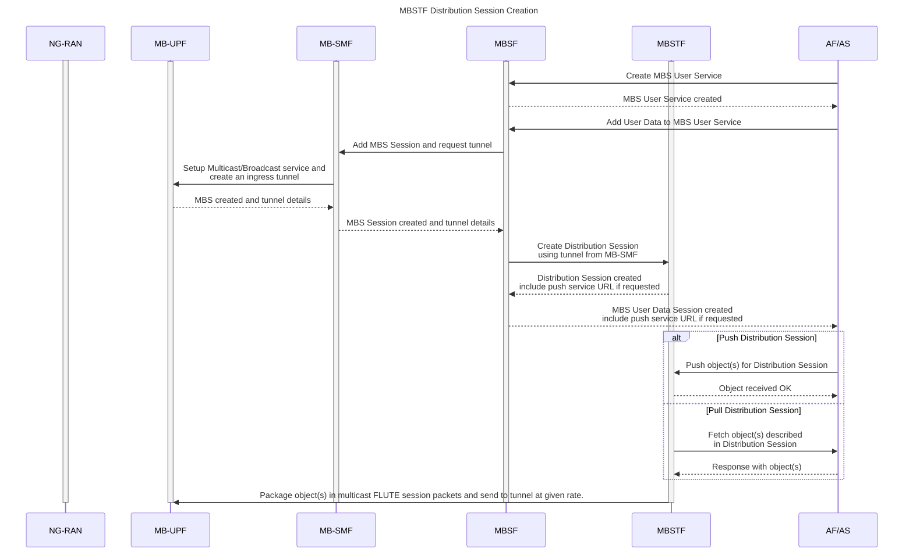

# Initial MBS Transport Function API examples

This tutorial showcases the current features present in the 5G-MAG MBSTF implementation. You can check out the videos to
see more details or follow the write-up tutorial.

## Tutorial videos

<iframe width="560" height="315" src="https://www.youtube.com/embed/GSc6fcO6cvo?si=4-uf_4Cn6i1J9Cs6" title="YouTube video player" frameborder="0" allow="accelerometer; autoplay; clipboard-write; encrypted-media; gyroscope; picture-in-picture; web-share" referrerpolicy="strict-origin-when-cross-origin" allowfullscreen></iframe>

## Architecture





## Prerequisites

This tutorial assumes that you have cloned and built the [rt-mbs-transport-function repository](https://github.com/5G-MAG/rt-mbs-transport-function).

## Description

In this tutorial we will configure the MBSTF with a variety of MBS Distribution Session types. This tutorial will also cover optional integration with the MB-SMF and MB-UPF.

You should follow the build instructions for the [rt-mbs-transport-function repository](https://github.com/5G-MAG/rt-mbs-transport-function) found in the README.md on the repository main page.

For these examples you will also need Wireshark, to view the results, and either build the 5G-MAG version of Open5GS with UDP tunnelling or the install the *netcat* package to fake an MB-UPF UDP tunnel.

### Step 1a: (Optional) Create an MBS Session on the MB-UPF with UDP tunnel

To use this you will need a 5G core with MB-UPF and MB-SMF that are capable of allocating ingress tunnels, such as the one found in the [5G-MAG/open5gs](https://github.com/5G-MAG/open5gs/tree/feature/mbs-udp-tunnel-creation) repository in the `feature/mbs-udp-tunnel-creation` branch.<!-- Change this to the 5mbs branch when tunnelling is merged -->

Start the NRF, SCP, AMF, MB-UPF and MB-SMF.
```sh
git clone --depth 1 --recurse-submodules -b feature/mbs-udp-tunnel-creation https://github.com/5G-MAG/open5gs.git ~/open5gs
cd ~/open5gs
meson setup --prefix=$PWD/install build
ninja -C build install
LD_LIBRARY_PATH="$PWD/install/lib64:$PWD/install/lib" export LD_LIBRARY_PATH
install/bin/open5gs-nrfd > nrf.log 2>&1 &
install/bin/open5gs-scpd > scp.log 2>&1 &
install/bin/open5gs-amfd > amf.log 2>&1 &
install/bin/open5gs-smfd > smf.log 2>&1 &
sudo -E install/bin/open5gs-upfd > upf.log 2>&1 &
```

Copy this Nmbsmf_MBSSession *CreateReqData* JSON object into a file called `create-mbs-session.json`:
```json
{
  "mbsSession": {
    "mbsSessionId": {
      "ssm": {
        "sourceIpAddr": {
          "ipv4Addr": "127.0.0.1"
        },
        "destIpAddr": {
          "ipv4Addr": "232.0.0.1"
        }
      }
    },
    "tmgiAllocReq": true,
    "serviceType": "MULTICAST",
    "ingressTunAddrReq": true,
    "activityStatus": "ACTIVE",
    "anyUeInd": true
  }
}
```

Then we send this file to the MB-SMF to request a new MBS session:
```sh
curl --http2-prior-knowledge -H 'Content-Type: application/json' --data @create-mbs-session.json http://127.0.0.4:7777/nmbsmf-mbssession/v1/mbs-sessions
```

The response will contain the UDP tunnel details at JSON path `.mbsSession.ingressTunAddr`. These will need to be substituted in the `.distSession.mbUpfTunAddr` object in the Distribution Session JSON objects in the following steps in order to direct the output to the MB-UPF.

### Step 1b: (Optional) Fake a UDP tunnel

This can be useful if you don't want to start up 5G core functions and just want to examine the multicast coming out of the MBSTF.

For this we will need the `netcat` or `nc` command from the *netcat* package (*nmap-ncat* on RHEL based systems).

The command to create a tunnel at 127.0.0.7:5678 is:
```sh
nc -u -l 127.0.0.7 5678 > /dev/null &
```

### Step 2: Start the mock media express server

The start the express mock media server for MBSTF testing you will need to do the following things.

1. To clone the rt-mbs-examples repository:
   ```bash
   cd ~
   git clone -b development https://github.com/5G-MAG/rt-mbs-examples.git
   ```

1. To prepare the express server for running
   ```bash
   cd ~/rt-mbs-examples/express-mock-media-server
   npm install
   ```

1. Run the express server
   ```bash
   cd ~/rt-mbs-examples/express-mock-media-server
   npm start
   ```

The mock media server is now running on TCP port 3004 and ready to serve objects for the following tests.

### Step 3: Run the MBSTF

If the build and install instructions from [rt-mbs-transport-function](https://github.com/5G-MAG/rt-mbs-transport-function) have been followed, then the MBSTF can be run using:
```bash
sudo /usr/local/bin/open5gs-mbstfd &
```

### Step 4: Start and configure Wireshark to capture the encapsulated FLUTE

1. Set up the packet decoding:
   - In the *Analyze* menu, select *Decode As...* to open the "Decode As..." dialog.
   - If a rule does not exist for UDP with a port number matching the UDP tunnel (the port number given for the first tunnel in the response in Step 1a or `5678` for Step 1b), then create a new rule, set the field to `UDP port`, set the port number to the tunnel port and set the Current decoding as `IPv4`.
   - If a rule does not exist for the UDP port `5000` (the port we will use for the multicast) then create a new rule for a "UDP port", set the port number to `5000` and the Current decoding to `ALC`.
   - Select the *Save* or *OK* button to close the dialog. Saving will store the rules for next time Wireshark is started.
   

2. Select (but don't start) the correct interface for capture. This will usually be the ethernet interface if you used Step 1a or the local loopback (lo) interface if you are using Step 1b.

3. Enter the filter expression if...:
   - You followed Step 1a, enter a filter of `host <tunnel-ip-address>`, where `<tunnel-ip-address>` is the IP address of the tunnel given in the response for 1a.
   - You followed Step 1b, enter a filter of `host 127.0.0.7`.

4. Then start the capture.

### Step 5: Create a single shot MBS Distribution Session for pull operation

With the express server, from Step 2 (above), running and the MBSTF, from Step 3 (above), running, perform the following actions to test a single shot distribution from *PULL* requested media objects.

Copy the following into DistSession-PULL-request.json:
```json
{
    "distSession": {
        "distSessionId": "976236ec-d35a-41ef-8575-37171d5304be",
        "distSessionState": "ACTIVE",
        "mbUpfTunAddr": {
            "ipv4Addr": "127.0.0.7",
            "portNumber": 5678
        },
        "upTrafficFlowInfo": {
            "destIpAddr": { "ipv4Addr": "232.0.0.1" },
            "portNumber": 5000
        },
        "mbr": "10 Mbps",
        "objDistributionData": {
            "objDistributionOperatingMode": "SINGLE",
            "objAcquisitionMethod": "PULL",
            "objAcquisitionIdsPull": ["object1", "object2", "object3", "object4"],
            "objIngestBaseUrl": "http://127.0.0.1:3004/",
            "objDistributionBaseUrl": "http://127.0.0.2/"
        }
    }
}
```

If you are using the option to use a running MB-SMF/MB-UPF (Step 1a) then make the following changes to the JSON above:
- The tunnel IP address for `distSession.mbUpfTunAddr.ipv4Addr` from 127.0.0.7 to the IP address for the tunnel, which was returned in the MB-SMF response.
- The port number for `distSession.mbUpfTunAddr.portNumber` from 5678 to the port number for the tunnel, which was returned in the MB-SMF response.

Then push the *DistSession* to the MBSTF to configure it:

```bash
curl --http2-prior-knowledge -H 'Content-Type: application/json' --data-binary @DistSession-PULL-request.json http://127.0.0.62:7777/nmbstf-distsession/v1/dist-sessions
```

The result should look like:

**TODO**: insert response JSON here

The wireshark capture will look like:

**TODO**: wireshark screen shots showing FDT and media packets

### Step 6: Create a single shot MBS Distribution Session for push operation

```json
{
    "distSession": {
        "distSessionId": "976236ec-d35a-41ef-8575-37171d5304be",
        "distSessionState": "ACTIVE",
        "mbUpfTunAddr": {
            "ipv4Addr": "127.0.0.7",
            "portNumber": 37423
        },
        "upTrafficFlowInfo": {
            "destIpAddr": { "ipv4Addr": "232.0.0.1" },
            "portNumber": 5000
        },
        "mbr": "10 Mbps",
        "objDistributionData": {
            "objDistributionOperatingMode": "SINGLE",
            "objAcquisitionMethod": "PUSH",
            "objDistributionBaseUrl": "http://127.0.0.2/"
        }
    }
}
```

### Step 7: Create a streaming MBS Distribution Session for pull operation on the DASH manifest

```json
{
    "distSession": {
        "distSessionId": "A76236ec-d35a-41ef-8575-37171d5304be",
        "distSessionState": "ACTIVE",
        "mbUpfTunAddr": {
            "ipv4Addr": "127.0.0.7",
            "portNumber": 37423
        },
        "upTrafficFlowInfo": {
            "destIpAddr": { "ipv4Addr": "232.0.0.1" },
            "portNumber": 5000
        },
        "mbr": "10 Mbps",
        "objDistributionData": {
            "objDistributionOperatingMode": "STREAMING",
            "objAcquisitionMethod": "PULL",
            "objIngestBaseUrl": "https://pub-c4-b6-thdow-bbc.live.bidi.net.uk/vs-cmaf-pushb-uk/x=4/i=urn:bbc:pips:service:bbc_one_north_west/",
            "objAcquisitionIdsPull": ["pc_hd_abr_v2.mpd"],
            "objDistributionBaseUrl": "http://127.0.0.2/"
        }
    }
}
```

### Step 8: Create a streaming MBS Distribution Session for push operation on the DASH manifest

```json
{
    "distSession": {
        "distSessionId": "A76236ec-d35a-41ef-8575-37171d5304be",
        "distSessionState": "ACTIVE",
        "mbUpfTunAddr": {
            "ipv4Addr": "127.0.0.7",
            "portNumber": 37423
        },
        "upTrafficFlowInfo": {
            "destIpAddr": { "ipv4Addr": "232.0.0.1" },
            "portNumber": 5000
        },
        "mbr": "10 Mbps",
        "objDistributionData": {
            "objDistributionOperatingMode": "STREAMING",
            "objAcquisitionMethod": "PUSH",
            "objAcquisitionIdPush": "manifest.mpd",
            "objDistributionBaseUrl": "http://127.0.0.2/"
        }
    }
}
```
