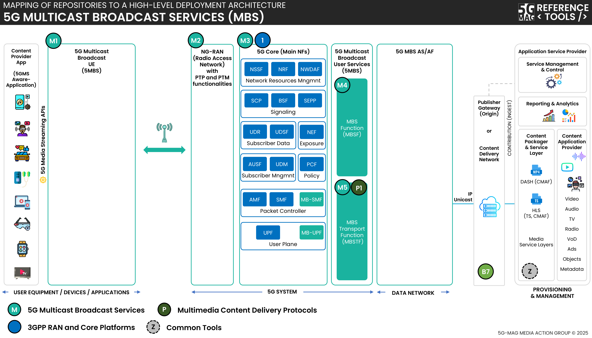

 

1. TOC
{:toc}

This page contains information such as the specifications within the scope of the tools, high-level architecture, APIs under implementation,...

# Specifications
Visit the [Standards repository](https://5g-mag.github.io/Standards/pages/5g-multicast-broadcast-services.html) for more details on the specifications within the scope of the tools.

# High-level architecture

## High-level architecture: 5G Downlink Media Streaming (5GMSd) over 5G Multicast Broadcast Services (MBS)

 * Check [here](./repositories.html) to access the repositories for 5G Multicast Broadcast Services (MBS)
 * Check [here](../3gpp-ran-and-core-platforms/repositories.html) to access the repositories for 3GPP RAN and Core Platforms
 * Check [here](../5g-media-streaming/repositories.html) to access the repositories for 5G Media Streaming

# Features under implementation

## MBS development over Open5GS

The 5G-MAG Reference Tools for MBS currently target:
- Multicast transport over N6mb (from AF to MB-UPF).
- Shared delivery on the 5G Core (from MB-UPF to gNBs).
- Point to Multipoint (PTM) delivery on RAN (from gNBs to UE).

The following features are supported:
- `MB-SMF TMGI Service API` (Following 3GPP TS 29.532 - Release 17.4.0)
  - TMGI Allocate Service operation
  - TMGI Deallocate Service operation
- `MB-SMF MBS Session Service API` (Following 3GPP TS 29.532 - Release 17.4.0)
  - MBS Session Create Service operation
  - MBS Session Release Service operation
- `MB-SMF PFCP Session Establishment extensions` (Following 3GPP TS 29.244 - Release 17.9.0)
  - PFCP Session Establishment Request extensions
- `MB-UPF PFCP Session Establishment extensions` (Following 3GPP TS 29.244 - Release 17.9.0)
  - PFCP Session Establishment Response extensions

The following features are not yet supported:
- `AMF MBS Broadcast Service API` (Following 3GPP TS 29.518 - Release 17.11.0)
  - MBS Broadcast ContextCreate Service operation
  - MBS Broadcast ContextRelease Service operation
- `AMF NGAP extensions` (Following 3GPP TS 38.413 - Release 17.6.0)
  - BROADCAST SESSION SETUP REQUEST
- `gNB NGAP extensions` (Following 3GPP TS 38.413 - Release 17.6.0)
  - BROADCAST SESSION SETUP RESPONSE
- `NRF NFDiscovery Service API extensions` (Following 3GPP TS 29.510 - Release 17.11.0)
  - MB-SMF TMGI Service API extensions
  - MB-SMF MBS Session Service API extensions
  - AMF MBS Broadcast Service API extensions
