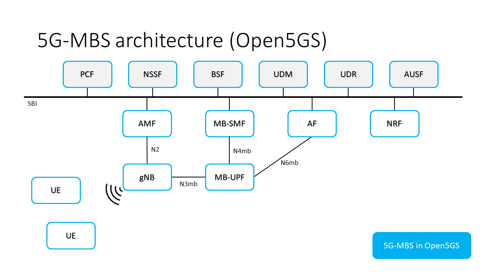

# Docker Implementation
A Docker Compose implementation to deploy an MBS capable 5G Core is available in the [rt-mbs-examples](https://github.com/5G-MAG/rt-mbs-examples/) repository.

## Deployment architecture using Open5GS



> [!NOTE]
> Ports `TCP 27017`, `SCTP 38412` and `UDP 2152` are being exposed to the host running this Docker Compose deployment

These ports are being used for the following:
- `TCP 27017` to add subscribers to the MongoDB database
- `SCTP 38412` from the AMF for the NGAP `N2 interface`, used for the control plane connection with the external gNB
- `UDP 2152` from the MB-UPF for the GTPU `N3mb interface`, used for the data plane connection with the external gNB

> [!NOTE]
> Modify the `.env` file present on this repository to change the values being deployed on `docker-compose.yaml`

Add your host's IP address to the `DOCKER_HOST_IP` variable in the `.env` file for the MB-UPF to be reachable by external gNBs.

## Testing

# Tests

This section explains how to use the Python tests present on the `test` directory in the [rt-mbs-examples](https://github.com/5G-MAG/rt-mbs-examples/) repository.

The Python modules requirements are preinstalled on the AF container image. This container mounts the `test` directory as read-only to be able to run the tests.

To run the tests, execute an interactive session with the AF container and navigate to the test directory:
```bash
docker exec -it af bash

# inside the AF container
cd test

# to run the tests
python3 tests.py
```

The `test` directory contains the following subdirectories:
- `MB_SMF` the developed tests regarding the MB-SMF Network Function
- `utils` a Python package containing some common utils for the tests
- `support` some support files for the tests like JSON files for the requests and JSON schemas to validate them

Using the `config.toml` file some parameters can be configured:
- the log_level for the tests can be adjusted. The values supported are: DEBUG, INFO, WARNING, ERROR, CRITICAL
- some endpoint parameters like the MB-SMF address, the protocol (HTTP or HTTPS) and the port being used

The file `tests.py` contains the main logic for the tests. In this file the test suites are defined and run by the unittest testing framework.
