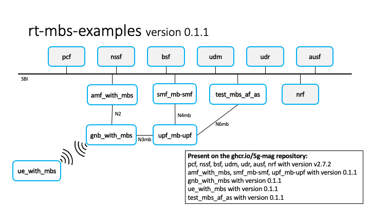

# Docker Deployments

Two Docker Compose deployments of the MBS capable 5G Core are available in the [rt-mbs-examples](https://github.com/5G-MAG/rt-mbs-examples/) repository:

- The `internal` deployment connects all the developed Network Functions for MBS with one srsRAN gNB and one srsRAN UE running using the ZeroMQ driver
- The `external` deployment deploys *only* the developed Network Functions for MBS waiting for a external gNB connection

## Architecture using Open5GS


> Note: All the procedures related to the AMF, SMF and UPF of Open5GS work as expected when using the 5G-MAG components. As an example it is possible to create a standard PDU Session with a gNB and a UE while using the MBS capable 5G Core.

> Note: Port `TCP 27017` is being exposed on the host when running both `internal` and `external` deployments

> Note: Ports `SCTP 38412` and `UDP 2152` are being exposed on the host when running the `external` deployment

These ports are being used for the following:
- `TCP 27017` to add subscribers to the MongoDB database
- `SCTP 38412` from the AMF for the NGAP `N2 interface`, used for the control plane connection with the external gNB
- `UDP 2152` from the MB-UPF for the GTPU `N3mb interface`, used for the data plane connection with the external gNB

> Note: Modify the `.env` file present on this repository to change the values being deployed on `docker-compose.yaml`

Add your host's IP address to the `DOCKER_HOST_IP` variable in the `.env` file for the MB-UPF to be reachable by external gNBs.

## Mapping of container names and the architecture

The following image shows the relationship between the `Architecture using Open5GS` image and the names of the containers.



# Testing

This section explains how to use the Python tests present on the `test` directory in the [rt-mbs-examples](https://github.com/5G-MAG/rt-mbs-examples/) repository.

The Python modules requirements are preinstalled on the AF/AS container image. This container mounts the `test` directory as read-only to be able to run the tests.

To run the tests, execute an interactive session with the AF/AS container and navigate to the test directory:
```bash
docker exec -it test_mbs_af_as bash

# inside the AF/AS container
cd test

# to run the tests
python3 tests.py
```

The `test` directory contains the following subdirectories:
- `MB_SMF` the developed tests regarding the MB-SMF Network Function
- `utils` a Python package containing some common utils for the tests
- `support` some support files for the tests like JSON files for the requests and JSON schemas to validate them

Using the `config.toml` file some parameters can be configured:
- the log_level for the tests can be adjusted. The values supported are: DEBUG, INFO, WARNING, ERROR, CRITICAL
- some endpoint parameters like the MB-SMF address, the protocol (HTTP or HTTPS) and the port being used

The file `tests.py` contains the main logic for the tests. In this file the test suites are defined and run by the unittest testing framework.

# Detailed Instructions

## Inspect all the traffic being sent in the network

You can use `tcpdump`/`Wireshark` to sniff all the messages being sent between the Network Functions by inspecting the `br-5g-mag` network bridge. This bridge is created by the Docker Compose network and is used to connect all the Network Functions.

```bash
$ tcpdump -i br-5g-mag
```

## Connect to the AF/AS container to start sending requests to the Network Functions

The AF/AS container is not Open5GS related, in fact, it is not even an AF/AS, it is just a container called AF/AS being used to send curl requests to the Open5GS APIs.

```bash
# Connect to the AF/AS container
docker exec -it test_mbs_af_as bash
```

Use curl inside the container to send requests to the other Network Functions:

```bash
# Inside the AF/AS container, example of the AF/AS sending the MB-SMF the TMGI allocate request
curl --http2-prior-knowledge \
  --request POST \
  --header "Content-Type: application/json" \
  --data '{ "tmgiNumber": 1 }' \
  smf-mb-smf.5g-mag.org:80/nmbsmf-tmgi/v1/tmgi
```

## Configure the MB-UPF multicast

Apart from editing the `.env` for the MB-UPF to be reachable by external gNBs, the MB-UPF needs extra configuration. To be able to detect the multicast traffic being sent and forward it to the lower layer source specific multicast (LLSSM) address, the MB-UPF needs to udpate the multicast forwarding cache (MFC) in the linux kernel.

For this purpose, the `smcroute` tool is installed on the MB-UPF container. Through the `smcroutectl` command, the MFC can be updated to the desired values. Currently this is done manually but other ways to update the MFC are being studied.

```bash
# Execute this command inside the MB-UPF container
smcroutectl add eth0 <n6mb_ip_multicast_destination_address> ogstun
```

After this, and after creating the MBS Session, the project can be tested by using the AF/AS to send multicast traffic to the MB-UPF and inspecting the MB-UPF output:

```bash
# Execute this command inside the AF/AS container
sendip -p ipv4 -is <af_as_container_ip> -id <n6mb_ip_multicast_destination_address> <mb_upf_container_ip>
```

### Full example

Create a Broadcast MBS Session using TMGI as identifier but specifying also the SSM address, this SSM will be the address that the AF/AS will use to send the multicast traffic to the MB-UPF through the N6mb interface.

> Important note: Currently, there is a limit of 20 MBS Sessions per MB-UPF. The range of IP multicast addresses being used for the MB-UPF to forward the multicast traffic to the gNB using the LLSSM is `239.0.0.4-239.0.0.24`. That is why it is recommended to start the range for the SSM on the IP multicast address `239.0.0.25` onwards.

Deploy the `internal` Docker Compose deployment and check everything is up and running.

From the AF/AS container execute:

```bash
# Execute this command inside the AF/AS container
# MBS Session Create request with TMGI allocate: /nmbsmf-mbssession/v1/mbs-sessions with multicast source
curl --http2-prior-knowledge \
  --request POST \
  --header "Content-Type: application/json" \
  --data '{ "mbsSession": { "ssm": { "sourceIpAddr": { "ipv4Addr": "<af_as_container_ip>" }, "destIpAddr": { "ipv4Addr": "<n6mb_ip_multicast_destination_address>" } },"tmgiAllocReq": true, "serviceType":"BROADCAST" } }' \
  smf-mb-smf.5g-mag.org:80/nmbsmf-mbssession/v1/mbs-sessions
```

> Tip: Check AF container IP executing `ip address` from the AF container and use the `eth0` interface address as `<af_as_container_ip>`

The AF/AS with IP address `<af_as_container_ip>` will send an IP packet to the multicast destination `<n6mb_ip_multicast_destination_address>`. In order for the MB-UPF to receive the traffic being sent to this multicast group and then forward it to the LLSSM, we need to execute the following command to configure the MB-UPF:

```bash
# Execute this command inside the MB-UPF container
smcroutectl add eth0 <n6mb_ip_multicast_destination_address> ogstun
```

This command will update the MFC of the MB-UPF to receive the traffic for the multicast group `<n6mb_ip_multicast_destination_address>` and forward it internally using the `ogstun` interface.

After all of this is configured, the MB-UPF has been configured through PFCP to forward the traffic received to the LLSSM. The first LLSSM created uses the multicast destination address `239.0.0.4` and random C-TEID.

Now, sending traffic with the AF/AS to the MB-UPF with the addresses configured causes the MB-UPF to forward the traffic using GTPU to the LLSSM:

```bash
# To send traffic from the AF/AS to the MB-UPF
sendip -p ipv4 -is <af_as_container_ip> -id <n6mb_ip_multicast_destination_address> upf-mb-upf.5g-mag.org
```

You can check the traffic is being forwarded to the LLSSM executing:

```bash
$ tcpdump -i br-5g-mag udp port 2152
```
