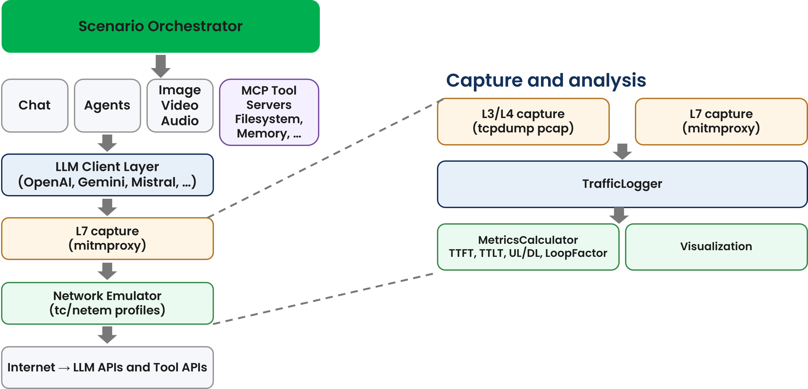

 

[Scope](./scope.html){: .btn .btn-blue } [Project Roadmap](./projects.html){: .btn .btn-blue } [GitHub Repos](./repositories.html){: .btn .btn-github } [Releases](../releases.html){: .btn .btn-release } [Tutorials](./tutorials.html){: .btn .btn-tutorial } [Requirements](./requirements.html){: .btn .btn-blue }

# Scope

This project hosts an open-source testbed for AI/media traffic evaluation targeting 5G, 6G, and realistic UE-observed network conditions. It supports 3GPP SA4 studies and broader media delivery evaluations and may be extended and used for other purposes.

# What is being implemented? 

{: .inshort }
A testbed for 6G AI Traffic Characterization able to: Measure traffic characteristics of generative AI services (LLMs, image/video generation); Analyze agentic AI patterns such as multi-step tool calling and tool server workflows; Evaluate QoE under emulated network conditions like latency, loss, and bandwidth.



## Network emulator
The emulator supports one-way delay, jitter, loss, bandwidth shaping, and advanced netem controls (correlation, distributions, loss models, reordering, duplication, corruption, and queue limits). It can combine Hierarchical Token Bucket (HTB) rate limiting with netem impairments and is controlled via YAML profiles.

### Architecture
The network emulator is built on Linux Traffic Control (tc) with netem qdisc, providing precise control over network characteristics. Network conditions are applied at the interface level, enabling transparent emulation for any media delivery protocol without requiring modifications to the client or server implementations.

Beyond basic delay and loss parameters, the emulator supports advanced netem controls for more realistic network modeling.

An example of the profile YAML is shown below.

```
profiles:
  example_full_profile:
    # === DELAY PARAMETERS ===
    
    # One-way packet delay in milliseconds
    # Maps to: tc qdisc add dev eth0 root netem delay <delay_ms>ms
    delay_ms: 50
    
    # Delay variation (jitter) in milliseconds
    # Adds random variation to base delay using specified distribution
    # Maps to: tc qdisc ... delay 50ms 10ms (adds +/- jitter)
    jitter_ms: 10
    
    # Delay distribution model
    # Options: "normal", "pareto", "paretonormal"
    # - normal: Gaussian distribution (symmetric around mean)
    # - pareto: Heavy-tailed distribution (models bursty delays)
    # - paretonormal: Combination for realistic mobile networks
    # Maps to: tc qdisc ... delay 50ms 10ms distribution pareto
    delay_distribution: "normal"
    
    # Correlation between consecutive packet delays (0-100%)
    # Higher values create smoother delay variations (less random)
    # Maps to: tc qdisc ... delay 50ms 10ms 25%
    delay_correlation_pct: 25
    
    # === LOSS PARAMETERS ===
    
    # Random packet loss percentage (0-100)
    # Maps to: tc qdisc ... loss 0.5%
    loss_pct: 0.5
    
    # Loss correlation for bursty loss patterns (0-100%)
    # Higher values create loss bursts rather than random drops
    # Maps to: tc qdisc ... loss 0.5% 25%
    loss_correlation_pct: 25
    
    # Gilbert-Elliott loss model for realistic loss simulation
    # Defines a two-state Markov model (Good/Bad states)
    # Maps to: tc qdisc ... loss gemodel p h 1-k
    loss_model:
      type: "gemodel"           # Gilbert-Elliott model
      p: 0.01                   # Probability of transitioning Good -> Bad
      r: 0.10                   # Probability of transitioning Bad -> Good  
      h: 0.0                    # Probability of loss in Good state (1-h)
      k: 0.95                   # Probability of loss in Bad state (1-k)
    
    # === BANDWIDTH PARAMETERS ===
    
    # Bandwidth limit in Mbps
    # When set, enables HTB (Hierarchical Token Bucket) with netem as leaf
    # Maps to: tc qdisc add dev eth0 root handle 1: htb default 1
    #          tc class add dev eth0 parent 1: classid 1:1 htb rate 100mbit
    #          tc qdisc add dev eth0 parent 1:1 handle 10: netem ...
    rate_mbit: 100
    
    # Queue buffer size in packets
    # Controls how many packets can be queued before drops occur
    # Maps to: tc qdisc ... limit 1000
    limit_packets: 1000
    
    # === ADDITIONAL IMPAIRMENTS ===
    
    # Packet reordering percentage
    # Causes specified percentage of packets to be delayed further
    # Maps to: tc qdisc ... reorder 5% 50%
    reorder_pct: 0.0
    reorder_correlation_pct: 0
    
    # Packet duplication percentage
    # Causes specified percentage of packets to be sent twice
    # Maps to: tc qdisc ... duplicate 0.1%
    duplicate_pct: 0.0
    
    # Packet corruption percentage
    # Introduces bit errors in specified percentage of packets
    # Maps to: tc qdisc ... corrupt 0.01%
    corrupt_pct: 0.0

# === GLOBAL CONFIGURATION ===
defaults:
  # Default interface to apply impairments
  interface: "eth0"
  
  # Default profile if none specified
  default_profile: "ideal_6g"
  
  # Whether to apply impairments bidirectionally
  # (requires IFB device for ingress shaping)
  bidirectional: true

```

{: .ingithub }
Example YAMLs with pre-defined profiles are available here: [https://github.com/5G-MAG/6G-Testbed/blob/main/netemu/examples/profiles.yaml](https://github.com/5G-MAG/6G-Testbed/blob/main/netemu/examples/profiles.yaml)

The emulator provides pre-defined network profiles derived from 3GPP 5QI specifications (e.g. 3GPP TS 23.501 Table 5.7.4-1 where PDB (Packet Delay Budget) is mapped to `delay_ms` and PER (Packet Error Rate) is mapped to `loss_pct`).

{: .ingithub }
Example YAMLs with pre-defined profiles are available here: [https://github.com/5G-MAG/6G-Testbed/blob/main/aitestbed/configs/profiles.yaml](https://github.com/5G-MAG/6G-Testbed/blob/main/netemu/examples/profiles.yaml)

The emulator supports multiple deployment configurations.

The following is an example showing how the network emulator can be setup:

```
# Apply a named profile for uplink and downlink
emulator.apply_profile("poor_cellular",                      
      ingress_profile="5g_urban")

# ... run tests ...

emulator.clear()
```

## AI Traffic characterization testbed
The testbed provides an end-to-end framework to run scenarios, emulate network conditions, and log metrics in a reproducible manner.

Key capabilities include orchestration of scenarios, provider adapters for different commercial and self-hosted models, L3/L4 capture (tcpdump), optional L7 capture (mitmproxy), and SQLite-based logging for large-scale analysis.

### Architecture and code structure
The testbed architecture is orchestrator-centric with clear separation of scenarios, clients, network emulation, capture, and analysis:
*	orchestrator.py coordinates scenario runs, applies network profiles, handles retries, and generates reports.
*	scenarios/* implement traffic patterns (chat, agent, direct search, realtime, multimodal, image, video, computer use).
*	clients/* provide provider adapters, including OpenAI, Gemini, DeepSeek (OpenAI-compatible), and vLLM for self-hosted models.
*	netem: external dependency on the network emulator module that is proposed to be common to all studies [1].
*	capture/* provides L3/L4 pcap capture and L7 capture via mitmproxy.
*	analysis/* logs to SQLite, computes 3GPP-aligned metrics, and generates plots.

The testbed is designed to be easily usable and highly configurable:* New scenarios can be added by creating a class in scenarios/ that extends BaseScenario, registering it in scenarios/init.py, and adding a YAML entry in configs/scenarios.yaml.

New providers can be added by implementing a client in clients/ that subclasses LLMClient and registering it in the orchestrator client factory.

The testbed includes a vLLM client (clients/vllm_client.py) and example scenarios in configs/scenarios.yaml (e.g., chat_vllm). This enables evaluation of self-hosted models via the OpenAI-compatible API provided by vLLM, supporting the same metrics and logging pipeline as hosted providers.
