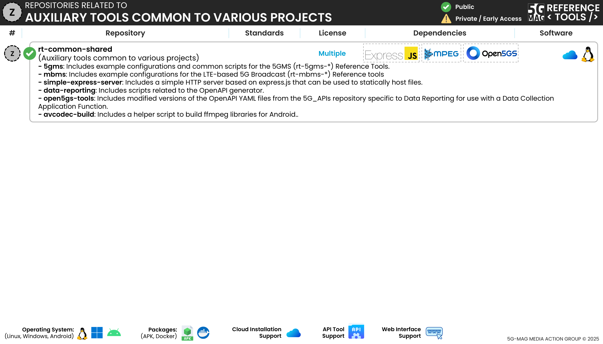

 

1. TOC
{:toc}

# Information and Repositories

The following repository contains a series of auxiliary tools that may be used by different 5G-MAG Reference Tools projects.  Please refer to the "Scope & Architecture" sections of the different projects for more context.

---

## Auxiliary tools common to various projects: [rt-common-shared](https://github.com/5G-MAG/rt-common-shared)

The following tools are available:

### 5G Media Streaming (5GMS): [https://github.com/5G-MAG/rt-common-shared/blob/main/5gms/](https://github.com/5G-MAG/rt-common-shared/blob/main/5gms/)
Includes example configurations and common scripts for the 5GMS (rt-5gms-*) Reference Tools. 

In particular, the `5G_APIs-overrides` directory contains files that can be used with the `open5gs-tools/scripts/generate_openapi` script to override or supplement the OpenAPI YAML files from the 5G_APIs repository.

### MBMS and LTE-based 5G Broadcast (MBMS): [https://github.com/5G-MAG/rt-common-shared/tree/main/mbms](https://github.com/5G-MAG/rt-common-shared/tree/main/mbms)

Includes example configurations for the LTE-based 5G Broadcast (rt-mbms-*) Reference Tools.

In particular, it includes information about the `ServiceAnnouncement(SA)` file also referred to as `bootstrap.multipart` in the context of 5G-MAG Reference Tools.

### Simple Express Server: [https://github.com/5G-MAG/rt-common-shared/blob/main/simple-express-server/README.md](https://github.com/5G-MAG/rt-common-shared/blob/main/simple-express-server/README.md)
Includes a simple HTTP server based on express.js that can be used to statically host files for streaming.

### Open5GS Tools: [https://github.com/5G-MAG/rt-common-shared/tree/main/open5gs-tools](https://github.com/5G-MAG/rt-common-shared/tree/main/open5gs-tools)
Includes scripts related to the OpenAPI generator.

### Data Reporting 5G_APIs overrides: [https://github.com/5G-MAG/rt-common-shared/tree/main/data-reporting/5G_APIs-overrides](https://github.com/5G-MAG/rt-common-shared/tree/main/data-reporting/5G_APIs-overrides)
Includes modified versions of the OpenAPI YAML files from the 5G_APIs repository specific to Data Reporting for use with a Data Collection Application Function.

### Avcodec build: [https://github.com/5G-MAG/rt-common-shared/blob/main/avcodec-build/README.md](https://github.com/5G-MAG/rt-common-shared/blob/main/avcodec-build/README.md)
Includes a helper script to build ffmpeg libraries for Android.
