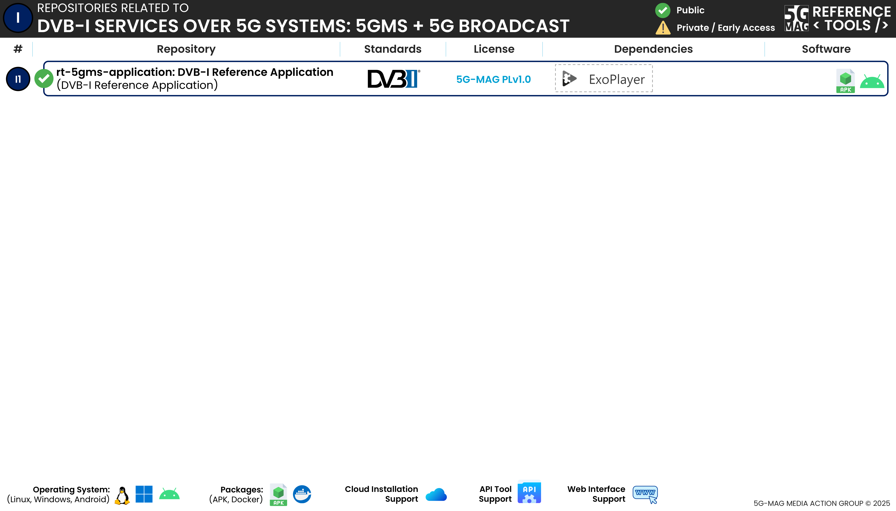

 

[Scope & Architectures](./scope.html){: .btn .btn-blue } [Project Roadmap](./projects.html){: .btn .btn-blue } [Features](./features.html){: .btn .btn-blue } [GitHub Repos](./repositories.html){: .btn .btn-github } [Releases](../releases.html##project-dvb-i-services-over-5g-systems){: .btn .btn-release } [Tutorials](./tutorials.html){: .btn .btn-blue } [Requirements](./requirements.html){: .btn .btn-blue }

# Repositories

The following repositories are available. Please refer to the "Scope & Architecture" sections of the different projects for more context.

---

## DVB-I Reference Application
[rt-5gms-application / fivegmag_ExoDvbi_player](https://github.com/5G-MAG/rt-5gms-application/tree/development/fivegmag_ExoDvbi_player){: .btn .btn-dvbi } [Releases](../releases.html##project-dvb-i-services-over-5g-systems){: .btn .btn-release }

This project uses the Android ExoPlayer and the DVB-I Reference Client functionality to provide the capabilities to select and play back media content.

Additional information:
* [Information and how to download, build, install and run](https://github.com/5G-MAG/rt-5gms-application/tree/development/fivegmag_ExoDvbi_player#readme)
