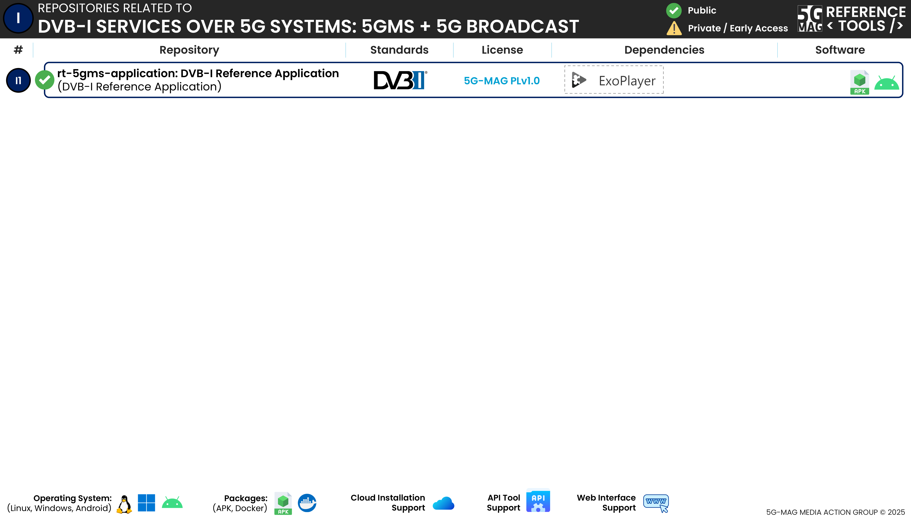

 

[Scope](./scope.html){: .btn .btn-blue } [Project Roadmap](./projects.html){: .btn .btn-blue } [GitHub Repos](./repositories.html){: .btn .btn-github } [Releases](./repositories.md#latest-releases){: .btn .btn-release } [Tutorials](./tutorials.html){: .btn .btn-tutorial } [Video Library](./tutorials.html#video-library){: .btn .btn-video } [Requirements](./requirements.html){: .btn .btn-blue }

# Repositories

The following repositories are available. Please refer to the "Scope & Architecture" sections of the different projects for more context.

---

## DVB-I Reference Application
[rt-5gms-application / fivegmag_ExoDvbi_player](https://github.com/5G-MAG/rt-5gms-application/tree/development/fivegmag_ExoDvbi_player){: .btn .btn-dvbi } [Releases](../releases.html##project-dvb-i-services-over-5g-systems){: .btn .btn-release }

This project uses the Android ExoPlayer and the DVB-I Reference Client functionality to provide the capabilities to select and play back media content.

Additional information:
* [Information and how to download, build, install and run](https://github.com/5G-MAG/rt-5gms-application/tree/development/fivegmag_ExoDvbi_player#readme)

---

## Latest Releases

[Project Documentation](./dvbi-over-5g/){: .btn .btn-blue }

<table class="release-table" style="width:100%; border-collapse: collapse; margin-top: 20px; table-layout: fixed;">
  <thead>
    <tr style="text-align: left; border-bottom: 2px solid #eee;">
      <th style="padding: 12px; width: 40%;">Repository</th>
      <th style="padding: 12px; width: 40%;">Version</th>
      <th style="padding: 12px; width: 20%;">Date</th>
    </tr>
  </thead>
  <tbody>
    
    <tr style="border-bottom: 1px solid #eee;">
      <td style="padding: 12px; overflow: hidden; text-overflow: ellipsis;"><a href="{{ item.url }}" class="btn">{{ item.short_name }}</a></td>
      <td style="padding: 12px; overflow: hidden; text-overflow: ellipsis;"><a href="{{ item.url }}" class="btn">{{ item.tag }}</a></td>
      <td style="padding: 12px;">{{ item.date }}</td>
    </tr>
    
  </tbody>
</table>
