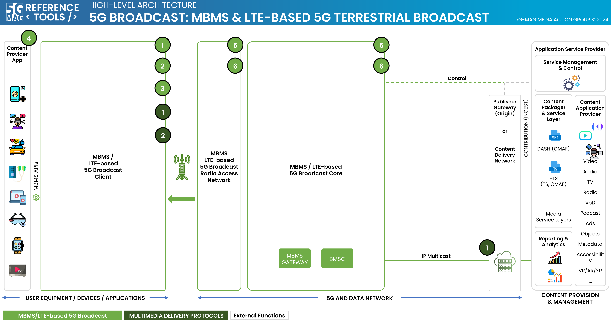

# Specifications and Architecture

## Specifications

Visit the [Standards repository](https://5g-mag.github.io/Standards/pages/lte-based-5g-broadcast.html) for details.

## High-level architecture

### High-level architecture: 5G Broadcast with Multimedia delivery protocols

 * Check [here](.repositories.html) to access the repositories for 5G Broadcast
 * Check [here](../multimedia-content-delivery/repositories.html) to access the repositories for Multimedia delivery protocols

### High-level architecture: 5G Downlink Media Streaming (5GMSd) over eMBMS

 * Check [here](.repositories.html) to access the repositories for 5G Broadcast
 * Check [here](../5g-media-streaming/repositories.html) to access the repositories for 5G Downlink Media Streaming
 * Check [here](../3gpp-ran-and-core-platforms/repositories.html) to access the repositories for 3GPP RAN and Core Platforms
 * Check [here](../multimedia-content-delivery/repositories.html) to access the repositories for Multimedia delivery protocols
