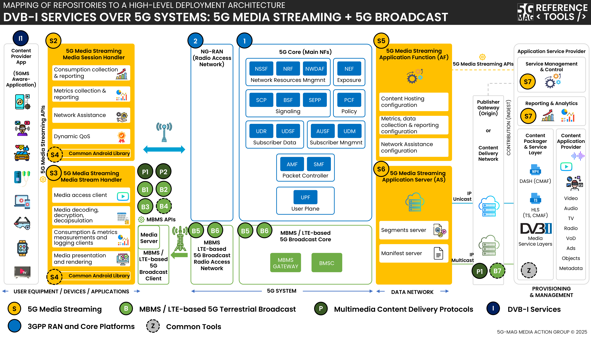

# Specifications and Architecture

## Specifications

Visit the [Standards repository](https://5g-mag.github.io/Standards/) for details.

## High-level architecture

### High-level architecture: DVB-I Services over 5G Systems: 5GMSd with 5G Broadcast

 * Check [here](./repositories.html) to access the repositories for DVB-I Services over 5G Systems
 * Check [here](../multimedia-content-delivery/repositories.html) to access the repositories for Multimedia delivery protocols
 * Check [here](../5g-media-streaming/repositories.html) to access the repositories for 5G Downlink Media Streaming
 * Check [here](../lte-based-5g-broadcast/repositories.html) to access the repositories for 5G Broadcast
