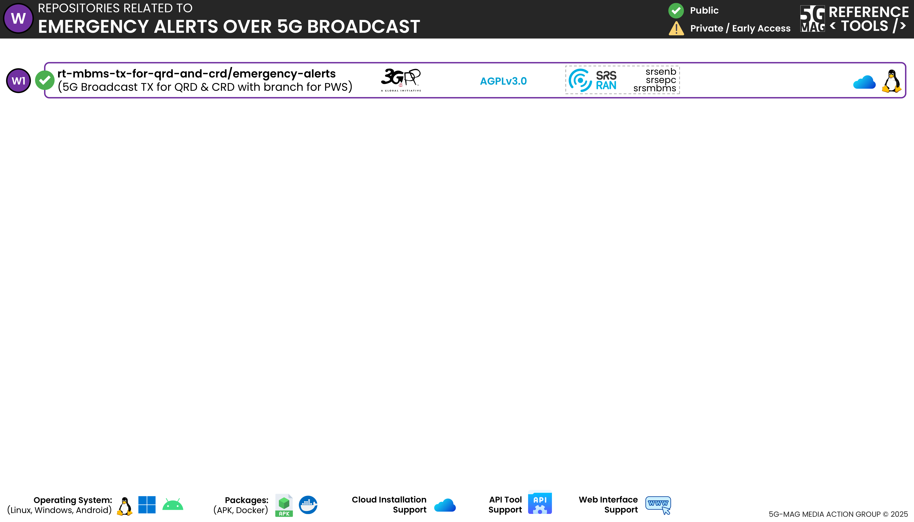

 

1. TOC
{:toc}

# High-level architecture

## 5G Broadcast extended with Emergency Alerts

 * Check [here](../3gpp-ran-and-core-platforms/repositories.html) to access the repositories for 3GPP RAN and Core Platforms

# Repositories

---

## 5G Broadcast Transmitter for QRD and CRD (with support for Emergency Alerts): [rt-mbms-tx-for-qrd-and-crd](https://github.com/5G-MAG/rt-mbms-tx-for-qrd-and-crd/tree/emergency-alerts)
* [Information and how to download, build, install and run](https://github.com/5G-MAG/rt-mbms-tx-for-qrd-and-crd/tree/emergency-alerts/README.md)
