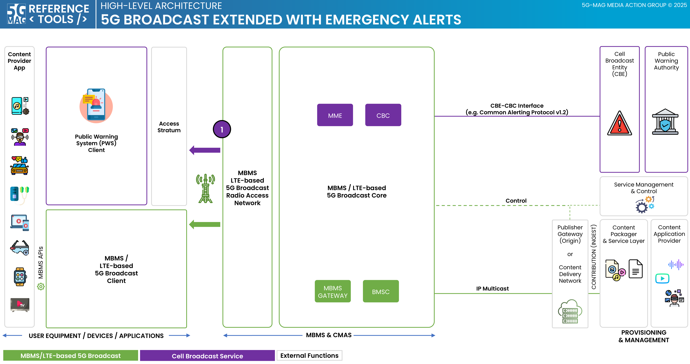

 

[Scope](./scope.html){: .btn .btn-blue } [Project Roadmap](./projects.html){: .btn .btn-blue } [GitHub Repos](./repositories.html){: .btn .btn-github } [Releases](./repositories.md#latest-releases){: .btn .btn-release } [Tutorials](./tutorials.html){: .btn .btn-tutorial } [Video Library](./tutorials.html#video-library){: .btn .btn-video } [Requirements](./requirements.html){: .btn .btn-blue }

# Scope

This page contains information such as the specifications within the scope of the tools and high-level architectures that bring context to their applicability.

Technical documentation providing context to this project can be found in the link below.

[Tech: 5G Broadcast: TV, Radio and Emergency Alerts](https://hub.5g-mag.com/Tech/pages/5gbroadcast.html){: .btn .btn-blue }

A list of relevant specifications can be found in the link below.

[Standards: 5G Broadcast](https://hub.5g-mag.com/Standards/pages/lte-based-5g-broadcast.html){: .btn .btn-blue }

# High-level architectures

## 5G Broadcast extended with Emergency Alerts

[Emergency Alerts over 5G Broadcast: Repositories](../emergency-alerts/repositories.html){: .btn .btn-5gms }
[3GPP RAN and Core Platforms: Repositories](../3gpp-ran-and-core-platforms/repositories.html){: .btn .btn-3gpp }
