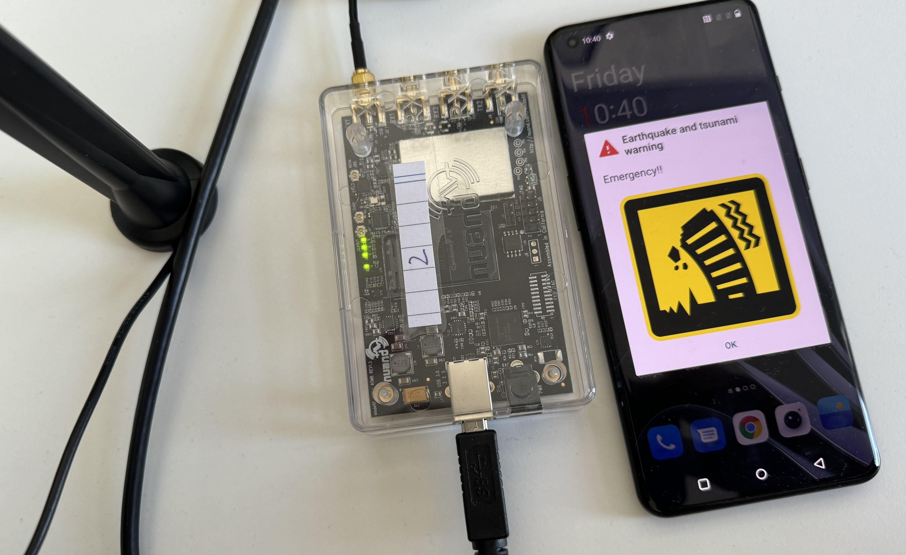

# Tutorial - Cell Broadcast emergency alerts over a 5G Broadcast transmitter

This tutorial describes a basic setup to deliver emergency alerts compliant with CBS over the rt-mbms-tx-for-qrd-and-crd from 5G-MAG Reference Tools.

## Architecture

TODO

## Requirements

The following components are required to setup the end to end chain for emergency alerts:

* A QRD or CRD device
* A Software Defined Radio (SDR) such as the [BladeRF](https://www.nuand.com/bladerf-2-0-micro/) with an antenna
  connected to the TX1 port
* A Linux machine running Ubuntu 22

## Installation

### Step 1: Install the 5G Broadcast Transmitter

Install the dependencies and SDR drivers for the transmitter as documented [here](https://github.com/5G-MAG/rt-mbms-tx-for-qrd-and-crd).

Next, clone the transmitter repository using the `emergency-alerts` branch:

```
git clone --recurse-submodules -b emergency-alerts https://github.com/5G-MAG/rt-mbms-tx-for-qrd-and-crd.git
```

Next, copy the `bytecode` file located in the root of the project in the folder.

!!!!!!!!!!!!!!!!!!!!!!`cp bytecode /home/fivegmag/bytecode`

Now build the transmitter running the following commands:

```
cd rt-mbms-tx-for-qrd-and-crd
git submodule update
mkdir build && cd build
cmake -DCMAKE_INSTALL_PREFIX=/usr -GNinja ..
ninja
sudo ninja install
```

## Configuration

### Step 1: Configuration of the 5G Broadcast Transmitter

Follow the configuration instructions documented [here](https://github.com/5G-MAG/rt-mbms-tx-for-qrd-and-crd?tab=readme-ov-file#configuration-after-installation).
Make sure to adjust the `dl_freq` and the `dl_earfcn` in the `enb.conf` based on the frequency that your CRD or QRD device is operating on. To derive the right `dl_earfcn` you can use
this [tool](https://5g-tools.com/4g-lte-earfcn-calculator/). Note also that SoapySDR might detect the wrong output (e.g. an audio device instead of your SDR.). In that case make sure to use `device_name` and `device_args` to select the right output device.

As an example, this is how the `enb.conf` file looks like for a device operating at a frequency of 626 MHz.

```` 
#####################################################################
#                   srsENB configuration file
#####################################################################

[enb]
enb_id = 0x19B
mcc = 901
mnc = 56
mme_addr = 127.0.1.100
gtp_bind_addr = 127.0.1.1
s1c_bind_addr = 127.0.1.1
s1c_bind_port = 0
n_prb = 50

#####################################################################
# eNB configuration files
#####################################################################
[enb_files]
sib_config = sib.conf.mbsfn
rr_config  = rr.conf
rb_config = rb.conf

#####################################################################
# RF configuration
#####################################################################
[rf]
#dl_freq = 1787500000
#dl_freq = 667000000
dl_freq = 626000000
ul_freq = 688000000
dl_earfcn = 68676
tx_gain = 130
rx_gain = 0

device_name = soapy
device_args = id=2

#####################################################################
# Packet capture configuration
#####################################################################
[pcap]
enable = false
filename = /tmp/enb.pcap
s1ap_enable = false
s1ap_filename = /tmp/enb_s1ap.pcap

mac_net_enable = false
bind_ip = 0.0.0.0
bind_port = 5687
client_ip = 127.0.0.1
client_port = 5847

#####################################################################
# Log configuration
#####################################################################
[log]
all_level = info
all_hex_limit = 1024
filename = /tmp/enb.log
file_max_size = -1

[gui]
enable = false

#####################################################################
# Scheduler configuration options
#####################################################################
[scheduler]
min_aggr_level   = 1
max_aggr_level   = 1
pdsch_mcs        = 2
pdsch_max_mcs    = 2
min_nof_ctrl_symbols = 2
max_nof_ctrl_symbols = 2

#####################################################################
# eMBMS configuration options
#####################################################################
[embms]
enable = true
mcs = 16

#####################################################################
# Channel emulator options:
#####################################################################

#####################################################################
# Expert configuration options
#####################################################################
[expert]
nof_phy_threads      = 2
extended_cp         = true

```

## Running
### Step 1: Running the 5G Broadcast Transmitter

Start the MBMS Gateway, EPC and eNodeB:
```
sudo srsmbms
sudo srsepc
cd rt-mbms-tx-for-qrd-and-crd/build && sudo srsenb/src/srsenb
```

### Step 2: Start the UE

Now that the transmitter is running you can turn on your phone. You should receive an alert shortly after the phone was
turned on. The output looks similar to this:



### Step 3: Changing the type of the alert

With the current implementation, the SIB 12 payload is static and defined in `build/sib.conf.mbsfn`. To change the type
of the alert you need to open `build/sib.conf.mbsfn` and change the `message_identifier`. A list of possible values is
defined in TS 23041 Section 9.4.1.2.2. For example:

````
sib12 =
{
    message_identifier = 0x1100;
    serial_number = 0x3005;
    data_coding_scheme = 01;
    warning_msg_segment_type = "lastSegment";
    warning_msg_segment_num = 0;
    warning_msg_segment_r9 = "01C576597E2EBBC7F950A8D168341A8D46A3D168341A8D46A>
};
````

### Step 4: Triggering multiple alerts

To trigger a new alert the `serial_number` needs to be changed. At this point, there is no interface to change
the `serial_number` while the eNB is still running. You will need to change the `serial_number`
in `build/sib.conf.mbsfn` manually and then restart the eNB.
