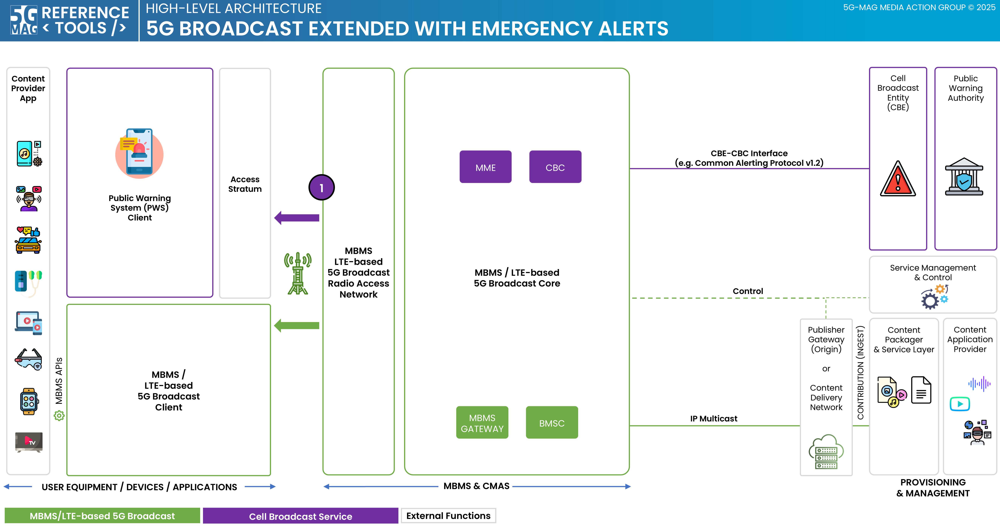

 

1. TOC
{:toc}

# Scope

## Specifications
Visit the [Standards repository](https://5g-mag.github.io/Standards/) for details.

## High-level architecture

### High-level architecture: 5G Broadcast extended with Emergency Alerts

 * Check [here](./repositories.html) to access the repositories for Emergency Alerts over 5G Broadcast
 * Check [here](../3gpp-ran-and-core-platforms/repositories.html) to access the repositories for 3GPP RAN and Core Platforms
