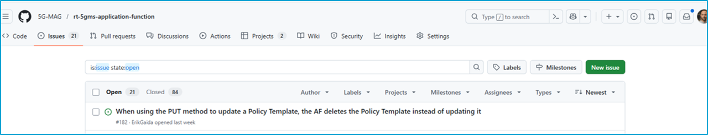
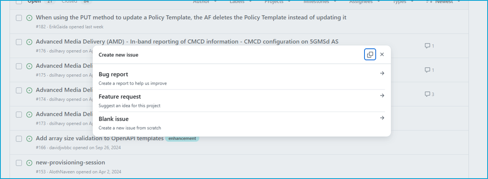
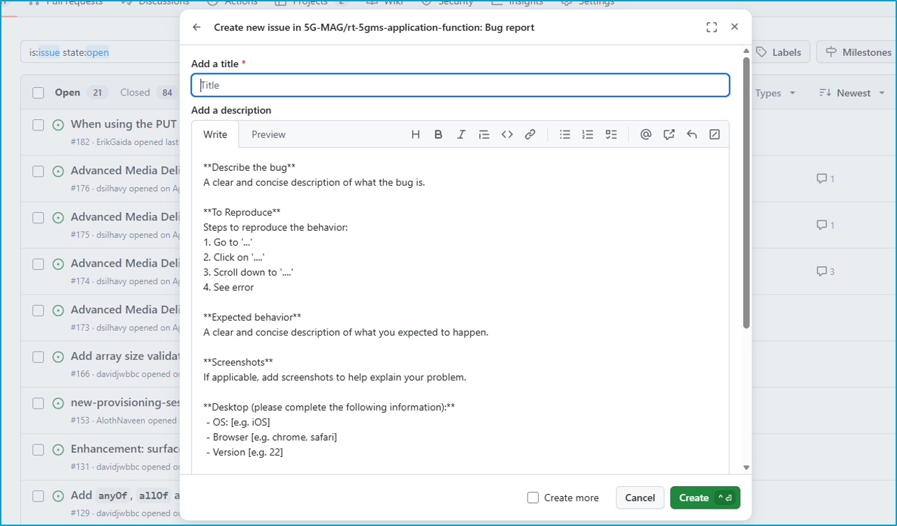
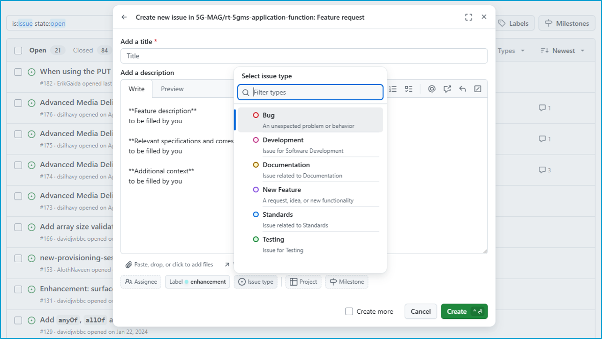
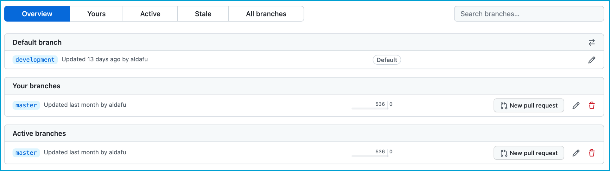
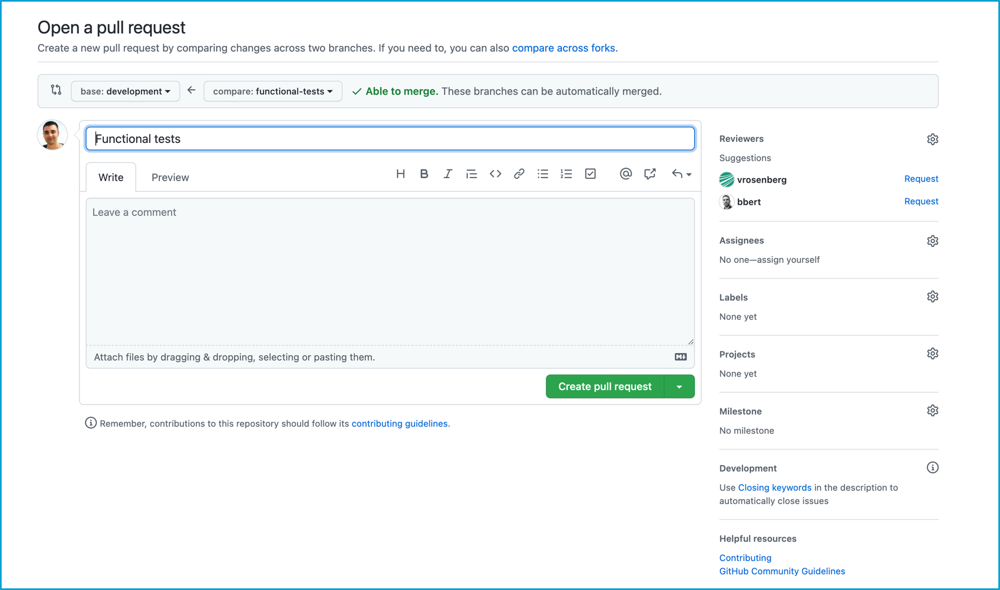

 

# Guidelines for Contributors

* Meet the developer community, participate, contribute, join the public calls: [https://www.5g-mag.com/community](https://www.5g-mag.com/community)
* Discussions among developers are held in [Slack](https://5g-mag.slack.com/).
* Announcements are communicated through the [Google Group](https://groups.google.com/g/5g-mag-reference-tools)
* If you have questions which cannot be shared publicly, reach out to us via email: [reference-tools@5g-mag.com](mailto:reference-tools@5g-mag.com)

Find here the information about:
* [Raising issues](#raising-issues)
* [Releases](#releases)
* [Git Branching strategy](#git-branching-strategy)
* [Forking the project](#forking-the-project)
* [Pull requests](#pull-requests)

## Raising issues

If you find problems or have requests for new features related to the code, please alert us by submitting an issue.

**Who can raise issues?** Anyone can raise issues against the projects, you do not need to have signed the Contributor License Agreement (CLA) to do so.

### 1. Go to the relevant repository



### 2. Create a new issue, select the type from the menu



### 3. Fill the description



### 4. Add a label, project,...



## Releases

The status of the different software releases can be found here: [Reference Tools Projects: Releases](./pages/releases.html)

### Testing release candidates

Availability of a RC for testing is announned in the Google Group and/or during the 5G-MAG Developers Calls. Feedback can be provided via issues during the testing period.
If there are blokcing issues, these will be fixed and a new release candidate will be created.

If after the testing period no issues have been found which block the release, a release will be created and announced.

## Git Branching strategy
We are using a slightly modified version of Gitflow as a branching model. A detailed introduction to Gitflow can be found [here](https://www.atlassian.com/git/tutorials/comparing-workflows/gitflow-workflow).

### Main branch
The _main_ branch stores the official release history. The current version of the _main_ branch always stores the latest release.

### Development branch
The _development_ branch serves as the integration branch for new feature and bugfix branches. It reflects the latest stable changes in the current development cycle.

### Feature branches
Each new feature is implemented in a separate _feature_ branch. Feature branches use _development_ as their parent branch. When a feature is completed the respective branch gets merged back into development. 

A feature branch is created the following way:
````
git checkout development
git checkout -b feature/newfeature
````

### Release branches
Once the _development_ branch has acquired enough features and bugfixes for a release, a release candidate branch is created based on the current version of the _development_ branch. For details on the release procedure please refer to the [release procedure](https://github.com/Dash-Industry-Forum/DASH-IF-Conformance/wiki/Release-Procedure) documentation.

The release candidate always includes a version number and is created in the following way:

````
git checkout development
git checkout -b RC-1.2.0
````

Once a release candidate is approved the respective branch is merged into the _main_ branch.

### Bugfix branches
Similar to _feature_ branches, the _bugfix_ branches are created directly from _development_. In contrast to hotfixes, bugfixes are not considered criticial and do not require a fast new release. _Bugfix_ branches are created the following way:

````
git checkout development
git checkout -b bugfix/newbugfix
````

### Hotfix branches
_Hotfix_ branches are used to quickly patch production releases in case of critical errors. _Hotfix_ branches are created directly from _main_ and merged back into _main_ and _development_ as soon as they are completed. Once the hotfix is applied a new release shall be created.

````
git checkout main
git checkout -b hotfix/newhotfix
````

### Cloning a repository with a specific branch
It is also possible to clone a repository and specify the target branch directly:

`git clone -b <branchname> <remote-repo-url>`

## Forking the project
To work on a new feature or a bugfix you first need to fork the repository that you want to work on. A detailed guide how to fork a repository can be found [here](https://docs.github.com/en/get-started/quickstart/fork-a-repo).

## Pull requests
Once a feature or a hotfix branch is completed a new pull request against the _development_ (in case of _feature_ branches) or the _main_ branch (in case of _hotfix_ branches) is created:

### 1.  Navigate to the list of available branches.
Depending on the concrete setup the new branch is available directly on the main repository or on your fork of the main repository.



### 2. Click on "New pull request"



### 3. Select the target (base) branch:
   * For `feature` branches select the `development` branch
   * For `hotfix` branches select the `main` branch

### 4. Provide a summary of your changes in the textfield

### 5. Click on "Create pull request"
