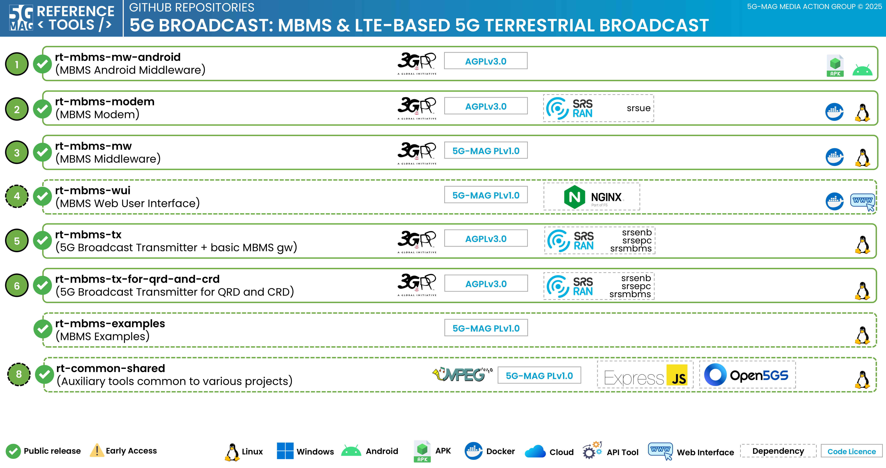

 

1. TOC
{:toc}

# Repositories

The following repositories are available. Please refer to the "Scope & Architecture" sections of the different projects for more context.

---

## 5G Broadcast Transmitter for MBMS-dedicated cells and basic MBMS gateway: [rt-mbms-tx](https://github.com/5G-MAG/rt-mbms-tx)
This repository holds a standalone 5G Broadcast transmitter.

Additional information:
* [Information and how to download, build, install and run](https://github.com/5G-MAG/rt-mbms-tx#readme)
* [Releases](https://github.com/5G-MAG/rt-mbms-tx/releases)

## 5G Broadcast Transmitter for QRD (Qualcomm Reference Design) and CRD (Commercial Research Device): [rt-mbms-tx-for-qrd-and-crd](https://github.com/5G-MAG/rt-mbms-tx-for-qrd-and-crd)
This repository holds an extension of an MBMS-enabled eNodeB tailored to operate as a 5G Broadcast transmitter compatible with Qualcomm Reference Design (QRD) and QRC devices.

Additional information:
* [Information and how to download, build, install and run](https://github.com/5G-MAG/rt-mbms-tx-for-qrd-and-crd#readme)
* [Releases](https://github.com/5G-MAG/rt-mbms-tx-for-qrd-and-crd/releases)

## MBMS Modem: [rt-mbms-modem](https://github.com/5G-MAG/rt-mbms-modem)
This repository holds an MBMS Modem, which main task is to convert a 5G BC input signal (received either as live I/Q raw data from the SDR or as prerecorded SDR sample file) to multicast IP packets on the output.

Additional information:
* [Information and how to download, build, install and run](https://github.com/5G-MAG/rt-mbms-modem#readme)
* [Releases](https://github.com/5G-MAG/rt-mbms-modem/releases)
* [Packages](https://github.com/5G-MAG/rt-mbms-modem/tree/development/modem)

## MBMS Middleware: [rt-mbms-mw](https://github.com/5G-MAG/rt-mbms-mw)
This repository holds an MBMS Middleware, which main task is to provide the best available content to the (internal or external) application at any time. If available, it combines content from (mobile) broadband, WiFi with the 5G broadcast content from the MBMS Modem using an advanced decision logic. The content is presented to the applications in the form of an intelligent edge cache ready for pickup via http(s).

Additional information:
* [Information and how to download, build, install and run](https://github.com/5G-MAG/rt-mbms-mw#readme)
* [Releases](https://github.com/5G-MAG/rt-mbms-mw/releases)
* [Docker](https://github.com/5G-MAG/rt-mbms-mw/tree/development/middleware)

## MBMS Middleware for Android: [rt-mbms-mw-android](https://github.com/5G-MAG/rt-mbms-mw-android)
This repository holds an implementation of the MBMS Middleware for Android.

Additional information:
* [Information and how to download, build, install and run](https://github.com/5G-MAG/rt-mbms-mw-android#readme)
* [Releases](https://github.com/5G-MAG/rt-mbms-mw-android/releases)

---

## Auxiliary repositories

### MBMS Web User Interface: [rt-mbms-wui](https://github.com/5G-MAG/rt-wui)
The 5G-MAG Reference Tools Webinterface (rt-wui) provides an optional graphical webinterface with a control display for each 5G-MAG Reference Tools process (MBMS Modem, MBMS Middleware). Its main purpose is to collect and display useful information from the MBMS Modem and the MBMS Middleware. The webinterface provides basic browser-based HLS playback of the HLS manifest and segments provided by the MBMS Middleare using hls.js.

Additional information:
* [Information and how to download, build, install and run](https://github.com/5G-MAG/rt-wui#readme)
* [Releases](https://github.com/5G-MAG/rt-wui/releases)
* [Docker](https://github.com/5G-MAG/rt-wui/tree/development/wui)

### MBMS Examples: [rt-mbms-examples](https://github.com/5G-MAG/rt-mbms-examples)
This repository holds example projects that make use of other 5G-MAG repositories or provide additional functionalities to test and implement new features for MBMS.

The following tools are available:
* **FLUTE ffmpeg** - The goal of this example project is to provide a tool that enables rt-mbms-mw development without the need for the rt-mbms-modem.

Additional information:
* [Information and how to download, build, install and run](https://github.com/5G-MAG/rt-mbms-examples#readme)
* [Releases](https://github.com/5G-MAG/rt-mbms-examples/releases)
