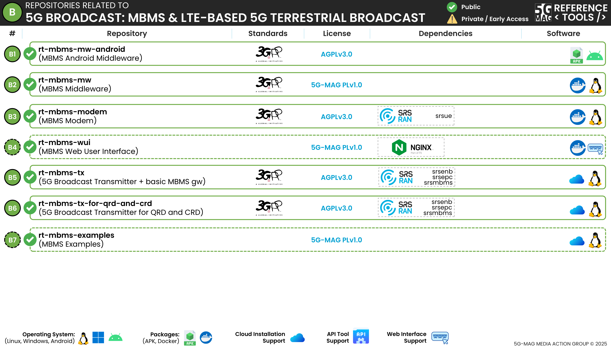

# Context of the repositories

# Access to the relevant repositories

## 5G Broadcast Transmitter for MBMS-dedicated cells and basic MBMS gateway: [rt-mbms-tx](https://github.com/5G-MAG/rt-mbms-tx)
* [Information and how to download, build, install and run](https://github.com/5G-MAG/rt-mbms-tx#readme)
* [Releases](https://github.com/5G-MAG/rt-mbms-tx/releases)

## 5G Broadcast Transmitter for QRD (Qualcomm Reference Design) and CRD (Commercial Research Device): [rt-mbms-tx-for-qrd-and-crd](https://github.com/5G-MAG/rt-mbms-tx-for-qrd-and-crd)
* [Information and how to download, build, install and run](https://github.com/5G-MAG/rt-mbms-tx-for-qrd-and-crd#readme)

## MBMS Modem: [rt-mbms-modem](https://github.com/5G-MAG/rt-mbms-modem)
* [Information and how to download, build, install and run](https://github.com/5G-MAG/rt-mbms-modem#readme)
* [Releases](https://github.com/5G-MAG/rt-mbms-modem/releases)
* [Docker](https://github.com/5G-MAG/rt-mbms-modem/tree/development/modem)

## MBMS Middleware: [rt-mbms-mw](https://github.com/5G-MAG/rt-mbms-mw)
* [Information and how to download, build, install and run](https://github.com/5G-MAG/rt-mbms-mw#readme)
* [Releases](https://github.com/5G-MAG/rt-mbms-mw/releases)
* [Docker](https://github.com/5G-MAG/rt-mbms-mw/tree/development/middleware)

## MBMS Middleware for Android: [rt-mbms-mw-android](https://github.com/5G-MAG/rt-mbms-mw-android)
* [Information and how to download, build, install and run](https://github.com/5G-MAG/rt-mbms-mw-android#readme)
* [Releases](https://github.com/5G-MAG/rt-mbms-mw-android/releases)

## Tools common to various projects: [rt-common-shared](https://github.com/5G-MAG/rt-common-shared)
* [Information and how to download, build, install and run](https://github.com/5G-MAG/rt-common-shared#readme)

# Repositories related to Multicast IP delivery
## File Delivery over Unidirectional Transport (FLUTE): [rt-libflute](https://github.com/5G-MAG/rt-libflute)
* [Information and how to download, build, install and run](https://github.com/5G-MAG/rt-libflute#readme)
* [Releases](https://github.com/5G-MAG/rt-libflute/releases)

# Repositories with dependencies related to LTE
* [srsRAN](https://github.com/5G-MAG/srsRAN)

# Auxiliary repositories:
## MBMS Web User Interface: [rt-mbms-wui](https://github.com/5G-MAG/rt-mbms-wui)
* [Information and how to download, build, install and run](https://github.com/5G-MAG/rt-mbms-wui#readme)
* [Releases](https://github.com/5G-MAG/rt-mbms-wui/releases)
* [Docker](https://github.com/5G-MAG/rt-mbms-wui/tree/development/wui)

## MBMS Examples: [rt-mbms-examples](https://github.com/5G-MAG/rt-mbms-examples)
* [Information and how to download, build, install and run](https://github.com/5G-MAG/rt-mbms-examples#readme)
* [Releases](https://github.com/5G-MAG/rt-mbms-examples/releases)
