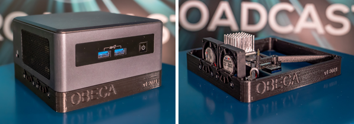

 

[Scope & Architectures](./scope.html){: .btn .btn-blue } [Project Roadmap](./projects.html){: .btn .btn-blue } [Features](./features.html){: .btn .btn-blue } [GitHub Repos](./repositories.html){: .btn .btn-github } [Releases](../releases.html#project-5g-broadcast-tv-and-radio-hybrid-services){: .btn .btn-release } [Tutorials](./tutorials.html){: .btn .btn-blue } [Requirements](./requirements.html){: .btn .btn-blue }

# Requirements

## Hardware requirements
It is hard to define system requirements because these depend e.g. on bandwidth (e.g., 5, 8, 10 MHz), modulation coding
scheme and other parameters. Generally, a CPU with 4 cores and 8 threads, 16 GB RAM and - in case a SDR and not just
sample files are used - an USB 3.0 port is necessary. Furthermore, HDMI, Wifi, LAN and sufficient SSD space (for sample
files,...) is recommended.

> **Note** We would appreciate if you let us know about your setup to list it below. Drop us a mail [reference-tools@5g-mag.com](mailto:reference-tools@5g-mag.com).

## Supported SDR

Using these Reference Tools in a live setup requires an SDR (software defined radio) platform.

5G-MAG Reference Tools *[MBMS Modem](MBMS-Modem)* supports [SoapyAPI](https://github.com/pothosware/SoapySDR/wiki), thus any
supported SDR should work provided the hardware is sufficient for receiving a 5G Broadcast signal (e.g. bandwidth, sample rate...)).

We recommend using a [LimeSDR Mini](https://limemicro.com/products/boards/limesdr-mini/) or [BladeRF 2.0 Micro XA4](https://www.nuand.com/product/bladeRF-xA4). A [HackRF One](https://greatscottgadgets.com/hackrf/one/) can also be used. Each has to be connected via USB to the computer and to your antenna via the SMA connector. USRPs known to work include Ettus USRP N310 and Ettus USRP B210.

> **Note** If you are using another SDR, please let us know that we can update the list above. Drop us a mail [reference-tools@5g-mag.com](mailto:reference-tools@5g-mag.com).

> **Note** If you only want to test with sample files, a SDR is NOT required.

## Operating System

We recommend using [Ubuntu 20.04 LTS (64 bit)](https://ubuntu.com/). Other versions of Ubuntu or Devian, Raspbian,... should also work when building from source.

> **Note** We would appreciate if you let us know about your setup to list it below. Drop us a mail [reference-tools@5g-mag.com](mailto:reference-tools@5g-mag.com).

## Reference setup

| Component | Part | Approx. price (EUR) |
| ------------- |-------------|-------------|
| Intel NUC | <a href="https://www.amazon.de/gp/product/B08CNLFM1N/ref=ppx_yo_dt_b_asin_title_o06_s00?ie=UTF8&psc=1" target="_blank">Intel Provo Canyon BKNUC8V7PNH</a> | 600 |
| RAM | <a href="https://www.amazon.de/gp/product/B08C4VKYFG/ref=ppx_yo_dt_b_asin_title_o00_s01?ie=UTF8&psc=1" target="_blank">Crucial RAM CT16G4SFRA266 16GB DDR4 2666 MHz CL19</a> | 60 |
| SSD| <a href="https://www.amazon.de/gp/product/B07BSSFB4N/ref=ppx_yo_dt_b_asin_title_o00_s00?ie=UTF8&psc=1" target="_blank">SanDisk Extreme PRO M.2 NVMe 3D SSD 500 GB interne SSD</a> | 70 |
| Power cord| <a href="https://www.amazon.de/gp/product/B00K65JGUY/ref=ppx_yo_dt_b_asin_title_o09_s00?ie=UTF8&psc=1" target="_blank">LINDY 30406 - Power cord for notebooks (Schuko) 3m</a> | 10 |
| _Optional:_ |
| _Display_|  <a href="https://www.amazon.de/gp/product/B08B67KJ75/ref=ppx_yo_dt_b_asin_title_o00_s02?ie=UTF8&psc=1" target="_blank">Capacitive display 7" IPS 1024x600</a> | 70 |

The full specification of the Intel NUC can be
found [here](https://ark.intel.com/content/www/us/en/ark/products/199110/intel-nuc-8-pro-kit-nuc8v7pnh.html).

If you want to fully integrate the SDR into the NUC as seen on the picture above courtesy of Johann Mika: [https://github.com/johannmika/obeca-ors-casing](https://github.com/johannmika/obeca-ors-casing)

### Testcases

The 5G-MAG Reference Tools system was tested live, with sample files, with bandwidths 3, 5, 6, 7, 8 and 10 MHz, SCS 1.25 and 7.5 kHz and
modulation coding schemes (MCS) 1-26 with multiple services (RTP, HLS). Max CPU (2 services, 10 MHz, MCS26) was below
60%.

## Virtual Environment

We have tested Ubuntu 20 with Hyper-V on Windows 10.

### Testcases

We tested the build process and sample files (1 RTP service, 5 MHz).
