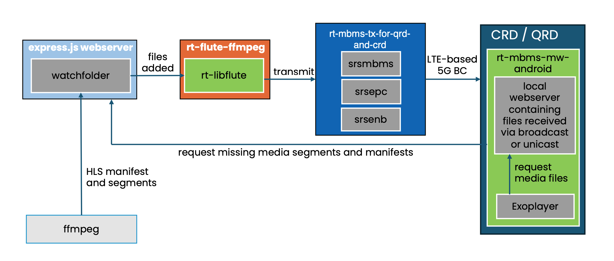
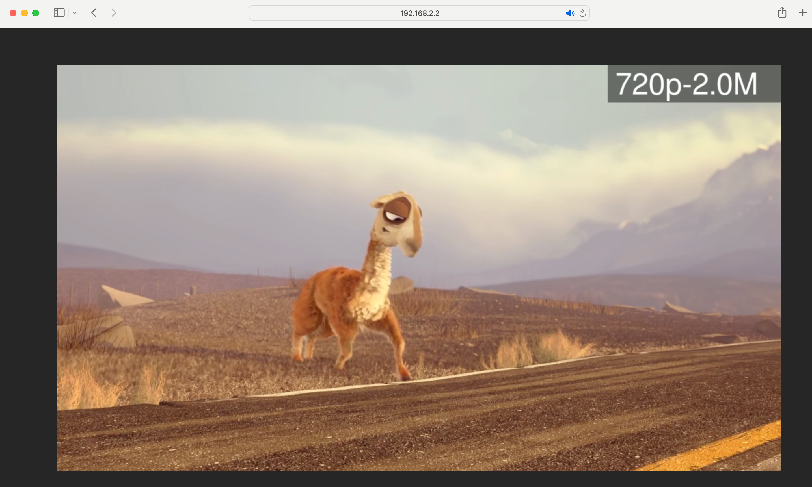
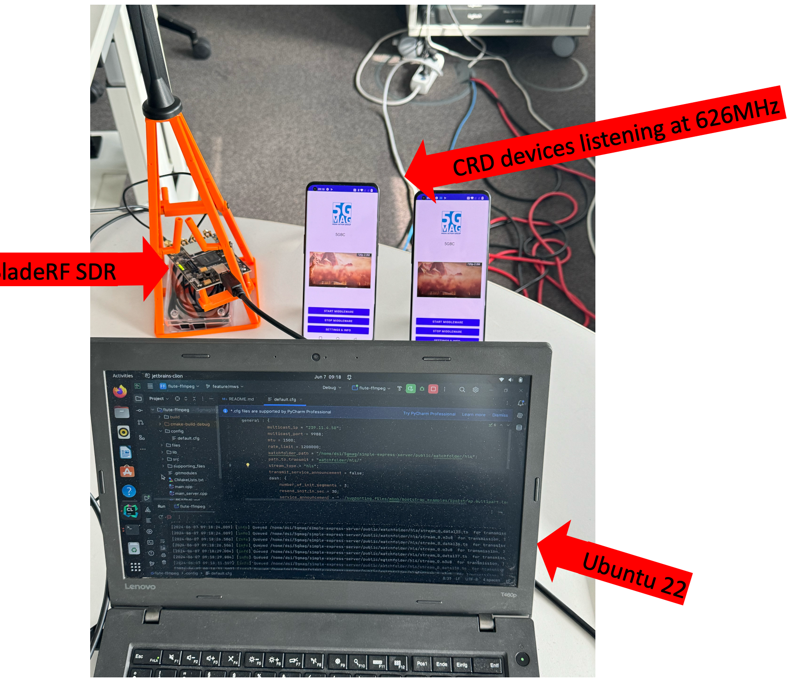
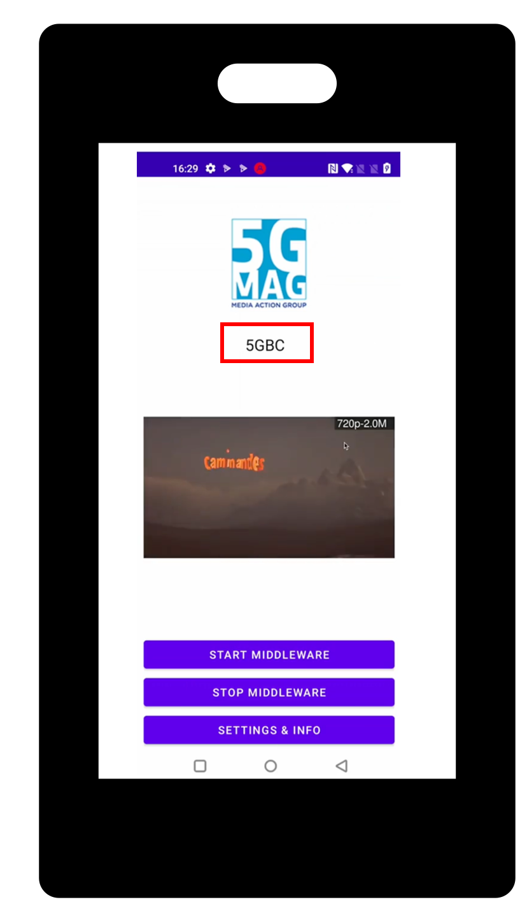
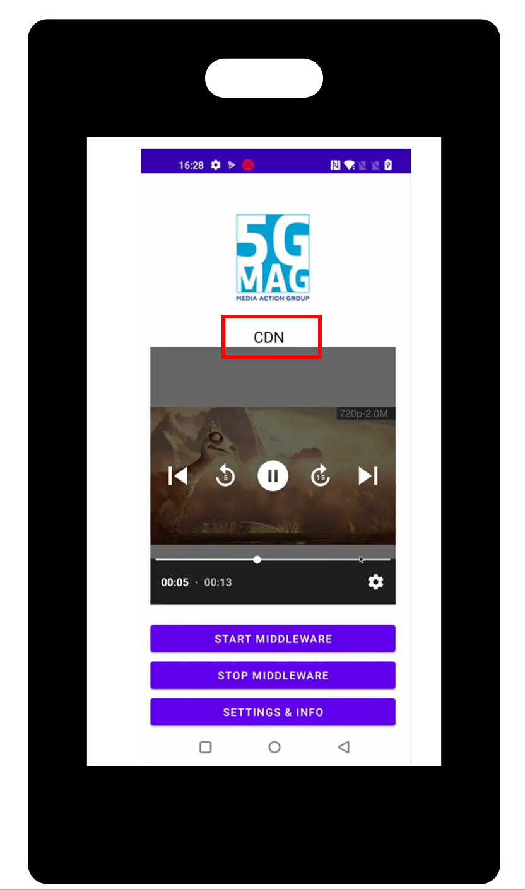

# Tutorial - Seamless Switching between Unicast and Broadcast (Android)

This tutorial describes the end-to-end setup for showcasing seamless switching between 5G Broadcast and unicast delivery on an Android device.

The basic architecture of the setup is depicted in the Figure below:



We use `ffmpeg` to create an HLS livestream from a plain .mp4 file. The resulting manifest files and media segments are
stored on a `watchfolder` located on a simple `express.js webserver`. From this webserver the files are accessible to
media players located in the same network. This setup corresponds to a classic OTT and CDN based workflow. As an example, the
HLS
stream can be played natively in a Safari Web-browser by simply pasting the URL to the primary or the media playlist
into the URL address bar:



Whenever a new file is added to the `watchfolder` located on the webserver, a background process called `flute-ffmpeg`
is notified. `flute-ffmpeg` uses the `rt-libflute` library to FLUTE encode the files and sends them via a dedicated
network tunnel as a multicast to the `srsmbms` process. For that reason the `srsmbms` process acts as an MBMS gateway
and exposes the `sgi_mb` interface.

The `rt-mbms-tx-for-qrd-and-crd` repository acts as a 5G Broadcast transmitter hosting the `srsmbms`, `srsepc`
and `srsenb` processes. It is based on srsRAN with additional changes from the 5G-MAG developer community to support transmission to LTE-based 5G Broadcast enabled UEs.

On the receiver side the `rt-mbms-mw-android` is running on a QRD or CRD device. It is responsible for receiving
the media files delivered via 5G Broadcast. The files are exposed to a media player such as the Exoplayer via a local
webserver. In cases in which no 5G Broadcast is available the Android Middleware fetches the required manifest and media
files directly from the CDN via unicast and exposes them again via the local webserver. From a media player's
perspective it does not matter if the files hosted on the local webserver have been received via unicast or via 5G
broadcast. It is simply consuming the files via standard HTTP GET requests to `localhost`. That way the Android MW can
dynamically switch between broadcast and unicast delivery based on the availability of the respective delivery
mechanism.

## Requirements

To replicate the setup described in this tutorial the following components are required:

* An Ubuntu 22 system to install and host ffmpeg, an express.js webserver, the flute-ffmpeg repository as well as our
  5G-MAG QRD and CRD transmitter.
* A Software Defined Radio (SDR) such as the BladeRF with an antenna for transmission of the 5G Broadcast signal
* A QRD or CRD device operating in Receive-only mode (ROM) to receive the 5G Broadcast transmission and run the 5G-MAG
  MBMS Android Middleware.

A photo of the basic setup is depicted below:



## Installation

First, we need to install and configure a few components:

### Step 1: Install the express.js webserver

The `express.js` webserver acts as our CDN node for unicast delivery. To install the webserver follow the
instructions [here](https://github.com/5G-MAG/rt-common-shared/tree/main/simple-express-server).

This will prepare the server so contents can be stored in the `simple-express-server\public\watchfolder`path.

### Step 2: Install flute-ffmpeg

We use `flute-ffmpeg` to create an HLS livestream and monitor changes to our watchfolder. Once new files have been added
to the watchfolder `flute-ffmpeg` will FLUTE encode them and multicast them to the MBMS Gateway.

To install `flute-ffmpeg` follow the installation and build
instructions [here](https://github.com/5G-MAG/rt-mbms-examples/tree/main/flute-ffmpeg). Do not apply the
configuration and running steps yet. We will do this later as part of this tutorial.

### Step 3: Install rt-mbms-tx-for-qrd-and-crd

Next we install our 5G Broadcast transmitter. For that reason follow the steps
described [here](https://github.com/5G-MAG/rt-mbms-tx-for-qrd-and-crd). Do not run the transmitter yet.

### Step 4: Clone the Android MW

The Android MW is responsible for receiving the media files delivered via 5G Broadcast. In addition, it fetches files
from the webserver if they are not available via 5G Broadcast. The Android MW including instructions on how to clone and
install can be found [here](https://github.com/5G-MAG/rt-mbms-mw-android).

## Configuration

Before putting the pieces together and running all components we need to run some configuration steps:

### Step 1: Configure ffmpeg

First we configure the `ffmpeg` output. Navigate to `rt-mbms-examples/flute-ffmpeg/files` and open `ffmpeg-hls.sh`. Change the following
two lines and point them to the path of the local webserver installed previously. If there is no `watchfolder/hls`
folder on your webserver yet create that as well.

````
-hls_segment_filename /home/fivegmag/rt-common-shared/simple-express-server/public/watchfolder/hls/stream_%v_data%02d.ts \
-master_pl_name manifest.m3u8 \
-var_stream_map "v:0,a:0 v:1,a:1" /home/fivegmag/rt-common-shared/simple-express-server/public/watchfolder/hls/stream_%v.m3u8
````

### Step 2: Configure flute-ffmpeg

Next we configure `flute-ffmpeg` to monitor the watchfolder on our webserver and also to multicast the resulting packets
to the right address. Open `re-mbms-examples/flute-ffmpeg/config/default.cfg` and edit the following lines:

````
general : {
   multicast_ip = "239.11.4.50";
   multicast_port = 9988;
   watchfolder_path = "/home/fivegmag/rt-common-shared/simple-express-server/public/watchfolder/hls";
   path_to_transmit = "watchfolder/hls/"
}
````

Set the `multicast_ip` and the `multicast_port` to the multicast IP that you will be using for the `sgi_mb` interface of
the MBMS Gateway later. The configuration above matches the default configuration of the 5G Broadcast Transmitter. If
you are unsure what to do use the default `multicast_ip` and `multicast_port` as defined in the example above.

Set the `watchfolder_path` to the path of your watchfolder located on the local webserver. `path_to_transmit` should be
set to `"watchfolder/hls/"`.

### Step 3: Configure rt-mbms-tx-for-qrd-and-crd

Now we need to configure our 5G Broadcast transmitter. For that reason follow the
instructions [here](https://github.com/5G-MAG/rt-mbms-tx-for-qrd-and-crd?tab=readme-ov-file#configuration-after-installation).
Make sure to set the right downlink frequency based on the frequency that your CRD/QRD device are operating on. For
instance, for a frequency of 626MHz using a BladeRF SDR these are the required settings
in `/root/.config/srsran/enb.conf`:

````
[rf]
dl_freq = 626000000
ul_freq = 688000000
dl_earfcn = 68676
tx_gain = 130
rx_gain = 0

device_name = soapy
device_args = id=2
````

`device_name` and `device_args`might be different in your setup. Make sure that the `enb` process later uses the right
SDR.

### Step 4: Configure rt-mbms-mw-android

In the current implementation the Android Middleware uses a static MBMS Service Announcement file. We need to add the
right unicast endpoint to this static service announcement. For that reason open the `bootstrap.multipart.hls` file
located in the `assets` folder. Search for all occurrences of `watchfolder/hls` that contain an IP. For
instance: `http://192.168.0.101:3333/watchfolder/hls/manifest.m3u8`. Now replace the IP with the IP of your machine that
is running the local webserver. The MW will use this address later to fetch manifest and media files via unicast from
our webserver.

## Running

After the configuration we are now ready to run all components and put all the pieces together:

### Step1: Start ffmpeg

Navigate to `flute-ffmpeg/files` and run `sh ffmpeg-hls.sh`. You should now see files being added to your watchfolder,
e.g.:

````
~/5gmag/simple-express-server/public/watchfolder/hls$ ls
manifest.m3u8          stream_0_data12773.ts  stream_0_data28.ts
stream_0_data12530.ts  stream_0_data12774.ts  stream_0_data29.ts
stream_0_data12531.ts  stream_0_data12775.ts  stream_0_data7389.ts
stream_0_data12532.ts  stream_0_data12776.ts  stream_0_data7390.ts
stream_0_data12533.ts  stream_0_data12777.ts  stream_0_data7391.ts
stream_0_data12534.ts  stream_0_data12778.ts  stream_0_data7392.ts
stream_0_data12535.ts  stream_0_data12779.ts  stream_0_data7393.ts
stream_0_data12536.ts  stream_0_data19.ts     stream_0_data7394.ts
stream_0_data12537.ts  stream_0_data20.ts     stream_0_data7395.ts
stream_0_data12538.ts  stream_0_data21.ts     stream_0_data7396.ts
stream_0_data12539.ts  stream_0_data22.ts     stream_0_data7397.ts
stream_0_data12540.ts  stream_0_data23.ts     stream_0_data7398.ts
stream_0_data12769.ts  stream_0_data24.ts     stream_0_data7399.ts
stream_0_data12770.ts  stream_0_data25.ts     stream_0.m3u8
stream_0_data12771.ts  stream_0_data26.ts
stream_0_data12772.ts  stream_0_data27.ts
````

### Step 2: Start the express.js webserver

Run `npm start` in `simple-express-server`. Our files created by `ffmpeg` are now hosted and available via unicast. Try
to query the master manifest to check for the availability of the files:

````
curl http://192.168.0.101:3333/watchfolder/hls/manifest.m3u8
#EXTM3U
#EXT-X-VERSION:6
#EXT-X-STREAM-INF:BANDWIDTH=2305600,RESOLUTION=1280x720,CODECS="avc1.64001f,mp4a.40.2"
stream_0.m3u8
````

### Step 3: Start the rt-mbms-tx-for-qrd-and-crd

Next we start our 5G Broadcast transmitter. For that reason, we need to start three different processes. In addition, we
need to create the `sgi_mb` interface. Follow the steps
described [here](https://github.com/5G-MAG/rt-mbms-tx-for-qrd-and-crd?tab=readme-ov-file#running) to start everything.

### Step 4: Start flute-ffmpeg

Now that we are ready to transmit files via 5G Broadcast we can start our `flute-ffmpeg` process to multicast all data
that is written to the `watchfolder` to `srsmbms`(MBMS Gateway).

Navigate to `flute-ffmpeg/build` and run `./flute-ffmpeg`. The logs should show messages similar to this indicating that
files written to the watchfolder are processed:

````
[2024-07-03 13:52:08.343] [info] Queued /home/dsi/5gmag/simple-express-server/public/watchfolder/hls/stream_0_data159.ts  for transmission, TOI is 38
[2024-07-03 13:52:08.347] [info] Queued /home/dsi/5gmag/simple-express-server/public/watchfolder/hls/stream_0.m3u8  for transmission, TOI is 39
[2024-07-03 13:52:10.811] [info] Queued /home/dsi/5gmag/simple-express-server/public/watchfolder/hls/stream_0_data160.ts  for transmission, TOI is 40
[2024-07-03 13:52:10.812] [info] Queued /home/dsi/5gmag/simple-express-server/public/watchfolder/hls/stream_0.m3u8  for transmission, TOI is 41
````

### Step 5: Start the rt-mbms-mw-android

The final step is to start our Android Middleware to receive the files we are broadcasting now with our transmitter.
Follow the instructions [here](https://github.com/5G-MAG/rt-mbms-mw-android) to deploy the Android Middleware to your
QRC/CRD device. As an alternative, the Android Middleware can also be deployed to the device using Android Studio.

After the Android Middleware has started click on "Start Middleware". Then click on the play icon in the middle of the
screen. Since the 5G broadcast is active the HLS media playlist and the HLS media segments are now received via 5G
broadcast and placed on the local webserver of the Android Middleware. From there they are consumed by the underlying
media player:



When terminating the `enb` process the media files are no longer transmitted via 5G Broadcast. Now the Android
Middleware falls back to fetching the media files via unicast:



