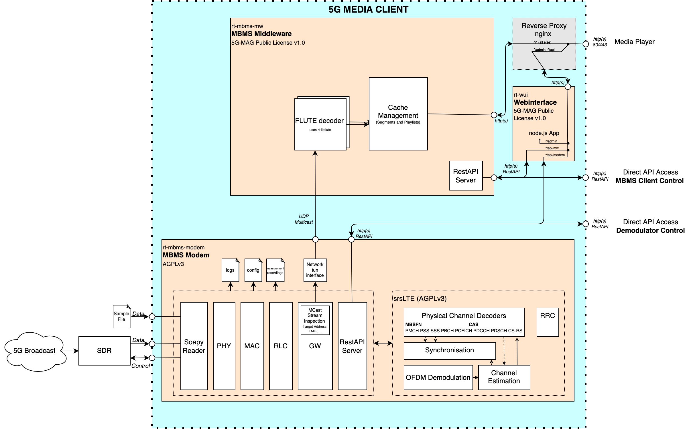

# Tutorial - HLS Playback over 5G Broadcast (Linux)

This tutorial provides the required steps to test the reception of an HLS stream processed by the [MBMS Modem](https://github.com/5G-MAG/rt-mbms-modem).

More information about HTTP Live Streaming (HLS) can be found in the IETF HLS specification: [RFC 8216 - HTTP Live Streaming](https://datatracker.ietf.org/doc/html/rfc8216)

## Basic workflow

This tutorial makes use of the rt-mbms-modem, rt-mbms-mw and a media player. Additional details on hardware requirements can be found in [Hardware Requirements](../additional/hardware-requirements.html). The basic workflow of these components is illustrated in the Figure below:



The output of the SDR or the sample file serves as the input for the MBMS Modem. The MBMS Modem exposes the FLUTE encoded content via UDP multicast to the MBMS Middleware. The MBMS Middleware listens to the local tun interface. Received multicast packets from the Receive Process are FLUTE decoded using the [5G-MAG Reference Tools FLUTE library](https://github.com/5G-MAG/rt-libflute). Once the manifest files and media segments are FLUTE-decoded they are cached in the middleware and made available to the media player via an Nginx proxy. The media player itself is not aware that the content is provided via broadcast.

## Step 1: Installation

1. [Install the MBMS Modem](https://github.com/5G-MAG/rt-mbms-modem)
2. [Install the MBMS Middleware](https://github.com/5G-MAG/rt-mbms-mw)
3. [Install the Webinterface](https://github.com/5G-MAG/rt-wui)
4. [Download an HLS sample file](../additional/sample-files.html) or setup an HLS live stream on your transmitting infrastructure

## Step 2: Configure multicast routing

Follow the detailed instructions on how to configure multicast routing provided [here](https://github.com/5G-MAG/rt-mbms-modem?tab=readme-ov-file#running-the-mbms-modem).

Stop and start the MBMS Modem as a service in order to generate or update the required configurations files. Note that this step may be required again after a reboot.
    - `systemctl stop 5gmag-rt-modem`
    - `systemctl start 5gmag-rt-modem`

Since we don't want to run the MBMS Modem as a service in the background but instead provide a prerecorded sample file, we need to make sure that the service is not running. Calling `systemctl stop 5g-mag-rt-modem` stops the service.

## Step 3: Start the MBMS Modem

Start the MBMS Modem with a sample as specified [here](https://github.com/5G-MAG/rt-mbms-modem?tab=readme-ov-file#run-a-sample-file). It is important to provide the right bandwidth to the MBMS Modem. Consequently, for a 5 MHz bandwidth sample file, the command looks like this: 

```
cd rt-mbms-modem/build
sudo ./modem -f "PathToSample/5MHz_MCS16_1kHz25_HLS_q6a.raw" -b 5`.
```
The final output on the terminal should now look similar to the output below:

```
modem[7891]: 5g-mag-rt modem v1.1.1 starting up
modem[7891]: Initialising SDR
modem[7891]: Launching phy thread with realtime scheduling priority 10
modem[7891]: Launching phy thread with realtime scheduling priority 10
modem[7891]: Launching phy thread with realtime scheduling priority 10
modem[7891]: Launching phy thread with realtime scheduling priority 10
modem[7891]: Launching phy thread with realtime scheduling priority 10
modem[7891]: Raising main thread to realtime scheduling priority 20
modem[7891]: GPS data stream started
modem[7891]: TUN file descriptor 6
modem[7891]: Starting RESTful API handler at http://0.0.0.0:3010/modem-api/
modem[7891]: Phy: PSS/SSS detected: Mode FDD, PCI 333, CFO 0.18315084 KHz, CP Extended
modem[7891]: Phy: MIB Decoded. Mode FDD, PCI 333, PRB 25, Ports 1, CFO 0.18315084 KHz, SFN 0
modem[7891]: Decoded MIB at target sample rate, TTI is 120. Subframe synchronized.
modem[7891]: CINR 16.13 dB
modem[7891]: PDSCH: MCS 5, BLER 0.0, BER 0.0
modem[7891]: MCCH: MCS 2, BLER 0.0, BER 0.0
modem[7891]: MCH 0: MCS 16, BLER 0.0, BER 0.05661512027491409
modem[7891]:     MTCH 0: LCID 1, TMGI 0x00000009f165, 238.1.1.95:40085
modem[7891]:     MTCH 1: LCID 2, TMGI 0x00001009f165, 238.1.1.111:40101
modem[7891]: -----
```

## Step 4: Start the MBMS Middleware

In this example, we start the MBMS Middleware from the build folder to enable logging to the terminal.

Note: Depending on the format of the Service Announcement file you need to adjust the configuration in `/etc/5gmag-rt.conf`. Detailed information can be
found [here](../additional/rt-common-shared/MBMS-service-announcement-files.html).

Start the middleware:

```
cd rt-mbms-mw/build
sudo ./mw
```
The output should look like this:

```
mw[216090]: 5g-mag-rt mw v0.10.0 starting up
mw[216090]: Starting FLUTE receiver on 238.1.1.95:40085 for TSI 0
````

## Step 5: Start the Web User Interface

We use the Web User Interface to monitor the MBMS Modem and the MBMS Middleware. Moreover, we use the hls.js integration to playback the final HLS stream. In order run the Webinterface perform the steps
describe [here](https://github.com/5G-MAG/rt-wui?tab=readme-ov-file#running).

The Webinterface can also be started directly from its folder:

```
cd rt-wui
node app.js
```

In order to use the webinterface for playback perform the following steps:

1. Navigate to `http://localhost` in your browser
2. Click `Middleware` on the top right corner
3. Click on the play button below the stream information
4. An instance of hls.js is initialized playing the HLS stream

The output for step 3 and step 4 should look similar to this:


It is also possible to use other players like VLC. Simply paste the url to the `index.m3u8` into the VLC player. As an
example the URL can look the following: `http://localhost/f/00001009f165/index.m3u8`. Replace the `localhost` part with
the IP of the machine that is running the MBMS Middleware in order to access the stream from other machines in the same
network.
