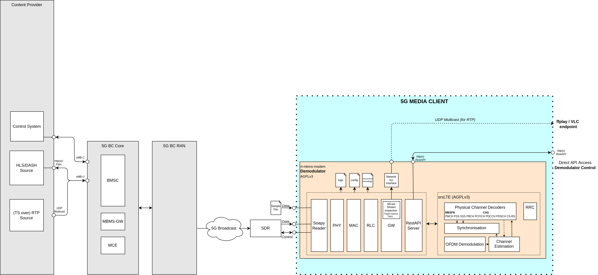

# Tutorial - RTP Playback over 5G Broadcast (Linux)

This tutorial provides the required steps to test the reception of an RTP stream processed by the [MBMS Modem](https://github.com/5G-MAG/rt-mbms-modem) and played in a third-party media player such as ffplay or VLC.

More information about the Real-Time Transport Protocol (RTP) can be found in the IETF RTP specification: [RTP: A Transport Protocol for Real-Time Applications](https://datatracker.ietf.org/doc/html/rfc3550)

## Basic workflow

This tutorial makes use of the rt-mbms-modem and a media player such as VLC or ffplay. Additional details on hardware requirements can be found in [Hardware Requirements](../additional/hardware-requirements.html). The basic workflow of these components is illustrated in the Figure below:



The output of the SDR or the sample file serves as the input for the MBMS Modem. The MBMS Modem exposes the input data to a UDP multicast address. The content can be played directly in ffplay or VLC.

## Step 1: Installation

1. [Install the MBMS Modem](https://github.com/5G-MAG/rt-mbms-modem)
2. Install at least one of the following media players:
    - [Install VLC](https://www.videolan.org/vlc/#download)
    - [Install ffplay](https://linuxize.com/post/how-to-install-ffmpeg-on-ubuntu-20-04/)
3. [Download an RTP sample file](../additional/sample-files.html#rtp-payload) or setup an RTP live stream on your transmitting infrastructure.

## Step 2: Configure multicast routing

Follow the detailed instructions on how to configure multicast routing provided [here](https://github.com/5G-MAG/rt-mbms-modem?tab=readme-ov-file#running-the-mbms-modem).

Stop and start the MBMS Modem as a service in order to generate or update the required configurations files. Note that this step may be required again after a reboot.
    - `systemctl stop 5gmag-rt-modem`
    - `systemctl start 5gmag-rt-modem`

Since we don't want to run the MBMS Modem as a service in the background but instead provide a prerecorded sample file, we need to make sure that the service is not running. Calling `systemctl stop 5g-mag-rt-modem` stops the service.

## Step 3: Start the MBMS Modem

Start the MBMS Modem with a sample as specified [here](https://github.com/5G-MAG/rt-mbms-modem?tab=readme-ov-file#run-a-sample-file). It is important to provide the right bandwidth to the MBMS Modem. Consequently, for a 5 MHz bandwidth sample file, the command looks like this: 

```
cd rt-mbms-modem/build
sudo ./modem -f "PathToSample/5MHz_MCS16_1kHz25_RTP_3.5.raw" -b 5`.
```
The final output on the terminal should now look similar to the output below:

````
modem[10498]: Phy: PSS/SSS detected: Mode FDD, PCI 333, CFO 0.20108362 KHz, CP Extended
modem[10498]: Phy: MIB Decoded. Mode FDD, PCI 333, PRB 25, Ports 1, CFO 0.20108362 KHz, SFN 528
modem[10498]: Decoded MIB at target sample rate, TTI is 5360. Subframe synchronized.
modem[10498]: CINR 20.82 dB
modem[10498]: PDSCH: MCS 5, BLER 0.0, BER 0.0
modem[10498]: MCCH: MCS 2, BLER 0.0, BER 0.0
modem[10498]: MCH 0: MCS 16, BLER 0.0, BER 0.05661512027491409
modem[10498]:     MTCH 0: LCID 1, TMGI 0x00000309f165, 238.1.1.95:40085
modem[10498]:     MTCH 1: LCID 2, TMGI 0x00001009f165, 239.11.4.10:5520
modem[10498]: -----
modem[10498]: CINR 18.12 dB
modem[10498]: PDSCH: MCS 5, BLER 0.0, BER 0.0
modem[10498]: MCCH: MCS 2, BLER 0.0, BER 0.0
modem[10498]: MCH 0: MCS 16, BLER 0.0, BER 0.04579037800687285
modem[10498]:     MTCH 0: LCID 1, TMGI 0x00000309f165, 238.1.1.95:40085
modem[10498]:     MTCH 1: LCID 2, TMGI 0x00001009f165, 239.11.4.10:5520
modem[10498]: -----
````

To identify the correct multicast address for playback, navigate to the terminal in which the modem process is running and check the log output. Next to the `TMGI` information, the multicast addresses are listed:

````
modem[10498]: CINR 20.38 dB
modem[10498]: PDSCH: MCS 5, BLER 0.0, BER 0.0
modem[10498]: MCCH: MCS 2, BLER 0.0, BER 0.0
modem[10498]: MCH 0: MCS 16, BLER 0.0, BER 0.0468213058419244
modem[10498]:     MTCH 0: LCID 1, TMGI 0x00000309f165, **238.1.1.95:40085**
modem[10498]:     MTCH 1: LCID 2, TMGI 0x00001009f165, **239.11.4.10:5520**
modem[10498]: -----
````

In this case, we see two addresses, `238.1.1.95:40085` and `239.11.4.10:5520`.

## Step 4: Play the stream

To play the stream in **ffplay** run the following steps:

1. Open a new terminal
2. Start ffplay specifying the address to the multicast stream: `ffplay udp://239.11.4.10:5520`

The output should look like this:


To play the stream in **VLC** run the following steps:

1. Open VLC
2. Navigate to `Media > Open Network Stream`
3. Enter the stream url `rtp://@239.11.4.10:5520`
4. Press play

The output should look like this:


