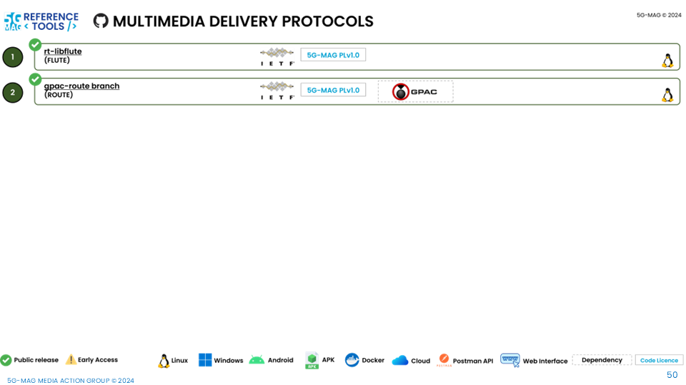

 

[Scope](./scope.html){: .btn .btn-blue } [Project Roadmap](./projects.html){: .btn .btn-blue } [GitHub Repos](./repositories.html){: .btn .btn-github } [Releases](./repositories.html#latest-releases){: .btn .btn-release } [Tutorials](./tutorials.html){: .btn .btn-tutorial } [Video Library](./tutorials.html#video-library){: .btn .btn-video } [Requirements](./requirements.html){: .btn .btn-blue }

# Software Repositories

The following repositories are available. Please refer to the "Scope" section of the different projects for more context.

---

## File Delivery over Unidirectional Transport (FLUTE)
[rt-libflute](https://github.com/5G-MAG/rt-libflute){: .btn .btn-md }

This is an implementation of a FLUTE server and client.

Additional information:
* [Information and how to download, build, install and run](https://github.com/5G-MAG/rt-libflute#readme)
* [Releases](https://github.com/5G-MAG/rt-libflute/releases)

## Real-time Object delivery over Unidirectional Transport (ROUTE), integrated within MBMS Middleware
[rt-mbms-mw / route-gpac](https://github.com/5G-MAG/rt-mbms-mw/tree/route-gpac){: .btn .btn-md }

This is an extension of the MBMS middleware implementing a ROUTE client.

---

## Latest Releases

<table class="release-table" style="width:100%; border-collapse: collapse; margin-top: 20px; table-layout: fixed;">
  <thead>
    <tr style="text-align: left; border-bottom: 2px solid #eee;">
      <th style="padding: 12px; width: 40%;">Repository</th>
      <th style="padding: 12px; width: 40%;">Version</th>
      <th style="padding: 12px; width: 20%;">Date</th>
    </tr>
  </thead>
  <tbody>
    
    <tr style="border-bottom: 1px solid #eee;">
      <td style="padding: 12px; overflow: hidden; text-overflow: ellipsis;"><a href="{{ item.url }}" class="btn">{{ item.short_name }}</a></td>
      <td style="padding: 12px; overflow: hidden; text-overflow: ellipsis;"><a href="{{ item.url }}" class="btn">{{ item.tag }}</a></td>
      <td style="padding: 12px;">{{ item.date }}</td>
    </tr>
    
  </tbody>
</table>
