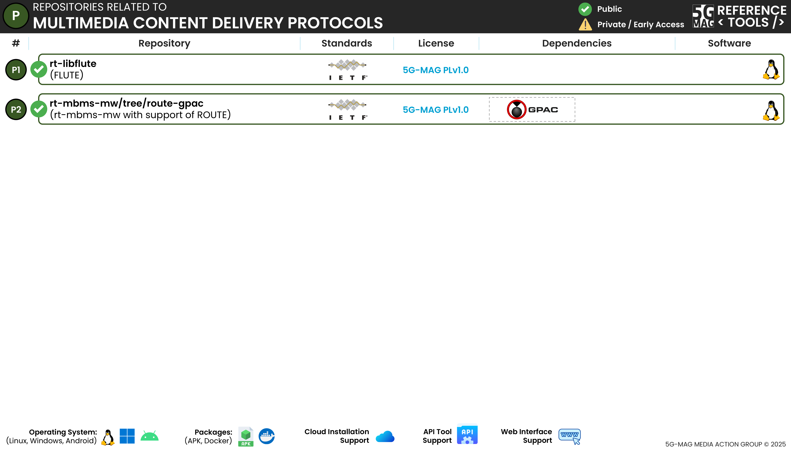

 

[Scope & Architectures](./scope.html){: .btn .btn-blue } [Project Roadmap](./projects.html){: .btn .btn-blue } [Features](./features.html){: .btn .btn-blue } [GitHub Repos](./repositories.html){: .btn .btn-github } [Releases](../releases.html#project-multimedia-content-delivery-protocols){: .btn .btn-release } [Tutorials](./tutorials.html){: .btn .btn-blue } [Requirements](./requirements.html){: .btn .btn-blue }

# Repositories

The following repositories are available. Please refer to the "Scope & Architecture" sections of the different projects for more context.

---

## File Delivery over Unidirectional Transport (FLUTE)
[rt-libflute](https://github.com/5G-MAG/rt-libflute){: .btn .btn-md } [Releases](../releases.html#project-5g-broadcast-tv-and-radio-hybrid-services){: .btn .btn-release }

This is an implementation of a FLUTE server and client.

Additional information:
* [Information and how to download, build, install and run](https://github.com/5G-MAG/rt-libflute#readme)
* [Releases](https://github.com/5G-MAG/rt-libflute/releases)

## Real-time Object delivery over Unidirectional Transport (ROUTE), integrated within MBMS Middleware
[rt-mbms-mw / route-gpac](https://github.com/5G-MAG/rt-mbms-mw/tree/route-gpac){: .btn .btn-md } [Releases](../releases.html#project-5g-broadcast-tv-and-radio-hybrid-services){: .btn .btn-release }

This is an extension of the MBMS middleware implementing a ROUTE client.

## External Tools
Check the [DVB-NIP Analyser]([../external-tools/index.html#dvb-nip-analyzer).
